# DevOps 4‑Hour Bootcamp — Detailed Notes (Markdown)

## Study plan (4 hours)

| Hour | Focus | Hands-on / Output |
|---:|---|---|
| 1 | DevOps overview + why DevOps | Map DevOps lifecycle to a sample app |
| 2 | Dev vs DevOps + CALMS culture | Identify bottlenecks in a “traditional” flow |
| 3 | CI/CD/CT concepts | Draw CI vs CD vs deployment pipeline diagram |
| 4 | Agile/Scrum + toolchain overview | Create a minimal toolchain checklist |

---

## Hour 1 — DevOps overview + why DevOps

### 1) DevOps definition

**DevOps is a way of working** that aligns **people + process + technology** to deliver software **faster, safer, and more reliably** by optimizing the **end‑to‑end value stream** (idea → production → learning).

- **DevOps is not**: a single tool, “only CI/CD”, or a job title that magically fixes delivery.
- **DevOps is**: an operating model that reduces friction between building software and running software.

Practical definition you can use in interviews:
- **DevOps**: “A set of practices and cultural norms that improve collaboration and automation so teams can deliver changes quickly with high reliability.”

Easy language perspective:
- **DevOps means**: “We work as one team, automate the boring parts, and learn fast from real results.”
- **The big promise**: you can ship often **without** breaking things often.

Key idea:
- The goal is not “more releases”. The goal is **more value**, delivered safely, with less stress.

---

### 2) Business outcomes (speed, quality)

DevOps is valuable when it improves business outcomes:

- **Speed**: deliver features/fixes faster; shorter time-to-market.
- **Quality**: fewer defects; more predictable releases.
- **Reliability**: stable services; fewer outages.
- **Cost efficiency**: less rework and manual toil; fewer emergency fixes.
- **Customer satisfaction**: faster response to feedback and incidents.

Two things to remember:
- **Speed and stability are not trade-offs** when you optimize for small batches + automation + feedback loops.
- Improvements are measured, not assumed.

Example (business view):
- If your competitor ships a bug fix in **1 day** but you take **2 weeks**, customers will notice.
- If you ship fast but cause outages every week, customers will also notice.
- DevOps aims to improve **both**.

#### DORA metrics (the 4 key outcomes to track)

These 4 metrics are widely used to measure DevOps performance:

| Metric | What it means (easy language) | What “good” usually looks like | How to improve |
|---|---|---|---|
| **Lead time for changes** | How long it takes for a code change to reach production | Hours–days (depends on org) | Smaller PRs, remove approval queues, fast CI |
| **Deployment frequency** | How often you deploy to production | Daily or more (for many teams) | Automate deploy, reduce fear via safe releases |
| **Change failure rate** | How often deploys cause incidents/hotfixes/rollback | Low and trending down | Better tests, canary, flags, smaller changes |
| **MTTR** | How fast you restore after failure | Minutes–hours | Observability, runbooks, rollback, incident practice |

How to measure (simple):
- **Lead time**: commit time → production deploy time (from Git + pipeline logs)
- **Deploy frequency**: count prod deploys per day/week/month
- **CFR**: number of “bad deploys” / total deploys (link deploys → incidents)
- **MTTR**: incident start → service restored (from incident timeline)

#### Traditional vs DevOps (quick comparison)

| Topic | Traditional approach (common) | DevOps approach (better flow) |
|---|---|---|
| Team structure | Dev, QA, Ops in silos | Cross-functional ownership + platform enablement |
| Handoffs | Many handoffs; context is lost | Fewer handoffs; shared responsibility |
| Release size | Large batches, big releases | Small batches, frequent releases |
| Quality checks | Mostly at the end | Shift-left: checks early and often |
| Deployments | Manual or “special people only” | Automated, repeatable, self-service with guardrails |
| Risk control | Big approvals / CAB | Automation + progressive delivery + fast rollback |
| Learning | Feedback arrives late | Fast feedback loops from CI + production |
| Incidents | Firefighting, blame | Blameless learning + prevention actions |

Traditional vs DevOps (simple diagram):

```mermaid
flowchart LR
  subgraph TRAD[Traditional (many gates)]
    T1[Dev] --> T2[QA gate] --> T3[Security gate] --> T4[Ops deploy] --> T5[Production]
  end
  subgraph DEVOPS[DevOps (built-in safety)]
    D1[Small PR] --> D2[Automated checks] --> D3[Staging auto deploy] --> D4[Progressive prod deploy] --> D5[Monitor + learn]
  end
```

Example: DORA metrics for one month (simple calculation table)

| Metric | Example inputs | Example result |
|---|---|---|
| Deployment frequency | 40 production deploys in 4 weeks | ~10/week (about 2/day on weekdays) |
| Change failure rate | 40 deploys, 3 caused incidents/hotfix | \(3/40 = 7.5\%\) |
| Lead time | 10 sampled changes: avg commit→prod = 18 hours | ~18 hours average |
| MTTR | 3 incidents: 20 min, 45 min, 60 min | avg = 41.7 min |

Important note:
- Don’t compare your org to others blindly. Use DORA metrics to measure **trend** (getting better month over month).

---

### 3) Lead time basics

**Lead time for changes** = the time from when work starts (or code is committed) until it is **running in production**.

Break lead time into parts to find delays:
- **Work time**: coding, testing, building.
- **Wait time**: queues for review, approvals, environments, deploy windows.

Typical causes of long lead time:
- Large PRs, slow reviews
- Manual regression testing
- Late security checks
- CAB / change windows
- Manual deploy steps

Simple example (lead time breakdown):
- You fix a login bug.
  - Coding: **30 minutes**
  - Waiting for review: **6 hours**
  - CI build+tests: **12 minutes**
  - Waiting for QA: **2 days**
  - Waiting for deploy window: **3 days**
  - Deploy: **20 minutes**
- Result: lead time is ~**5 days**, but real work time is ~**1 hour**. The rest is waiting/queues.

Tip:
- To reduce lead time, you often fix **queues**, not coding speed.

Lead time vs cycle time (quick clarity):
- **Cycle time**: time spent actively working (coding/testing)
- **Lead time**: cycle time **+ all waiting**
- Many orgs have low cycle time but very high lead time (because of queues).

---

### 4) Deployment frequency basics

**Deployment frequency** = how often you deploy to production (per day/week/month).

Why it matters:
- Higher frequency often means **smaller, safer changes**
- Faster feedback from real users
- Reduced “big bang” release risk

Common blockers:
- Manual approvals, slow tests, fragile deployments, fear of rollback

Example levels (rough guidance):
- **Low**: monthly/quarterly releases (big batches, high risk)
- **Medium**: weekly releases (moderate batches)
- **High**: daily/multiple times per day (small batches, automated safety)

---

### 5) Change failure rate (CFR) basics

**Change failure rate** = percent of deployments that cause a user-impacting problem (rollback, hotfix, incident).

Ways to lower CFR:
- Smaller changes (reduce blast radius)
- Automated tests that catch defects early
- Progressive delivery (canary / blue-green)
- Feature flags to separate deploy vs release

Easy example:
- If you deploy 20 times a month and 2 deployments cause incidents, CFR = \(2/20 = 10\%\).

---

### 6) MTTR basics

**MTTR (Mean Time To Restore)** = time to recover service after a failure.

MTTR improves with:
- Good **observability** (logs/metrics/traces)
- Clear **ownership** and on-call process
- **Runbooks** and incident playbooks
- Rapid rollback and safe roll-forward

What “good MTTR” looks like in practice:
- Alert fires within **minutes**
- Engineers quickly see “what changed?”
- They know the rollback/fix steps
- Service is restored quickly, then a postmortem prevents repeats

#### Observability basics (needed for good MTTR)

Three pillars (simple definitions):
- **Logs**: “What happened?” (events, errors, context)
- **Metrics**: “How is it behaving over time?” (rates, latency, saturation)
- **Traces**: “Where is time spent?” (request path across services)

What to alert on (avoid noisy alerts):
- **User impact** first: error rate, latency, availability
- **Capacity risk**: CPU/memory/disk, queue depth, DB connections

Golden signals (easy set to remember):
- **Latency**: response time is getting slow
- **Traffic**: request volume is changing
- **Errors**: failures are rising
- **Saturation**: resource usage is near limits

SLI/SLO (simple):
- **SLI** = what you measure (e.g., “% successful checkouts”)
- **SLO** = your target (e.g., “99.9% successful checkouts per month”)
- Alerts should often be tied to **SLO burn** (how fast you’re consuming your error budget).

SLI/SLO examples table (easy and practical):

| User journey | SLI example | SLO example | Good alert signal |
|---|---|---|---|
| Login | % successful logins | 99.95% monthly | Error rate spike (5xx/4xx anomalies) |
| Checkout | % successful payments | 99.9% monthly | Payment failures > X% for 5 min |
| Search | p95 latency | p95 < 500ms | Latency above threshold with rising traffic |

Error budget (simple meaning):
- If your SLO is 99.9% success/month, your “allowed failure” is about **0.1%**.
- If you burn the budget fast, you slow down risky releases and focus on reliability work.

Observability pipeline (where signals come from):

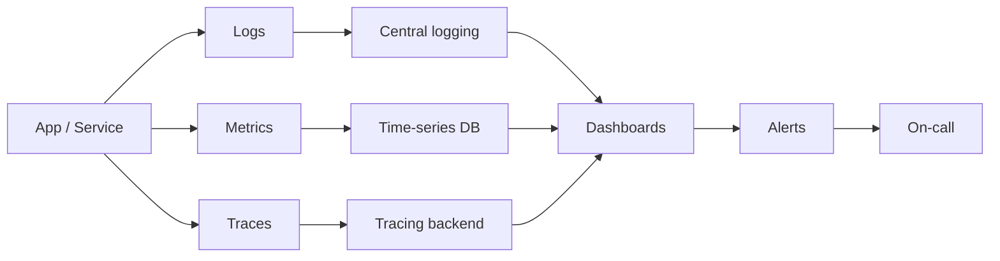

---

### 7) Feedback loops

DevOps strengthens feedback loops at multiple speeds:

- **Inner loop (seconds–minutes)**: local build/tests, lint, fast unit tests.
- **CI loop (minutes)**: automated pipeline checks on every change.
- **Pre-prod loop (hours)**: staging, integration tests, perf/security checks.
- **Prod loop (continuous)**: monitoring, alerts, error tracking, user analytics.

Goal:
- Detect problems **earlier**
- Learn from reality **faster**

Example feedback loop you can implement this week:
- PR checks: lint + unit tests
- After merge: build artifact + deploy to staging
- After deploy: run smoke tests automatically
- In prod: dashboard + alert for error rate spike

---

### 8) Automation mindset

Automate to reduce:
- **Toil**: repetitive, manual, low-value work.
- **Variation**: inconsistent steps that cause defects.
- **Latency**: waiting for humans or coordination.

Rules of thumb:
- If you do it **more than twice**, consider automating.
- If it’s **error-prone or high-impact**, automate with guardrails.

High-value automation targets (common):
- Build + test pipelines
- Environment creation (IaC)
- Deploy steps and rollback
- Release notes generation
- Evidence collection for audits (who approved what, which tests ran)

---

### 9) Collaboration model

Healthy DevOps collaboration:
- **Shared responsibility** for delivery and reliability.
- Teams have **clear ownership** (services, pipelines, runbooks).
- Platform/SRE functions **enable** teams with paved roads and self-service.

Common team models (choose based on org maturity):
- **Cross-functional product teams**: dev + QA + ops aligned to a product.
- **Platform team**: provides standard CI/CD templates, golden paths, and self-service infra.
- **SRE/Operations**: reliability engineering, incident management, performance.

Anti-pattern to avoid:
- Dev team optimizes for “features shipped”
- Ops team optimizes for “no changes”
- Result: conflict, slow releases, and hidden risk

---

### 10) Value stream overview

**Value stream**: the full chain from idea to real customer value.

You optimize by reducing:
- **Handoffs** (context loss)
- **Batch size** (big changes → big risk)
- **Queue time** (waiting dominates total time)
- **Rework loops** (late discovery of issues)

Value stream “current state” (typical):

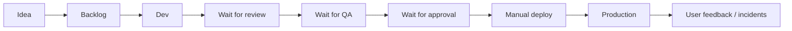

Value stream “better state” (DevOps):

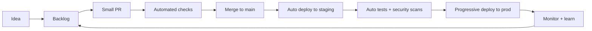

Value stream mapping table (work time vs wait time)

This is how you identify “where time is really lost”:

| Step | Work time (doing) | Wait time (queue) | Common improvements |
|---|---:|---:|---|
| Dev coding | 1–4 hours | 0–1 day | smaller tasks, clear AC |
| Code review | 15–60 min | 0–2 days | smaller PRs, review rotation |
| CI build/tests | 5–20 min | 0 | caching, parallel jobs |
| QA/regression | 30–180 min | 0–5 days | automate high-value tests |
| Security review | 15–90 min | 0–5 days | shift-left scans, policies |
| Deploy | 10–30 min | 0–7 days | automated deploy, remove windows |

Rule:
- You get the biggest lead-time wins by removing **queue time**, not by “typing faster”.

---

### Hands-on (Hour 1): Map DevOps lifecycle to a sample app

Sample app: **ShopEasy** (web frontend + API + database)

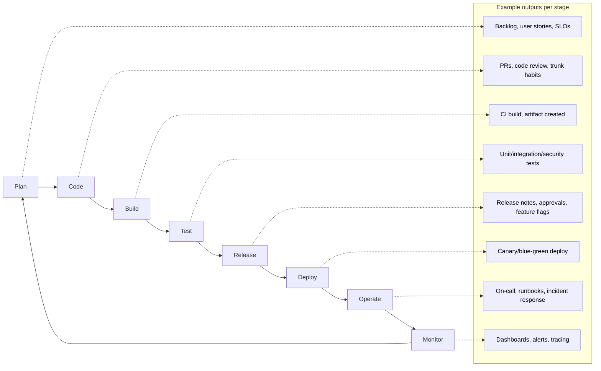

Quick “ShopEasy” example mapping (easy language):
- **Plan**: choose “Add coupon codes” + define success metric (increase conversions by 2%).
- **Code**: implement coupon validation + add unit tests.
- **Build**: create a container image `shopeasy-api:1.3.0`.
- **Test**: run unit + integration tests; scan dependencies.
- **Release**: write release notes; keep feature behind a flag.
- **Deploy**: canary release to 5% traffic.
- **Operate**: on-call knows rollback procedure.
- **Monitor**: watch error rate + checkout latency; then ramp to 100%.

Mini-checklist (Hour 1):
- Can I explain DevOps in 1–2 sentences?
- Can I explain the 4 key delivery metrics (lead time, deploy frequency, CFR, MTTR)?
- Can I draw the lifecycle loop from memory?

### Extra (Hour 1) — The “Three Ways” of DevOps (easy explanation)

Many DevOps books summarize DevOps into three core ideas:

1) **Flow**: make work move smoothly from idea → production (reduce queues and batch size).
2) **Feedback**: detect issues early and learn quickly (fast tests + fast monitoring).
3) **Continual learning**: improve the system continuously (experiments + blameless learning).

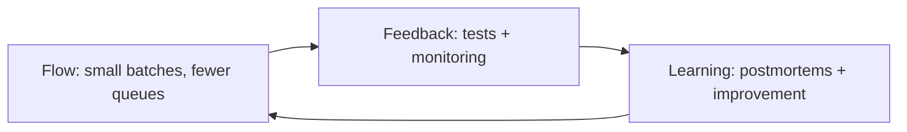

### Extra (Hour 1) — A realistic PR → Production flow (small change)

Example change: “Add coupon code input on checkout”.

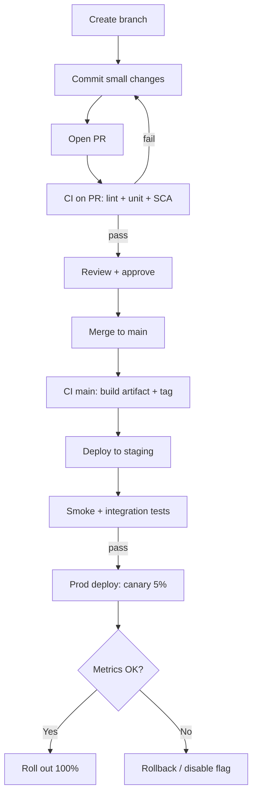

### Extra (Hour 1) — Delivery metrics formulas (so you can explain them clearly)

| Metric | Simple formula | Notes |
|---|---|---|
| Lead time | \(t_{prod} - t_{commit}\) | Use median/percentiles (p50/p95) to avoid outliers |
| Deploy frequency | deploys / time | Track trend weekly/monthly |
| Change failure rate | bad deploys / total deploys | Define “bad deploy” consistently (incident/hotfix/rollback) |
| MTTR | avg(restore time per incident) | Also track p95 to understand worst cases |

Practical tip:
- If you can’t measure it from tooling (Git + CI/CD + incident system), start with a simple spreadsheet for 2–4 weeks, then automate.

---

## Hour 2 — Dev vs DevOps + CALMS culture

### 1) Silos and handoffs

Traditional delivery often looks like:
- Dev builds features → hands off to QA → hands off to Ops → Ops deploys

Problems caused by silos:
- Slow feedback
- Context loss between handoffs
- “Throw it over the wall” behavior
- Late discovery of defects (expensive rework)

DevOps reduces these by aligning teams to outcomes (delivery + reliability).

Easy language perspective:
- Traditional model: “Dev finishes work when code is done.”
- DevOps model: “Work is done when users get value safely.”

---

### 2) Bottlenecks and queues

A **queue** forms when work arrives faster than it can be processed:
- Review queues
- QA queues
- Change approval queues
- Deployment window queues

Symptoms:
- PRs wait days
- Staging environments are always “busy”
- Releases happen rarely and are scary

Key idea:
- Most “slow delivery” is **waiting time**, not work time.

How to find bottlenecks quickly:
- List the steps from idea → prod.
- For each step, ask:
  - How long does it take when someone is actively working?
  - How long does it wait in a queue?
  - How often does it bounce back for rework?

Common bottlenecks and fast fixes (table):

| Bottleneck | What it looks like | Root cause (common) | Fixes that work |
|---|---|---|---|
| Code review queue | PRs wait days | Big PRs, few reviewers, unclear ownership | Smaller PRs, CODEOWNERS, reviewer rotation, review SLAs |
| QA queue | “Testing takes a week” | Manual regression, unstable env/test data | Test automation, stable test env, reduce E2E scope, contract tests |
| Environment bottleneck | “Staging is busy” | Shared envs, snowflake config | IaC, ephemeral env per PR, containerized dependencies |
| CAB/approval queue | Release waits for meeting | Manual policy | Policy-as-code + automated evidence, risk-based approvals |
| Manual deploy | Release is scary | Tribal steps, no standard | Standard pipeline, runbooks, automated rollback, progressive delivery |

Queue and flow picture (simple):

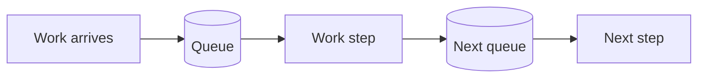

---

### 3–7) CALMS framework

**CALMS** is a way to structure DevOps improvements:

- **C — Culture**: trust, collaboration, shared responsibility.
- **A — Automation**: CI/CD, tests, infra, compliance evidence.
- **L — Lean**: small batches, remove waste, optimize flow.
- **M — Measurement**: DORA metrics, SLOs, actionable KPIs.
- **S — Sharing**: knowledge sharing, postmortems, inner source.

Use CALMS as a checklist:
- If you only buy tools (Automation) without Culture/Lean, results are limited.

CALMS in one picture:

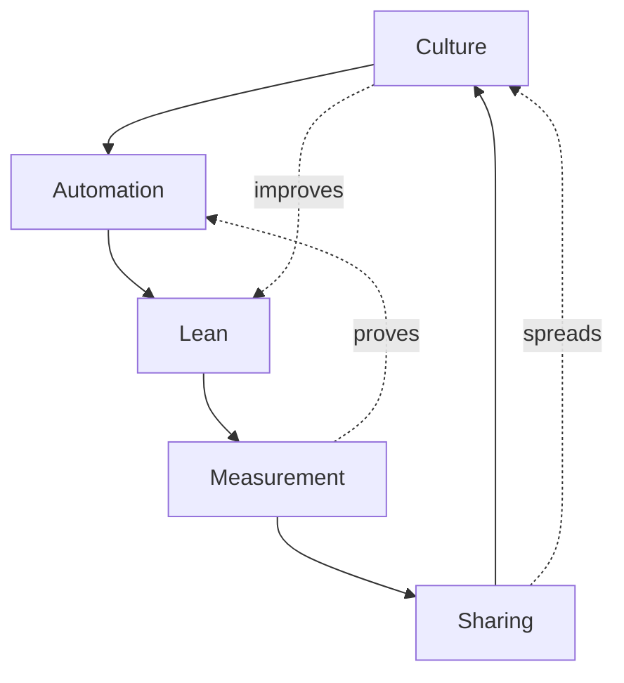

Concrete examples for each letter:
- **Culture**
  - Shared on-call rotation
  - Blameless postmortems
  - “Stop the line” when main is broken
- **Automation**
  - CI checks on every PR
  - One-click deploy
  - Automated rollback
- **Lean**
  - Smaller PRs
  - Limit WIP
  - Remove manual handoffs
- **Measurement**
  - DORA metrics tracked monthly
  - SLOs for key endpoints
  - Actionable alerts (not noisy)
- **Sharing**
  - Internal demos
  - Runbook knowledge base
  - Reusable templates

Quick “CALMS self-check” (yes/no):
- Do teams feel safe to report mistakes?
- Are builds and deploys mostly automated?
- Are changes small and frequent?
- Do you measure delivery + reliability outcomes?
- Does knowledge live in docs/templates, not only in people’s heads?

CALMS maturity rubric (simple scoring table)

Use this to assess where you are today (0–3):
- **0** = not present, **1** = basic, **2** = good, **3** = excellent

| Area | 0 | 1 | 2 | 3 |
|---|---|---|---|---|
| Culture | blame, silos | some collaboration | shared ownership | strong trust + learning culture |
| Automation | manual builds/deploys | some scripts | CI/CD standard | self-service + guardrails everywhere |
| Lean | big batches | smaller work sometimes | consistent small batches | flow optimized, minimal queues |
| Measurement | no metrics | basic dashboards | DORA+SLO tracked | metrics drive decisions consistently |
| Sharing | knowledge in heads | docs exist | templates + docs used | strong internal community + reuse |

---

### 8) Ownership and accountability

Healthy accountability:
- Teams own **outcomes** (uptime, latency, delivery speed), not just tasks.
- Platform/SRE provides **guardrails** and **self-service**, not gates.

Ownership model example:
- Product team owns: API service + dashboards + alerts + runbooks
- Platform team owns: CI/CD templates, cluster baseline, logging stack, secrets tooling
- Security helps define: scanning policies and risk controls, automated where possible

---

### 9) Blameless postmortems

A blameless postmortem is about improving systems, not punishing people.

Typical structure:
- Summary + impact
- Timeline
- Contributing factors (technical + process)
- What went well / what didn’t
- Action items with owners and due dates

Best practice:
- Actions should reduce recurrence via automation/guardrails (not “be more careful”).

Simple postmortem template (copy/paste style):
- **What happened**:
- **Impact** (users, revenue, SLA/SLO):
- **Timeline** (timestamps):
- **Root cause / contributing factors**:
- **Detection**: how did we notice?
- **Response**: what did we do?
- **Fix**: rollback or roll-forward?
- **Prevention actions** (each with owner + due date):

Example action items (good):
- Add a canary step for checkout service (owner: DevOps, due: Friday)
- Add an alert on “payment failures > 2% for 5 min” (owner: SRE, due: Wed)
- Add contract test between frontend and API (owner: team, due: next sprint)

Example action items (bad):
- “Be more careful next time”
- “QA should test harder”

Postmortem workflow (what happens after the incident)

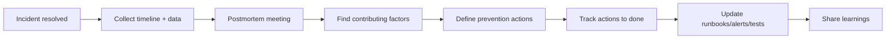

RACI-style ownership example (simple)

RACI meaning:
- **R** = Responsible (does the work)
- **A** = Accountable (owns the outcome)
- **C** = Consulted (gives input)
- **I** = Informed (kept in the loop)

| Activity | Product team | Platform team | Security | SRE/Ops |
|---|---|---|---|---|
| Build feature + unit tests | R/A | I | C | I |
| Maintain CI templates | C | R/A | C | I |
| Deploy to production | R/A (for their service) | C | I | C |
| Incident response | R | C | I | A/R (if centralized) |
| Postmortem + actions | R/A | C | C | C |
| Vulnerability policy | I | C | R/A | I |

Team topology (easy picture)

```mermaid
flowchart LR
  P[Product teams\n(own services)] -->|self-service| PL[Platform team\n(paved roads)]
  P -->|reliability help| S[SRE / Ops]
  P -->|risk guidance| SEC[Security]
  PL --> S
  PL --> SEC
```

---

### 10) Continuous improvement loop

Continuous improvement is a loop:
- Observe → measure → improve → standardize → repeat

Common improvement targets:
- Reduce flaky tests
- Reduce manual release steps
- Improve alert quality
- Reduce deploy time

Continuous improvement loop (practical):

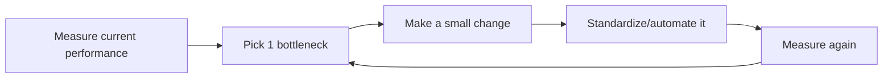

---

### Hands-on (Hour 2): Identify bottlenecks in a “traditional” flow

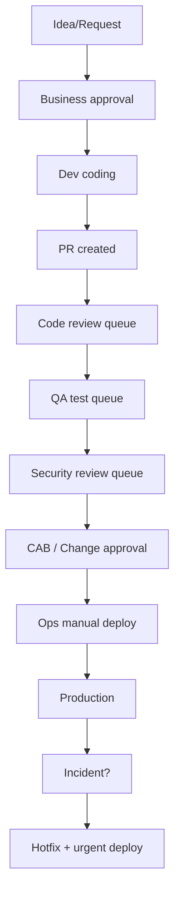

**Mark likely bottlenecks (examples):**
- **Code review queue**: few reviewers, large PRs, no review SLAs.
- **QA queue**: manual regression, environment constraints, unstable test data.
- **Security queue**: review happens too late; big findings block release.
- **CAB/Change approval**: batching and meeting schedules.
- **Manual deploy**: slow and error-prone; knowledge held by a few.

**Improvements (examples):**
- Smaller PRs + automated checks + reviewer rotation
- Automated regression + test pyramid + reliable staging
- Shift-left security: SAST/SCA/container scans in CI
- Replace CAB with policy-as-code + automated evidence
- Standard pipeline + push-button deploy + progressive delivery

Extra example (traditional vs DevOps, same change):
- Traditional: “Add new checkout field”
  - waits 2 days for QA, 3 days for CAB → deploy next week
- DevOps: small PR + tests + staging auto deploy + canary
  - ship in hours, with lower risk

---

## Hour 3 — CI/CD/CT (concepts)

### 1) CI definition and goals

**Continuous Integration (CI)** means integrating changes frequently into a shared branch and verifying them automatically.

CI goals:
- Catch integration issues early
- Keep main branch green
- Reduce “it works on my machine”
- Increase confidence to release anytime

Good CI behaviors:
- Small commits, frequent merges
- Fast builds
- Broken build = top priority fix

#### Continuous Testing (CT) — what it means

**Continuous Testing (CT)** means tests run **automatically and continuously** across the pipeline, so you get fast feedback about risk and quality.

CT examples (practical):
- On PR: lint + unit tests (fast feedback)
- After merge: integration tests (service + DB)
- Before prod: smoke tests + security scans
- In prod (yes, tests can run there too): synthetic checks (“checkout works” every 5 minutes)

CT goal:
- Make quality checks **routine**, not a last-minute scramble.

---

### 2) Build vs test stages

- **Build stage**: compile/package, dependency resolution, static checks, create artifact.
- **Test stage**: validate behavior (unit/integration/e2e) and quality (security/perf).

Pipeline principle:
- Run **fast, high-signal checks first**.

Example pipeline stage order (common):
- PR pipeline (fast):
  - lint → unit tests → build (or build first, depending on language)
  - dependency scan (SCA)
- Main pipeline (slower):
  - build artifact → integration tests → container scan → deploy staging → smoke tests

Quality gates (what must pass before production)

| Gate | What it prevents | Typical evidence |
|---|---|---|
| Build gate | broken builds, missing deps | successful build + artifact |
| Unit gate | obvious logic bugs | unit test report |
| Security gate | known vulnerable deps | SCA report, policy pass |
| Integration gate | service-to-service failures | integration test report |
| Deploy gate | broken deployments | successful staging deploy |
| Smoke gate | “service is down” | smoke test results |
| Observability gate | invisible failures | dashboards/alerts present |

Quality gate pipeline (diagram)

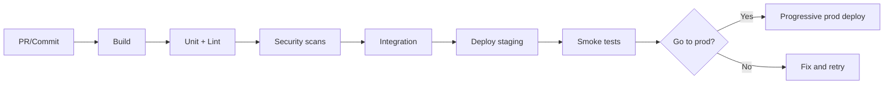

Test pyramid (simple):

```mermaid
flowchart TD
  U[Unit tests (many, fast)] --> I[Integration tests (some)]
  I --> E[E2E tests (few, slow)]
```

Detailed test types table (what to run and when)

| Test type | What it checks | Where it runs best | Typical speed | Example (ShopEasy) |
|---|---|---|---|---|
| Lint/format | code style, basic errors | PR | seconds | ESLint, flake8 |
| Unit tests | single function/module | PR | seconds–minutes | coupon validation rules |
| Integration tests | service + DB/queues | main/staging | minutes | API ↔ database checkout flow |
| Contract tests | API agreements between services | PR/main | minutes | frontend expects `/price` schema |
| E2E tests | full user journey | staging/nightly | slow | login → add cart → checkout |
| Performance tests | latency/throughput | staging | slow | 1000 req/s to checkout |
| Security scans (SAST/SCA) | code + dependencies | PR/main | minutes | vulnerable library detected |
| Container scan | image vulnerabilities | main | minutes | base image CVEs |
| Smoke tests | quick health checks | post-deploy | minutes | “/health returns 200” |
| Synthetic checks | production canary monitoring | prod | continuous | checkout works every 5 min |

Shift-left security in the pipeline (diagram)

```mermaid
flowchart LR
  A[Commit/PR] --> B[Lint + Unit]
  B --> C[SAST + SCA]
  C --> D[Build artifact]
  D --> E[Container scan]
  E --> F[Deploy staging]
  F --> G[Smoke + integration]
  G --> H[Prod deploy (progressive)]
```

---

### 3) Artifact concept

An **artifact** is the immutable output you deploy/promote:
- Container image
- JAR/WAR/ZIP
- Package (npm/pypi)

Best practice:
- **Build once, promote the same artifact** through environments.

Artifact example (container):
- Build: `shopeasy-api:1.3.0` (immutable)
- Deploy staging: same tag
- Deploy production: same tag
- Only config changes by environment (URLs, secrets, scaling)

Artifact versioning (easy table)

| Version type | Example | When to bump | Meaning |
|---|---|---|---|
| Semantic version (SemVer) | `1.3.0` | when you release a new version | **MAJOR.MINOR.PATCH** |
| Major | `2.0.0` | breaking API changes | old clients may break |
| Minor | `1.4.0` | new features (backward compatible) | safe additions |
| Patch | `1.3.1` | bug fixes | no new features |

Practical tagging advice (containers):
- Use **immutable tags** for deploys (example: `1.3.0` or git SHA like `a1b2c3d`).
- Avoid deploying `latest` (it changes and breaks traceability).
- Track which commit produced which artifact (build metadata).

---

### 4) CD (delivery) definition

**Continuous Delivery**: every change is kept in a deployable state; production deploy is a **business decision** (often a manual approval).

Easy language:
- The pipeline does everything needed to deploy.
- Humans decide *when* to press “deploy to prod”.

---

### 5) CD (deployment) definition

**Continuous Deployment**: every change that passes automated checks is automatically deployed to production.

Easy language:
- If it passes the pipeline, it goes live automatically.
- This requires very strong automation and rollback strategies.

---

### 6) Trunk-based CI habits

Trunk-based development typically means:
- Short-lived branches (hours–1 day)
- Frequent merges to main
- Feature flags for incomplete work
- Avoid long-running branches that cause merge conflicts

Branching picture (simple):

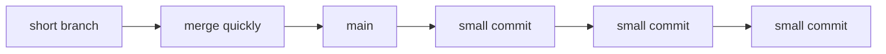

---

### 7) Feature flags concept

Feature flags separate **deploy** from **release**:
- Deploy code with feature OFF
- Enable gradually: internal → small cohort → full rollout

Flag hygiene:
- Owner + expiry date
- Remove stale flags
- Avoid complex “flag spaghetti”

Feature flag rollout example:
- Day 1: deploy code, flag OFF (0% users)
- Day 2: enable for internal staff (1%)
- Day 3: enable for 10% users (watch metrics)
- Day 4: enable for 100%, then delete the flag later

Feature flag lifecycle (important to avoid “flag debt”)

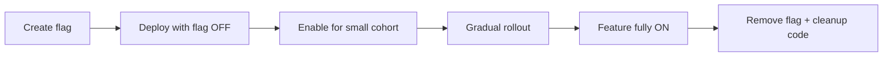

---

### 8) Rollback vs roll-forward

- **Rollback**: revert to the last known good version (fast, but can be tricky with DB migrations).
- **Roll-forward**: deploy a fix (preferred when changes are forward-only).

You should practice both:
- Test rollback paths
- Use safe migrations (expand/contract) when needed

DB example (why roll-forward is sometimes safer):
- You deploy code that writes to a new DB column.
- You also deploy a migration that adds the column.
- If you rollback code to an older version, it might still work, but if you removed/changed schema, rollback can break.

Safer approach (expand/contract):
- **Expand**: add new column, keep old column, write to both
- **Migrate**: backfill data
- **Switch**: read from new column
- **Contract**: remove old column later

Expand/contract migration flow (diagram)

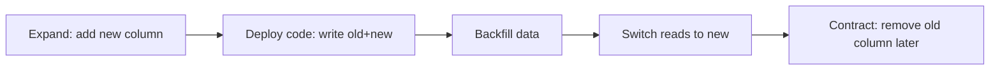

Rule of thumb:
- Only do the **contract** step after the new version is stable and all older versions are gone.

---

### 9) Environment promotion model

Common environments:
- dev → test → staging → prod

Promotion model:
- Same artifact promoted forward
- Config injected per environment at deploy time (not rebuilt)

Promotion diagram (artifact stays same):

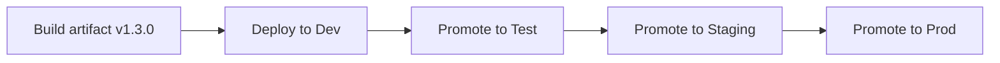

---

### 10) Release management vocabulary

- **Release**: making a version available to users.
- **Deploy**: installing a version into an environment.
- **Promotion**: moving a build/artifact to the next environment.
- **Canary**: deploy to a small subset of traffic first.
- **Blue/Green**: two prod environments; switch traffic.
- **Ring deployment**: internal → beta → GA.

Progressive delivery strategies (quick compare):
- **Rolling**: replace instances gradually
- **Blue/Green**: switch traffic between two environments
- **Canary**: route a small % of traffic to the new version first

Blue/Green (simple diagram):

```mermaid
flowchart TD
  U[Users] --> LB[Load balancer]
  LB --> BLUE[Blue: current prod]
  LB -. switch .-> GREEN[Green: new version]
```

Canary rollout with metric gate (diagram)

```mermaid
flowchart LR
  A[Deploy v1.3.0 to 5%] --> B{Metrics OK?}
  B -->|Yes| C[Increase to 25%]
  C --> D{Metrics OK?}
  D -->|Yes| E[Increase to 100%]
  D -->|No| F[Rollback or disable flag]
  B -->|No| F
```

Release strategies table (quick decision guide)

| Strategy | Best for | Pros | Cons |
|---|---|---|---|
| Rolling | simple services | easy, common | harder to instantly revert |
| Blue/Green | high safety | fast switch | needs extra capacity |
| Canary | risk reduction | catch issues early | needs good metrics + routing |
| Feature flags | controlled exposure | separate deploy vs release | adds complexity if not cleaned |

---

### Hands-on (Hour 3): CI vs CD vs deployment pipeline diagram

```mermaid
flowchart LR
  D[Developer commit] --> CI[CI: build + unit tests + lint]
  CI --> ART[Artifact stored (immutable)]
  ART --> CD1[CD: deploy to test/staging]
  CD1 --> CT[CT: continuous testing (integration/e2e/perf/security)]
  CT --> G{Gate}
  G -->|Continuous Delivery| MAN[Manual approval / business decision]
  MAN --> PROD[Deploy to production]
  G -->|Continuous Deployment| PROD

  PROD --> OBS[Observability + alerts]
  OBS --> FB[Feedback to backlog]
  FB --> D
```

Extra diagram: “fast PR checks” vs “full main pipeline”

```mermaid
flowchart LR
  subgraph PR[Pull Request Pipeline (fast)]
    A1[lint] --> A2[unit tests] --> A3[build] --> A4[SCA scan]
  end
  subgraph MAIN[Main Branch Pipeline (full)]
    B1[build artifact] --> B2[integration tests] --> B3[container scan] --> B4[deploy staging] --> B5[smoke tests]
  end
```

GitOps deployment flow (diagram)

```mermaid
flowchart LR
  A[Developer merges code] --> B[CI builds artifact]
  B --> C[Update deploy manifest in Git]
  C --> D[GitOps controller watches repo]
  D --> E[Sync desired state to cluster]
  E --> F[Deployment happens]
  F --> G[Monitor + alert]
```

GitOps promotion by PR (common real workflow)

Idea:
- One repo (or folder) per environment: `dev/`, `staging/`, `prod/`
- Promotion = a PR that updates the version in the next environment

```mermaid
flowchart LR
  A[CI builds artifact v1.3.0] --> B[PR: update dev manifest to v1.3.0]
  B --> C[Dev sync + tests]
  C --> D[PR: promote to staging]
  D --> E[Staging sync + tests]
  E --> F[PR: promote to prod]
  F --> G[Prod sync + monitor]
```

GitOps benefits (easy):
- You always know “what is deployed” by looking at Git history.
- Rollback is also a PR (revert manifest to previous version).

Mini-checklist (Hour 3):
- Can I explain CI vs Continuous Delivery vs Continuous Deployment?
- Can I explain what an artifact is and why “build once” matters?
- Can I draw a simple pipeline with stages from memory?

---

## Hour 4 — Agile/Scrum + toolchain overview

### 1) Agile principles summary

Agile emphasizes:
- Deliver value early and often
- Collaborate closely with stakeholders
- Respond to change
- Build quality in continuously

Agile + DevOps fit together because both favor:
- Small batches
- Fast feedback
- Continuous improvement

Easy language:
- Agile helps you choose the **right work** and deliver in increments.
- DevOps helps you deliver that work **safely and repeatedly**.

Agile vs DevOps (how they connect) — table

| Topic | Agile focus | DevOps focus | Together |
|---|---|---|---|
| Goal | deliver value iteratively | deliver safely and reliably | ship value quickly with low risk |
| Feedback | stakeholder/customer feedback | technical + operational feedback | full feedback loop (users + systems) |
| Cadence | sprints/continuous flow | continuous delivery/deployment | small batches end-to-end |
| Quality | Definition of Done | automation + observability | quality built-in from story to production |

---

### 2) Scrum roles

- **Product Owner (PO)**: owns prioritization and value; manages product backlog.
- **Scrum Master (SM)**: facilitates process, removes blockers, coaches the team.
- **Developers**: create the product increment (coding, testing, quality).

Common confusion (quick fix):
- “Developer” in Scrum means the people doing the work, not only programmers.

Scrum quick reference (table)

| Item | Purpose | Output |
|---|---|---|
| Product backlog | single source of “what’s next” | ordered list of work |
| Sprint backlog | work chosen for sprint | sprint goal + tasks |
| Sprint goal | focus for the sprint | 1 sentence goal |
| Increment | working, potentially shippable result | demo-able product slice |
| Definition of Done | quality bar | checklist for completion |

---

### 3) Scrum ceremonies

- **Sprint Planning**: define sprint goal and select backlog items.
- **Daily Scrum**: coordinate work and surface blockers.
- **Sprint Review**: demo increment and collect feedback.
- **Retrospective**: improve the team’s process and collaboration.

Simple ceremony outputs (what you should have after each):
- Planning: sprint goal + selected stories
- Daily: updated plan, blockers identified
- Review: stakeholder feedback captured
- Retro: 1–3 improvement actions agreed

---

### 4) Sprint backlog vs product backlog

- **Product backlog**: all desired work, ordered by priority.
- **Sprint backlog**: the subset selected for the sprint + plan for delivering it.

Example:
- Product backlog item: “Add coupon codes”
- Sprint backlog: “Create coupon schema”, “API validation”, “UI input”, “unit tests”, “staging rollout”

---

### 5) Definition of Done (DoD)

DoD is your team’s quality contract. Example DoD:
- Code reviewed and merged
- Unit tests added and passing
- CI pipeline green
- Security checks pass (SAST + dependency scan)
- Deployed to staging
- Basic observability added (key logs/metrics)
- Release notes updated

DoD vs Acceptance Criteria (AC):
- **AC**: what the feature must do (requirements)
- **DoD**: what quality steps must be completed for any work item

---

### 6) Estimation basics (story points)

Story points estimate **relative effort/complexity**, not time.
- Use them for planning and forecasting trends.
- Don’t use them to rank individual performance.

Easy example:
- Story A is “1 point” (small)
- Story B is “3 points” (about 3x bigger)
- After a few sprints, your team learns its typical capacity (velocity trend)

---

### 7) Kanban WIP limits

WIP limits reduce context switching and improve flow.

Example:
- To do (limit 10)
- In progress (limit 3)
- Review (limit 2)
- Testing (limit 2)
- Done

WIP limit example (why it works):
- If “In progress” limit is 3, the team finishes work before starting too much new work.
- This reduces half-done tasks and improves flow.

---

### 8) DevOps toolchain map (plan-code-build-test-release-operate-monitor)

```mermaid
flowchart LR
  P[Plan] --> C[Code] --> B[Build] --> T[Test] --> R[Release] --> D[Deploy] --> O[Operate] --> M[Monitor] --> P
```

Toolchain idea (easy language):
- Tools should make the loop **faster**, **safer**, and **more visible**.

Platform “golden path” (what good self-service looks like)

Easy idea:
- Developers should not beg for infrastructure or deployments.
- They should follow a standard path (templates + guardrails) that is fast and safe.

```mermaid
flowchart LR
  A[Dev uses service template] --> B[Repo created with CI/CD]
  B --> C[PR checks enforced]
  C --> D[Artifact built + stored]
  D --> E[Deploy via GitOps/CI]
  E --> F[Dashboards + alerts auto-created]
  F --> G[On-call + runbook linked]
```

Secrets management (simple, safe flow)

```mermaid
flowchart LR
  A[Secret stored in Vault/KMS] --> B[Access policy (least privilege)]
  B --> C[Workload identity / token]
  C --> D[App retrieves secret at runtime]
  D --> E[Secret rotation]
  E --> A
```

Config vs secrets (easy table)

| Item | Example | Where to store | Why |
|---|---|---|---|
| Config (non-secret) | feature toggle defaults, timeouts | config files / config maps | safe to share, versioned |
| Secret | DB password, API keys | secret manager (Vault/KMS) | access-controlled + audited |
| Environment-specific values | URLs, scaling limits | deploy-time config | same artifact across envs |

Compliance/audit evidence (what you should be able to prove)

```mermaid
flowchart TD
  A[PR approved] --> B[CI tests pass]
  B --> C[Artifact built + versioned]
  C --> D[Deploy recorded (who/when/what)]
  D --> E[Monitoring confirms healthy]
  E --> F[Audit trail available]
```

Toolchain by stage (detailed table)

| Stage | Purpose (easy) | Typical inputs | Typical outputs | What to measure |
|---|---|---|---|---|
| Plan | choose the right work | customer needs, incidents, roadmap | prioritized backlog, DoD/AC | cycle time trends, WIP |
| Code | implement safely | stories, designs | commits, PRs | PR size, review time |
| Build | create deployable artifact | source code, dependencies | artifact (image/package) | build time, cache hit rate |
| Test | reduce risk | artifact, test suites | pass/fail reports | test duration, flaky rate |
| Release | decide exposure | artifact, change notes | release notes, flags | approval time, rollout time |
| Deploy | ship to envs | artifact + config | running version | deploy success rate, deploy time |
| Operate | keep it running | alerts, runbooks | mitigations, stability | incident count, toil |
| Monitor | learn from reality | logs/metrics/traces | insights, alerts | SLO compliance, alert quality |

Environment types (simple table)

| Environment | Main purpose | Common risks | Good practices |
|---|---|---|---|
| Dev | fast experimentation | drift, “works locally only” | containers, consistent config |
| Test | automated verification | unstable test data | seeded data, isolated deps |
| Staging | production-like checks | expensive to maintain | IaC, parity with prod |
| Production | real users | incidents, data risk | progressive delivery, backups |

---

### 9) Common tool categories (what you actually need)

Pick tools by **capability** (category), then pick the product that fits your constraints.

- **SCM**: Git hosting, PR reviews, branch protections
- **CI**: pipelines, runners, caching, test reporting
- **Artifact repository**: container registry/package repo
- **IaC**: Terraform/Bicep/CloudFormation; config management
- **CD/GitOps**: deployment automation and promotion
- **Secrets**: Vault/KMS/secret managers; secret injection
- **Observability**: logs + metrics + traces + alerting
- **Security**: SAST, SCA, container scanning, policy-as-code
- **Collaboration**: chat, incident management, docs/wiki

Example mapping (one possible stack, vendor-neutral):
- SCM: Git + PR reviews
- CI: pipelines/runners
- Artifact: container registry
- IaC: infra templates + state management
- CD: automated deploy + promotion
- Secrets: secret store + rotation
- Observability: dashboards + alerts + tracing
- Security: scans in CI + policy checks
- Collaboration: docs + incident playbook

Tool categories with “must-have features” (table)

| Category | Must-have features | Why it matters |
|---|---|---|
| SCM | PR reviews, protected branches, audit trail | controls quality and traceability |
| CI | parallel jobs, caching, secure secrets | fast, secure feedback |
| Artifact repo | immutable versioning, retention | “build once, promote” |
| CD/GitOps | rollbacks, progressive delivery hooks | safer releases |
| IaC | repeatable infra, state management | no snowflake environments |
| Observability | dashboards, alert routing, tracing | faster MTTR |
| Secrets | rotation, access control, auditing | prevents leaks and incidents |
| Security | SAST/SCA scans, policies | reduces risk early |

---

### 10) Choosing tools by constraints (practical decision guide)

Use constraints to choose tools:
- **Team size/skills**: who can run/maintain self-hosted tooling?
- **Hosting**: cloud vs on-prem vs hybrid
- **Compliance**: audit trails, approvals, retention
- **Integration**: SSO, APIs, ecosystem compatibility
- **Reliability**: SLA, HA requirements, backup/restore
- **Cost**: license cost vs engineering time

Rule:
- Choose the **simplest** toolchain that enables **fast feedback** and **safe releases**.

Quick tool choice questions (use in real projects):
- Does it support **audit trails** and approvals (if required)?
- Can it run in your environment (cloud/on-prem)?
- Does it integrate with your SCM and identity/SSO?
- Can it scale without rewriting everything later?
- Can your team operate it reliably?

---

### Hands-on (Hour 4): Minimal toolchain checklist (small-team friendly)

#### Must-have (minimum viable DevOps)

- **Plan**
  - Backlog board (work items, priorities, owners)
  - Definition of Done (DoD) visible
- **Code**
  - Git repo + branch protections (require review + CI checks)
  - Code owners (or reviewer rotation)
- **Build/Test (CI)**
  - Pipeline on PRs and on merges to main
  - Lint + unit tests (fast)
  - Dependency scan (SCA)
  - Build artifact once; store in a registry/repo
- **Release/Deploy (CD)**
  - Automated deploy to staging
  - Promote the same artifact to production
  - Rollback procedure documented and tested
  - Optional: progressive delivery (canary/blue-green)
- **Operate/Monitor**
  - Central logs + dashboards
  - Alerts tied to user impact (error rate, latency, saturation)
  - On-call rotation + basic runbooks
- **Security & governance (baseline)**
  - Secrets managed (no secrets in repo)
  - Least privilege access for CI/CD
  - Audit trail for deployments
- **Collaboration**
  - Incident channel + postmortem template
  - Shared documentation space

#### Example minimal end-to-end flow

```mermaid
flowchart TD
  A[Story selected] --> B[Branch/commit]
  B --> C[PR opened]
  C --> D[CI: lint + unit + SCA]
  D -->|pass| E[Review + merge]
  D -->|fail| B
  E --> F[CI main: build artifact + tag]
  F --> G[Deploy to staging]
  G --> H[Smoke/integration tests]
  H -->|pass| I[Promote same artifact to prod]
  H -->|fail| J[Fix forward]
  I --> K[Monitor dashboards + alerts]
  K --> L[Feedback to backlog]
```

Extra diagram: Incident response loop (Operate/Monitor in action)

```mermaid
flowchart LR
  A[Alert triggers] --> B[Triage]
  B --> C[Mitigate (rollback / scale / disable flag)]
  C --> D[Restore service]
  D --> E[Postmortem]
  E --> F[Prevent recurrence (automation/guardrails)]
  F --> G[Update runbooks + dashboards]
  G --> H[Back to normal]
```

IaC workflow (diagram) — how infra changes safely

```mermaid
flowchart LR
  A[Change IaC code] --> B[PR + review]
  B --> C[Plan (preview changes)]
  C --> D{Approve?}
  D -->|Yes| E[Apply]
  E --> F[Infra updated]
  F --> G[Monitor + validate]
  D -->|No| H[Fix IaC + retry]
```

Incident severity (simple table)

| Severity | User impact | Example | Expected response |
|---|---|---|---|
| Sev 1 | major outage / revenue stop | checkout down | immediate, all-hands, updates every 15–30 min |
| Sev 2 | partial outage / serious degradation | payments slow, errors rising | respond fast, mitigate within hours |
| Sev 3 | limited impact | one region affected | fix in normal on-call window |
| Sev 4 | minor issue | small bug, workaround exists | schedule in backlog |

Incident roles (simple)
- **Incident commander**: coordinates the response and communication
- **Responder(s)**: investigate and apply fixes
- **Comms**: updates stakeholders/users (if needed)
- **Scribe**: timeline notes for postmortem

Mini-checklist (Hour 4):
- Can I explain Scrum roles and ceremonies simply?
- Do I know the difference between AC and DoD?
- Can I map tool categories to Plan→Monitor?
- Can I describe a minimal pipeline from PR to production?

---

## Quick glossary (fast recall)

- **CI**: integrate frequently + automated checks.
- **Continuous Delivery**: always deployable; prod release may be manual.
- **Continuous Deployment**: prod deploy is automatic after checks pass.
- **Artifact**: immutable build output promoted across environments.
- **Lead time**: time from change to running in production.
- **Deployment frequency**: how often you deploy.
- **Change failure rate**: deployments that cause incidents/hotfixes/rollback.
- **MTTR**: time to restore after a failure.
- **Feature flag**: deploy code safely; release separately via toggles.
- **Canary**: roll out to small traffic first to reduce risk.

