# Retail Store Operations Platform - CI/CD Automation & Release Management

## Project Introduction

This initiative was delivered in the retail store operations space to create an end-to-end DevOps model around point-of-sale stability, inventory reconciliation, and store fulfillment. Before modernization, teams faced avoidable delays from manual handoffs, uneven environment controls, and limited release traceability. The project therefore focused on building a dependable, auditable delivery lifecycle that improved throughput without sacrificing reliability.

The implementation blueprint used Azure DevOps, AKS, ACR, Terraform, Helm as the core stack, supported by governance decisions tailored to release windows around store opening/closing hours. Practical emphasis was placed on environment strategy, release controls, incident readiness, and measurable service performance so the model remained sustainable after initial rollout.

## DevOps Project Flow Structure

### 1. Business Context and Objectives
This phase converted strategic goals into measurable operational outcomes for retail store operations. Rather than focusing only on speed, leadership prioritized predictable releases, reduced incident frequency, and transparent service ownership.

Business objectives were benchmarked against current pain points in point-of-sale stability, inventory reconciliation, and store fulfillment
### Detailed Module Notes

This module is designed to **set measurable business outcomes** for the point-of-sale stability, inventory reconciliation, and store fulfillment landscape so execution remains auditable and predictable across delivery cycles. Typical inputs include demand forecasts, KPI baselines, customer pain themes, and the expected outputs are decision-ready records, approved actions, and operational evidence that can be reused by engineering and support teams.

Key activities include dependency walkthroughs, workflow hardening, control-point verification, and readiness reviews with product, platform, security, and SRE ownership clearly separated. Tooling usually spans Git/Azure DevOps workflows, CI/CD orchestrators, Terraform/Helm or equivalent automation, registry/policy scanners, and observability platforms mapped to named owners.

Quality and security controls focus on peer-review enforcement, policy-as-code checks, vulnerability and secret detection, approval gates, and traceable test/sign-off artifacts before promotion. Primary risks are timeline compression, cross-team handoff gaps, hidden dependency drift, and weak rollback preparation; mitigations include explicit RACI coverage, pre-approved fallback runbooks, release rehearsal, and tighter change-window governance. Expected deliverables from this module are a outcome charter with target metrics, updated runbooks, measurable KPI/SLO checkpoints, and improvement actions linked to business impact.

### 2. Scope, Stakeholders, and Delivery Model
Execution used a federated model where domain teams delivered features while platform teams enforced common controls. Early role clarity reduced delays in change approvals, incident escalations, and post-release support transitions.

Stakeholder decisions in this phase were checked against release windows around store opening/closing hours to avoid late governance conflicts.
### Detailed Module Notes

This module is designed to **define decision rights and operating boundaries** for the point-of-sale stability, inventory reconciliation, and store fulfillment landscape so execution remains auditable and predictable across delivery cycles. Typical inputs include team capacity maps, stakeholder matrix, dependency register, and the expected outputs are decision-ready records, approved actions, and operational evidence that can be reused by engineering and support teams.

Key activities include dependency walkthroughs, workflow hardening, control-point verification, and readiness reviews with product, platform, security, and SRE ownership clearly separated. Tooling usually spans Git/Azure DevOps workflows, CI/CD orchestrators, Terraform/Helm or equivalent automation, registry/policy scanners, and observability platforms mapped to named owners.

Quality and security controls focus on peer-review enforcement, policy-as-code checks, vulnerability and secret detection, approval gates, and traceable test/sign-off artifacts before promotion. Primary risks are timeline compression, cross-team handoff gaps, hidden dependency drift, and weak rollback preparation; mitigations include explicit RACI coverage, pre-approved fallback runbooks, release rehearsal, and tighter change-window governance. Expected deliverables from this module are a RACI, cadence plan, and escalation map, updated runbooks, measurable KPI/SLO checkpoints, and improvement actions linked to business impact.

### 3. Architecture and Technology Baseline
This stage defined the foundational stack and technical constraints needed for predictable operations. The architecture centered on Azure DevOps, AKS, ACR, Terraform, Helm, with explicit guidance for reliability, security, and observability integration.

Architecture choices were stress-tested for maintainability and operational supportability in the retail store operations context.
### Detailed Module Notes

This module is designed to **lock the reference architecture and integration contracts** for the point-of-sale stability, inventory reconciliation, and store fulfillment landscape so execution remains auditable and predictable across delivery cycles. Typical inputs include non-functional requirements, integration constraints, regulatory needs, and the expected outputs are decision-ready records, approved actions, and operational evidence that can be reused by engineering and support teams.

Key activities include dependency walkthroughs, workflow hardening, control-point verification, and readiness reviews with product, platform, security, and SRE ownership clearly separated. Tooling usually spans Git/Azure DevOps workflows, CI/CD orchestrators, Terraform/Helm or equivalent automation, registry/policy scanners, and observability platforms mapped to named owners.

Quality and security controls focus on peer-review enforcement, policy-as-code checks, vulnerability and secret detection, approval gates, and traceable test/sign-off artifacts before promotion. Primary risks are timeline compression, cross-team handoff gaps, hidden dependency drift, and weak rollback preparation; mitigations include explicit RACI coverage, pre-approved fallback runbooks, release rehearsal, and tighter change-window governance. Expected deliverables from this module are a architecture baseline and approved technology guardrails, updated runbooks, measurable KPI/SLO checkpoints, and improvement actions linked to business impact.

### 4. Environment Strategy and Promotion Path
Environment segmentation was formalized across Dev, QA, UAT, Pre-Prod, and Prod, each with isolated credentials and policy boundaries. Promotion relied on immutable artifacts so release confidence increased as builds moved downstream.

Promotion criteria included readiness checks tied to point-of-sale stability, inventory reconciliation, and store fulfillment before release approval.
### Detailed Module Notes

This module is designed to **standardize environment promotion and readiness checks** for the point-of-sale stability, inventory reconciliation, and store fulfillment landscape so execution remains auditable and predictable across delivery cycles. Typical inputs include environment configs, test evidence, release windows, and the expected outputs are decision-ready records, approved actions, and operational evidence that can be reused by engineering and support teams.

Key activities include dependency walkthroughs, workflow hardening, control-point verification, and readiness reviews with product, platform, security, and SRE ownership clearly separated. Tooling usually spans Git/Azure DevOps workflows, CI/CD orchestrators, Terraform/Helm or equivalent automation, registry/policy scanners, and observability platforms mapped to named owners.

Quality and security controls focus on peer-review enforcement, policy-as-code checks, vulnerability and secret detection, approval gates, and traceable test/sign-off artifacts before promotion. Primary risks are timeline compression, cross-team handoff gaps, hidden dependency drift, and weak rollback preparation; mitigations include explicit RACI coverage, pre-approved fallback runbooks, release rehearsal, and tighter change-window governance. Expected deliverables from this module are a promotion matrix and immutable deployment policy, updated runbooks, measurable KPI/SLO checkpoints, and improvement actions linked to business impact.

### 5. Source Control, Branching, and Code Quality
Source control standards introduced protected branches, reviewer accountability, and automated merge validation. Teams shifted defect detection earlier by enforcing linting, unit tests, and dependency checks pre-merge.

Code review policies were tuned for retail store operations teams to sustain engineering flow while preserving strict quality expectations.
### Detailed Module Notes

This module is designed to **improve code quality through governed collaboration** for the point-of-sale stability, inventory reconciliation, and store fulfillment landscape so execution remains auditable and predictable across delivery cycles. Typical inputs include branch naming rules, PR templates, quality thresholds, and the expected outputs are decision-ready records, approved actions, and operational evidence that can be reused by engineering and support teams.

Key activities include dependency walkthroughs, workflow hardening, control-point verification, and readiness reviews with product, platform, security, and SRE ownership clearly separated. Tooling usually spans Git/Azure DevOps workflows, CI/CD orchestrators, Terraform/Helm or equivalent automation, registry/policy scanners, and observability platforms mapped to named owners.

Quality and security controls focus on peer-review enforcement, policy-as-code checks, vulnerability and secret detection, approval gates, and traceable test/sign-off artifacts before promotion. Primary risks are timeline compression, cross-team handoff gaps, hidden dependency drift, and weak rollback preparation; mitigations include explicit RACI coverage, pre-approved fallback runbooks, release rehearsal, and tighter change-window governance. Expected deliverables from this module are a branch governance guide and merge-quality scorecard, updated runbooks, measurable KPI/SLO checkpoints, and improvement actions linked to business impact.

### 6. CI Pipeline Design and Build Automation
This phase established reusable CI templates that enforced consistent build, test, and packaging behavior across repositories. Traceability improved through standardized artifact tagging linked to commit and pipeline run context.

CI validation included targeted checks relevant to point-of-sale stability, inventory reconciliation, and store fulfillment, improving confidence before artifact publication.
### Detailed Module Notes

This module is designed to **build fast, reliable CI with reusable templates** for the point-of-sale stability, inventory reconciliation, and store fulfillment landscape so execution remains auditable and predictable across delivery cycles. Typical inputs include repo triggers, build scripts, test suites, and the expected outputs are decision-ready records, approved actions, and operational evidence that can be reused by engineering and support teams.

Key activities include dependency walkthroughs, workflow hardening, control-point verification, and readiness reviews with product, platform, security, and SRE ownership clearly separated. Tooling usually spans Git/Azure DevOps workflows, CI/CD orchestrators, Terraform/Helm or equivalent automation, registry/policy scanners, and observability platforms mapped to named owners.

Quality and security controls focus on peer-review enforcement, policy-as-code checks, vulnerability and secret detection, approval gates, and traceable test/sign-off artifacts before promotion. Primary risks are timeline compression, cross-team handoff gaps, hidden dependency drift, and weak rollback preparation; mitigations include explicit RACI coverage, pre-approved fallback runbooks, release rehearsal, and tighter change-window governance. Expected deliverables from this module are a versioned pipeline templates and traceable artifacts, updated runbooks, measurable KPI/SLO checkpoints, and improvement actions linked to business impact.

### 7. Containerization and Artifact Governance
Artifact governance removed ambiguity from release packaging by defining ownership, validation steps, and retention lifecycles. Images were treated as audited release assets rather than temporary pipeline byproducts.

Artifact handling standards for retail store operations releases considered rollback speed and traceability expectations from production support teams.
### Detailed Module Notes

This module is designed to **govern images/artifacts as production assets** for the point-of-sale stability, inventory reconciliation, and store fulfillment landscape so execution remains auditable and predictable across delivery cycles. Typical inputs include base image policy, SBOM, signing keys, and the expected outputs are decision-ready records, approved actions, and operational evidence that can be reused by engineering and support teams.

Key activities include dependency walkthroughs, workflow hardening, control-point verification, and readiness reviews with product, platform, security, and SRE ownership clearly separated. Tooling usually spans Git/Azure DevOps workflows, CI/CD orchestrators, Terraform/Helm or equivalent automation, registry/policy scanners, and observability platforms mapped to named owners.

Quality and security controls focus on peer-review enforcement, policy-as-code checks, vulnerability and secret detection, approval gates, and traceable test/sign-off artifacts before promotion. Primary risks are timeline compression, cross-team handoff gaps, hidden dependency drift, and weak rollback preparation; mitigations include explicit RACI coverage, pre-approved fallback runbooks, release rehearsal, and tighter change-window governance. Expected deliverables from this module are a artifact trust chain and retention/rollback policy, updated runbooks, measurable KPI/SLO checkpoints, and improvement actions linked to business impact.

### 8. Infrastructure as Code and Platform Provisioning
Infrastructure provisioning shifted from manual portal operations to reviewed, versioned IaC modules. Plan outputs were validated during pull requests, creating a safer and more transparent change process.

IaC ownership boundaries were documented clearly in the retail store operations operating model to reduce ambiguity between platform and product squads.
### Detailed Module Notes

This module is designed to **deliver repeatable provisioning through IaC** for the point-of-sale stability, inventory reconciliation, and store fulfillment landscape so execution remains auditable and predictable across delivery cycles. Typical inputs include module catalogs, remote state, policy bundles, and the expected outputs are decision-ready records, approved actions, and operational evidence that can be reused by engineering and support teams.

Key activities include dependency walkthroughs, workflow hardening, control-point verification, and readiness reviews with product, platform, security, and SRE ownership clearly separated. Tooling usually spans Git/Azure DevOps workflows, CI/CD orchestrators, Terraform/Helm or equivalent automation, registry/policy scanners, and observability platforms mapped to named owners.

Quality and security controls focus on peer-review enforcement, policy-as-code checks, vulnerability and secret detection, approval gates, and traceable test/sign-off artifacts before promotion. Primary risks are timeline compression, cross-team handoff gaps, hidden dependency drift, and weak rollback preparation; mitigations include explicit RACI coverage, pre-approved fallback runbooks, release rehearsal, and tighter change-window governance. Expected deliverables from this module are a approved IaC modules and provisioned platform baseline, updated runbooks, measurable KPI/SLO checkpoints, and improvement actions linked to business impact.

### 9. Deployment Orchestration and Release Controls
Deployment controls were designed around blast-radius reduction and recovery speed. Teams formalized rollback criteria and verification checkpoints before a release was declared successful.

Release controls reflected both technical risk and business timing constraints associated with release windows around store opening/closing hours.
### Detailed Module Notes

This module is designed to **control deployments with risk-aware promotion** for the point-of-sale stability, inventory reconciliation, and store fulfillment landscape so execution remains auditable and predictable across delivery cycles. Typical inputs include deployment manifests, change tickets, validation checks, and the expected outputs are decision-ready records, approved actions, and operational evidence that can be reused by engineering and support teams.

Key activities include dependency walkthroughs, workflow hardening, control-point verification, and readiness reviews with product, platform, security, and SRE ownership clearly separated. Tooling usually spans Git/Azure DevOps workflows, CI/CD orchestrators, Terraform/Helm or equivalent automation, registry/policy scanners, and observability platforms mapped to named owners.

Quality and security controls focus on peer-review enforcement, policy-as-code checks, vulnerability and secret detection, approval gates, and traceable test/sign-off artifacts before promotion. Primary risks are timeline compression, cross-team handoff gaps, hidden dependency drift, and weak rollback preparation; mitigations include explicit RACI coverage, pre-approved fallback runbooks, release rehearsal, and tighter change-window governance. Expected deliverables from this module are a promotion evidence pack with go/no-go records, updated runbooks, measurable KPI/SLO checkpoints, and improvement actions linked to business impact.

### 10. Security, Compliance, and Secrets Management
The security model combined preventive controls and detective monitoring to catch issues early. Teams enforced secret rotation, dependency hygiene, and hardened runtime baselines as standard practice.

Security controls in this project addressed data exposure and privilege risks common in point-of-sale stability, inventory reconciliation, and store fulfillment.
### Detailed Module Notes

This module is designed to **embed security/compliance controls in the path** for the point-of-sale stability, inventory reconciliation, and store fulfillment landscape so execution remains auditable and predictable across delivery cycles. Typical inputs include threat model, secret inventory, control catalog, and the expected outputs are decision-ready records, approved actions, and operational evidence that can be reused by engineering and support teams.

Key activities include dependency walkthroughs, workflow hardening, control-point verification, and readiness reviews with product, platform, security, and SRE ownership clearly separated. Tooling usually spans Git/Azure DevOps workflows, CI/CD orchestrators, Terraform/Helm or equivalent automation, registry/policy scanners, and observability platforms mapped to named owners.

Quality and security controls focus on peer-review enforcement, policy-as-code checks, vulnerability and secret detection, approval gates, and traceable test/sign-off artifacts before promotion. Primary risks are timeline compression, cross-team handoff gaps, hidden dependency drift, and weak rollback preparation; mitigations include explicit RACI coverage, pre-approved fallback runbooks, release rehearsal, and tighter change-window governance. Expected deliverables from this module are a control evidence archive and remediation backlog, updated runbooks, measurable KPI/SLO checkpoints, and improvement actions linked to business impact.

### 11. Observability, Monitoring, and SLO Management
SLO-driven monitoring practices were introduced to track reliability commitments objectively. Alert thresholds, notification routes, and escalation definitions were tuned through iterative production feedback.

Dashboards and alerts were tuned around the reliability indicators that matter most for retail store operations.
### Detailed Module Notes

This module is designed to **convert telemetry into actionable reliability signals** for the point-of-sale stability, inventory reconciliation, and store fulfillment landscape so execution remains auditable and predictable across delivery cycles. Typical inputs include metrics/logs/traces, SLO targets, alert policies, and the expected outputs are decision-ready records, approved actions, and operational evidence that can be reused by engineering and support teams.

Key activities include dependency walkthroughs, workflow hardening, control-point verification, and readiness reviews with product, platform, security, and SRE ownership clearly separated. Tooling usually spans Git/Azure DevOps workflows, CI/CD orchestrators, Terraform/Helm or equivalent automation, registry/policy scanners, and observability platforms mapped to named owners.

Quality and security controls focus on peer-review enforcement, policy-as-code checks, vulnerability and secret detection, approval gates, and traceable test/sign-off artifacts before promotion. Primary risks are timeline compression, cross-team handoff gaps, hidden dependency drift, and weak rollback preparation; mitigations include explicit RACI coverage, pre-approved fallback runbooks, release rehearsal, and tighter change-window governance. Expected deliverables from this module are a service dashboards, alert routing, and SLO reviews, updated runbooks, measurable KPI/SLO checkpoints, and improvement actions linked to business impact.

### 12. Incident Response and Production Support Workflow
Incident management was standardized across detection, triage, containment, mitigation, communication, and closure. On-call playbooks clarified who acts, when escalation occurs, and how rollback decisions are made.

Incident escalation pathways were rehearsed with scenarios typical to point-of-sale stability, inventory reconciliation, and store fulfillment and peak-load behavior.
### Detailed Module Notes

This module is designed to **reduce incident MTTR through clear response flow** for the point-of-sale stability, inventory reconciliation, and store fulfillment landscape so execution remains auditable and predictable across delivery cycles. Typical inputs include alert payloads, runbooks, severity rubric, and the expected outputs are decision-ready records, approved actions, and operational evidence that can be reused by engineering and support teams.

Key activities include dependency walkthroughs, workflow hardening, control-point verification, and readiness reviews with product, platform, security, and SRE ownership clearly separated. Tooling usually spans Git/Azure DevOps workflows, CI/CD orchestrators, Terraform/Helm or equivalent automation, registry/policy scanners, and observability platforms mapped to named owners.

Quality and security controls focus on peer-review enforcement, policy-as-code checks, vulnerability and secret detection, approval gates, and traceable test/sign-off artifacts before promotion. Primary risks are timeline compression, cross-team handoff gaps, hidden dependency drift, and weak rollback preparation; mitigations include explicit RACI coverage, pre-approved fallback runbooks, release rehearsal, and tighter change-window governance. Expected deliverables from this module are a incident timeline, comms log, and recovery actions, updated runbooks, measurable KPI/SLO checkpoints, and improvement actions linked to business impact.

### 13. Performance, Scalability, and Cost Optimization
Teams established a recurring optimization rhythm covering right-sizing, storage lifecycle tuning, and compute utilization review. FinOps dashboards made cost-performance tradeoffs visible to both engineers and managers.

Capacity and spend decisions for retail store operations workloads were reviewed together so resilience goals did not create avoidable cloud waste.
### Detailed Module Notes

This module is designed to **optimize performance and cloud cost together** for the point-of-sale stability, inventory reconciliation, and store fulfillment landscape so execution remains auditable and predictable across delivery cycles. Typical inputs include capacity trends, load-test output, cost reports, and the expected outputs are decision-ready records, approved actions, and operational evidence that can be reused by engineering and support teams.

Key activities include dependency walkthroughs, workflow hardening, control-point verification, and readiness reviews with product, platform, security, and SRE ownership clearly separated. Tooling usually spans Git/Azure DevOps workflows, CI/CD orchestrators, Terraform/Helm or equivalent automation, registry/policy scanners, and observability platforms mapped to named owners.

Quality and security controls focus on peer-review enforcement, policy-as-code checks, vulnerability and secret detection, approval gates, and traceable test/sign-off artifacts before promotion. Primary risks are timeline compression, cross-team handoff gaps, hidden dependency drift, and weak rollback preparation; mitigations include explicit RACI coverage, pre-approved fallback runbooks, release rehearsal, and tighter change-window governance. Expected deliverables from this module are a tuning actions with cost-benefit tracking, updated runbooks, measurable KPI/SLO checkpoints, and improvement actions linked to business impact.

### 14. Documentation, Enablement, and Operating Model
Operating model maturity improved through recurring training sessions and cross-team walkthroughs. Shared documentation reduced dependence on individual subject-matter experts during critical events.

Documentation from this stage was written to be actionable for retail store operations handovers, not just for compliance archives.
### Detailed Module Notes

This module is designed to **institutionalize knowledge for sustained operations** for the point-of-sale stability, inventory reconciliation, and store fulfillment landscape so execution remains auditable and predictable across delivery cycles. Typical inputs include SOP drafts, onboarding gaps, support feedback, and the expected outputs are decision-ready records, approved actions, and operational evidence that can be reused by engineering and support teams.

Key activities include dependency walkthroughs, workflow hardening, control-point verification, and readiness reviews with product, platform, security, and SRE ownership clearly separated. Tooling usually spans Git/Azure DevOps workflows, CI/CD orchestrators, Terraform/Helm or equivalent automation, registry/policy scanners, and observability platforms mapped to named owners.

Quality and security controls focus on peer-review enforcement, policy-as-code checks, vulnerability and secret detection, approval gates, and traceable test/sign-off artifacts before promotion. Primary risks are timeline compression, cross-team handoff gaps, hidden dependency drift, and weak rollback preparation; mitigations include explicit RACI coverage, pre-approved fallback runbooks, release rehearsal, and tighter change-window governance. Expected deliverables from this module are a living runbooks, training pack, and ownership model, updated runbooks, measurable KPI/SLO checkpoints, and improvement actions linked to business impact.

### 15. Outcomes, Metrics, and Continuous Improvement
The project concluded with a structured benefits review and a prioritized backlog for next-step optimization. Continuous improvement was embedded as a standing practice across delivery and support teams.

The improvement backlog for retail store operations services was prioritized by measurable impact and implementation effort to sustain momentum post-launch.
### Detailed Module Notes

This module is designed to **close delivery loops with measurable improvements** for the point-of-sale stability, inventory reconciliation, and store fulfillment landscape so execution remains auditable and predictable across delivery cycles. Typical inputs include release metrics, incident learnings, technical debt list, and the expected outputs are decision-ready records, approved actions, and operational evidence that can be reused by engineering and support teams.

Key activities include dependency walkthroughs, workflow hardening, control-point verification, and readiness reviews with product, platform, security, and SRE ownership clearly separated. Tooling usually spans Git/Azure DevOps workflows, CI/CD orchestrators, Terraform/Helm or equivalent automation, registry/policy scanners, and observability platforms mapped to named owners.

Quality and security controls focus on peer-review enforcement, policy-as-code checks, vulnerability and secret detection, approval gates, and traceable test/sign-off artifacts before promotion. Primary risks are timeline compression, cross-team handoff gaps, hidden dependency drift, and weak rollback preparation; mitigations include explicit RACI coverage, pre-approved fallback runbooks, release rehearsal, and tighter change-window governance. Expected deliverables from this module are a quarterly improvement roadmap and value summary, updated runbooks, measurable KPI/SLO checkpoints, and improvement actions linked to business impact.

## Visual Flow Diagrams

### End-to-End Retail DevOps Lifecycle
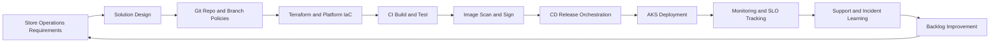

### CI Pipeline Validation Flow
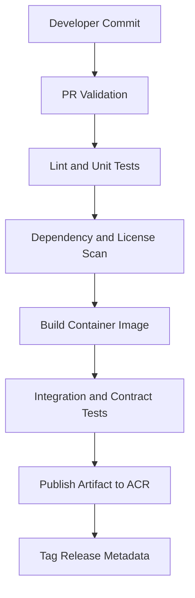

### Release Promotion and Rollback Governance
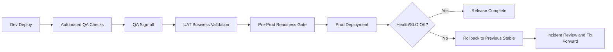

### Store Incident Response Lifecycle
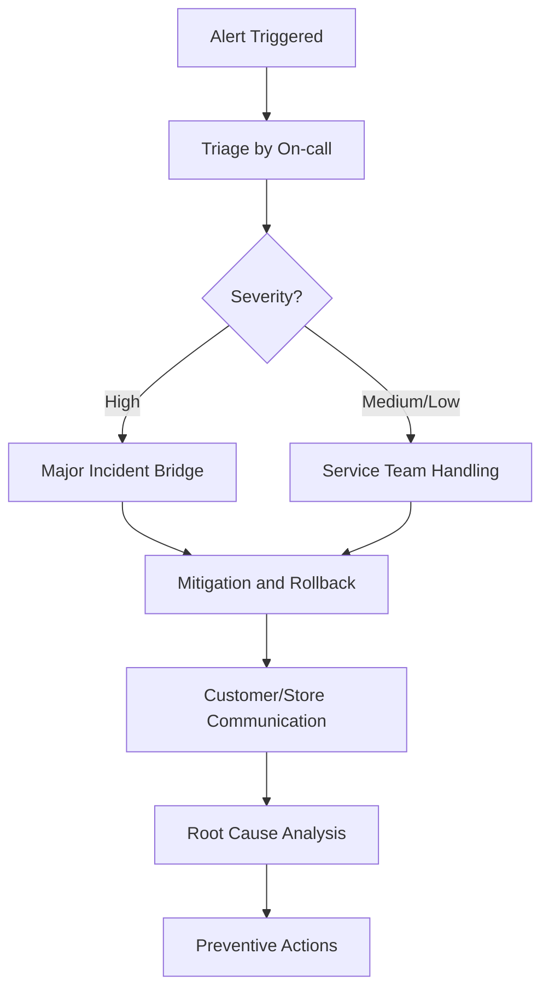

### DevSecOps Control Gates
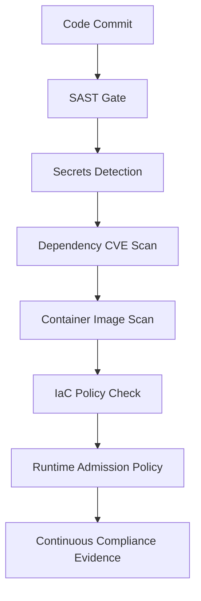

## Additional Advanced Diagrams

### Deployment Coordination Sequence
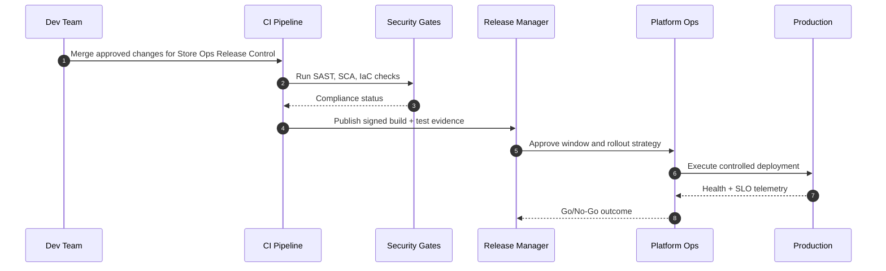

### Release and Incident State Lifecycle
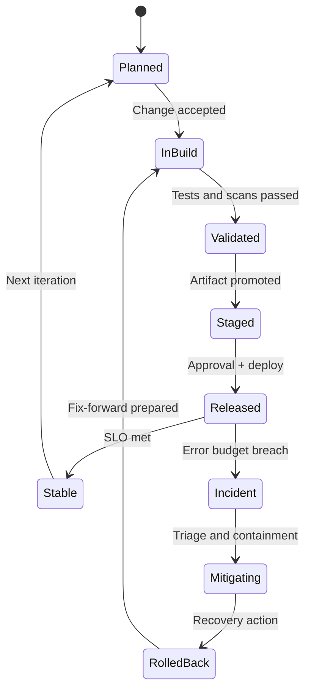

### Runtime Architecture and Data Path
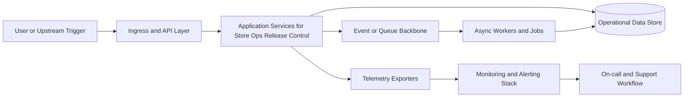

### Environment Promotion Dependency Graph
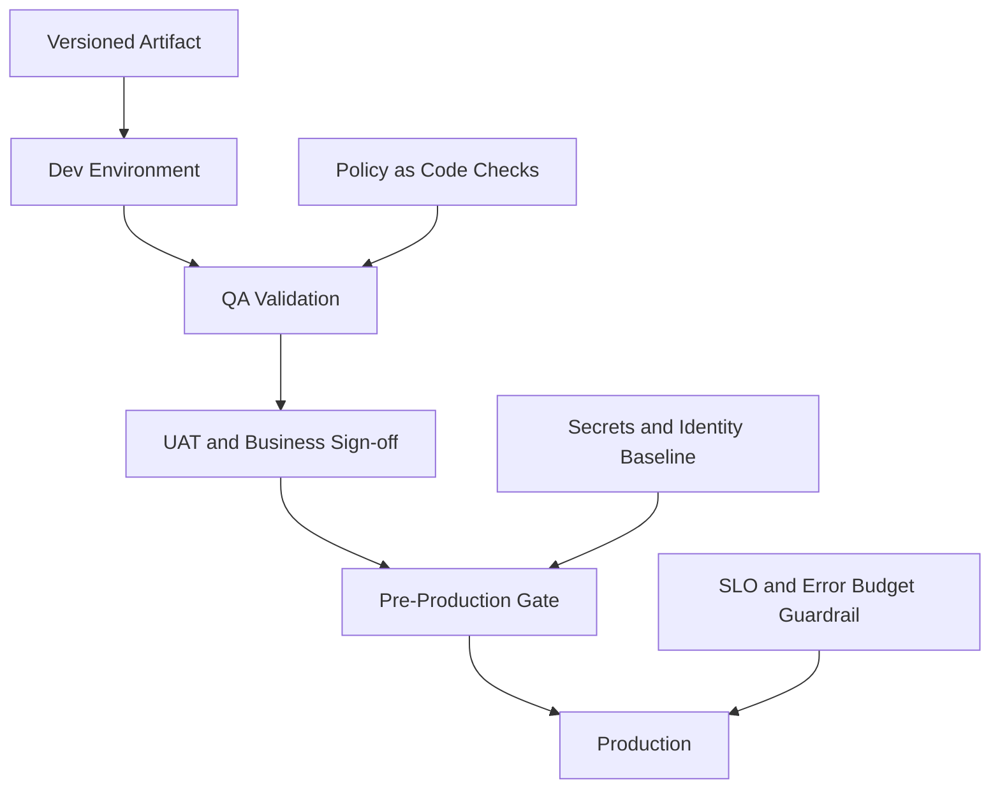

## Additional Module Flow Diagrams

### Branch and PR Governance Flow (Retail Store Operations Platform Cicd Automation Release Management)
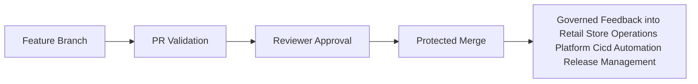

### Terraform Plan-Apply Lifecycle (Retail Store Operations Platform Cicd Automation Release Management)
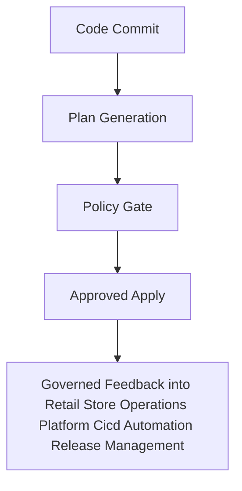

### Image Build-Sign-Scan-Push Chain (Retail Store Operations Platform Cicd Automation Release Management)
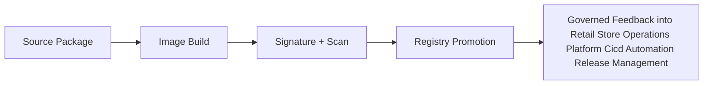

### Deployment Approval and Promotion Chain (Retail Store Operations Platform Cicd Automation Release Management)
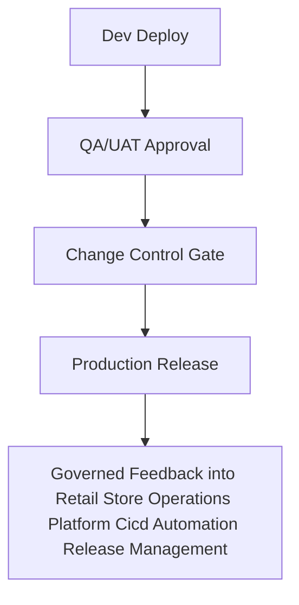

### AKS Runtime Scaling and Self-Healing Flow (Retail Store Operations Platform Cicd Automation Release Management)
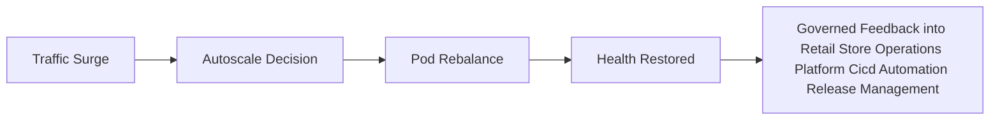

### Observability Signal Flow (Retail Store Operations Platform Cicd Automation Release Management)
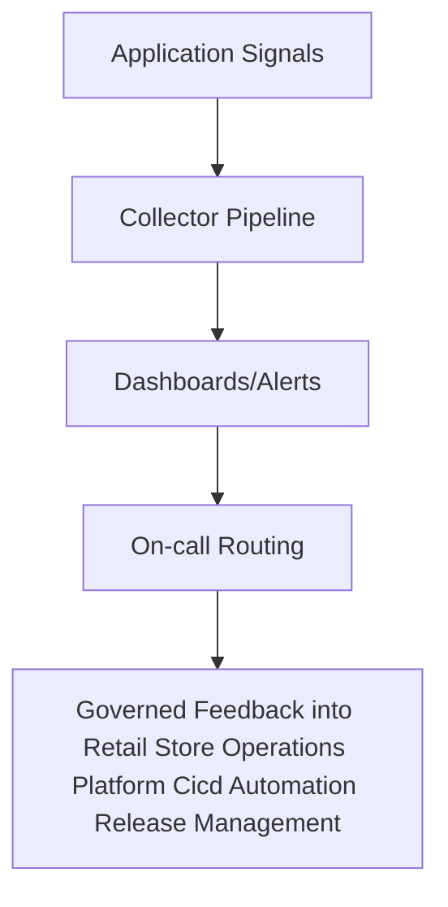

