# E-Commerce Web Platform - Release Pipeline Automation & Containerization

## Project Introduction

This initiative was delivered in the e-commerce web delivery space to create an end-to-end DevOps model around home page, search, cart, checkout, and payment callback reliability. Before modernization, teams faced avoidable delays from manual handoffs, uneven environment controls, and limited release traceability. The project therefore focused on building a dependable, auditable delivery lifecycle that improved throughput without sacrificing reliability.

The implementation blueprint used GitHub, Azure Pipelines, Docker, AKS, ACR, Playwright as the core stack, supported by governance decisions tailored to conversion-sensitive deployments with strict rollback triggers. Practical emphasis was placed on environment strategy, release controls, incident readiness, and measurable service performance so the model remained sustainable after initial rollout.

## DevOps Project Flow Structure

### 1. Business Context and Objectives
Business alignment workshops identified where delivery delays were hurting customer and operational outcomes in e-commerce web delivery. The objective framework linked engineering effort directly to uptime, lead-time reduction, and incident containment performance.

Business objectives were benchmarked against current pain points in home page, search, cart, checkout, and payment callback reliability
### Detailed Module Notes

This module is designed to **set measurable business outcomes** for the home page, search, cart, checkout landscape so execution remains auditable and predictable across delivery cycles. Typical inputs include demand forecasts, KPI baselines, customer pain themes, and the expected outputs are decision-ready records, approved actions, and operational evidence that can be reused by engineering and support teams.

Key activities include dependency walkthroughs, workflow hardening, control-point verification, and readiness reviews with product, platform, security, and SRE ownership clearly separated. Tooling usually spans Git/Azure DevOps workflows, CI/CD orchestrators, Terraform/Helm or equivalent automation, registry/policy scanners, and observability platforms mapped to named owners.

Quality and security controls focus on peer-review enforcement, policy-as-code checks, vulnerability and secret detection, approval gates, and traceable test/sign-off artifacts before promotion. Primary risks are timeline compression, cross-team handoff gaps, hidden dependency drift, and weak rollback preparation; mitigations include explicit RACI coverage, pre-approved fallback runbooks, release rehearsal, and tighter change-window governance. Expected deliverables from this module are a outcome charter with target metrics, updated runbooks, measurable KPI/SLO checkpoints, and improvement actions linked to business impact.

### 2. Scope, Stakeholders, and Delivery Model
The project established a practical operating cadence combining sprint delivery with formal readiness gates. This blend kept teams agile while still meeting enterprise expectations around traceability and risk review.

Stakeholder decisions in this phase were checked against conversion-sensitive deployments with strict rollback triggers to avoid late governance conflicts.
### Detailed Module Notes

This module is designed to **define decision rights and operating boundaries** for the home page, search, cart, checkout landscape so execution remains auditable and predictable across delivery cycles. Typical inputs include team capacity maps, stakeholder matrix, dependency register, and the expected outputs are decision-ready records, approved actions, and operational evidence that can be reused by engineering and support teams.

Key activities include dependency walkthroughs, workflow hardening, control-point verification, and readiness reviews with product, platform, security, and SRE ownership clearly separated. Tooling usually spans Git/Azure DevOps workflows, CI/CD orchestrators, Terraform/Helm or equivalent automation, registry/policy scanners, and observability platforms mapped to named owners.

Quality and security controls focus on peer-review enforcement, policy-as-code checks, vulnerability and secret detection, approval gates, and traceable test/sign-off artifacts before promotion. Primary risks are timeline compression, cross-team handoff gaps, hidden dependency drift, and weak rollback preparation; mitigations include explicit RACI coverage, pre-approved fallback runbooks, release rehearsal, and tighter change-window governance. Expected deliverables from this module are a RACI, cadence plan, and escalation map, updated runbooks, measurable KPI/SLO checkpoints, and improvement actions linked to business impact.

### 3. Architecture and Technology Baseline
A reference architecture was documented to standardize service interfaces, environment dependencies, and operational tooling boundaries. Core components were selected from GitHub, Azure Pipelines, Docker, AKS, ACR, Playwright to keep the platform maintainable and auditable.

Architecture choices were stress-tested for maintainability and operational supportability in the e-commerce web delivery context.
### Detailed Module Notes

This module is designed to **lock the reference architecture and integration contracts** for the home page, search, cart, checkout landscape so execution remains auditable and predictable across delivery cycles. Typical inputs include non-functional requirements, integration constraints, regulatory needs, and the expected outputs are decision-ready records, approved actions, and operational evidence that can be reused by engineering and support teams.

Key activities include dependency walkthroughs, workflow hardening, control-point verification, and readiness reviews with product, platform, security, and SRE ownership clearly separated. Tooling usually spans Git/Azure DevOps workflows, CI/CD orchestrators, Terraform/Helm or equivalent automation, registry/policy scanners, and observability platforms mapped to named owners.

Quality and security controls focus on peer-review enforcement, policy-as-code checks, vulnerability and secret detection, approval gates, and traceable test/sign-off artifacts before promotion. Primary risks are timeline compression, cross-team handoff gaps, hidden dependency drift, and weak rollback preparation; mitigations include explicit RACI coverage, pre-approved fallback runbooks, release rehearsal, and tighter change-window governance. Expected deliverables from this module are a architecture baseline and approved technology guardrails, updated runbooks, measurable KPI/SLO checkpoints, and improvement actions linked to business impact.

### 4. Environment Strategy and Promotion Path
Teams designed a promotion path that separated experimentation from business-critical stages. Configuration was externalized per environment, allowing controlled progression without rebuilding deployable artifacts.

Promotion criteria included readiness checks tied to home page, search, cart, checkout, and payment callback reliability before release approval.
### Detailed Module Notes

This module is designed to **standardize environment promotion and readiness checks** for the home page, search, cart, checkout landscape so execution remains auditable and predictable across delivery cycles. Typical inputs include environment configs, test evidence, release windows, and the expected outputs are decision-ready records, approved actions, and operational evidence that can be reused by engineering and support teams.

Key activities include dependency walkthroughs, workflow hardening, control-point verification, and readiness reviews with product, platform, security, and SRE ownership clearly separated. Tooling usually spans Git/Azure DevOps workflows, CI/CD orchestrators, Terraform/Helm or equivalent automation, registry/policy scanners, and observability platforms mapped to named owners.

Quality and security controls focus on peer-review enforcement, policy-as-code checks, vulnerability and secret detection, approval gates, and traceable test/sign-off artifacts before promotion. Primary risks are timeline compression, cross-team handoff gaps, hidden dependency drift, and weak rollback preparation; mitigations include explicit RACI coverage, pre-approved fallback runbooks, release rehearsal, and tighter change-window governance. Expected deliverables from this module are a promotion matrix and immutable deployment policy, updated runbooks, measurable KPI/SLO checkpoints, and improvement actions linked to business impact.

### 5. Source Control, Branching, and Code Quality
The code quality approach combined peer review discipline with automated static analysis. As a result, many integration defects were prevented before they entered release candidate builds.

Code review policies were tuned for e-commerce web delivery teams to sustain engineering flow while preserving strict quality expectations.
### Detailed Module Notes

This module is designed to **improve code quality through governed collaboration** for the home page, search, cart, checkout landscape so execution remains auditable and predictable across delivery cycles. Typical inputs include branch naming rules, PR templates, quality thresholds, and the expected outputs are decision-ready records, approved actions, and operational evidence that can be reused by engineering and support teams.

Key activities include dependency walkthroughs, workflow hardening, control-point verification, and readiness reviews with product, platform, security, and SRE ownership clearly separated. Tooling usually spans Git/Azure DevOps workflows, CI/CD orchestrators, Terraform/Helm or equivalent automation, registry/policy scanners, and observability platforms mapped to named owners.

Quality and security controls focus on peer-review enforcement, policy-as-code checks, vulnerability and secret detection, approval gates, and traceable test/sign-off artifacts before promotion. Primary risks are timeline compression, cross-team handoff gaps, hidden dependency drift, and weak rollback preparation; mitigations include explicit RACI coverage, pre-approved fallback runbooks, release rehearsal, and tighter change-window governance. Expected deliverables from this module are a branch governance guide and merge-quality scorecard, updated runbooks, measurable KPI/SLO checkpoints, and improvement actions linked to business impact.

### 6. CI Pipeline Design and Build Automation
Continuous integration design focused on balancing throughput with quality assurance depth. Teams received immediate signals for compilation and test failures while still running comprehensive checks for release-bound branches.

CI validation included targeted checks relevant to home page, search, cart, checkout, and payment callback reliability, improving confidence before artifact publication.
### Detailed Module Notes

This module is designed to **build fast, reliable CI with reusable templates** for the home page, search, cart, checkout landscape so execution remains auditable and predictable across delivery cycles. Typical inputs include repo triggers, build scripts, test suites, and the expected outputs are decision-ready records, approved actions, and operational evidence that can be reused by engineering and support teams.

Key activities include dependency walkthroughs, workflow hardening, control-point verification, and readiness reviews with product, platform, security, and SRE ownership clearly separated. Tooling usually spans Git/Azure DevOps workflows, CI/CD orchestrators, Terraform/Helm or equivalent automation, registry/policy scanners, and observability platforms mapped to named owners.

Quality and security controls focus on peer-review enforcement, policy-as-code checks, vulnerability and secret detection, approval gates, and traceable test/sign-off artifacts before promotion. Primary risks are timeline compression, cross-team handoff gaps, hidden dependency drift, and weak rollback preparation; mitigations include explicit RACI coverage, pre-approved fallback runbooks, release rehearsal, and tighter change-window governance. Expected deliverables from this module are a versioned pipeline templates and traceable artifacts, updated runbooks, measurable KPI/SLO checkpoints, and improvement actions linked to business impact.

### 7. Containerization and Artifact Governance
Container standards covered image hardening, base image lifecycle, runtime user policies, and vulnerability remediation timelines. Artifact promotion rules clearly separated development builds from production-approved images.

Artifact handling standards for e-commerce web delivery releases considered rollback speed and traceability expectations from production support teams.
### Detailed Module Notes

This module is designed to **govern images/artifacts as production assets** for the home page, search, cart, checkout landscape so execution remains auditable and predictable across delivery cycles. Typical inputs include base image policy, SBOM, signing keys, and the expected outputs are decision-ready records, approved actions, and operational evidence that can be reused by engineering and support teams.

Key activities include dependency walkthroughs, workflow hardening, control-point verification, and readiness reviews with product, platform, security, and SRE ownership clearly separated. Tooling usually spans Git/Azure DevOps workflows, CI/CD orchestrators, Terraform/Helm or equivalent automation, registry/policy scanners, and observability platforms mapped to named owners.

Quality and security controls focus on peer-review enforcement, policy-as-code checks, vulnerability and secret detection, approval gates, and traceable test/sign-off artifacts before promotion. Primary risks are timeline compression, cross-team handoff gaps, hidden dependency drift, and weak rollback preparation; mitigations include explicit RACI coverage, pre-approved fallback runbooks, release rehearsal, and tighter change-window governance. Expected deliverables from this module are a artifact trust chain and retention/rollback policy, updated runbooks, measurable KPI/SLO checkpoints, and improvement actions linked to business impact.

### 8. Infrastructure as Code and Platform Provisioning
IaC implementation standardized how network, identity, compute, and policy controls were created across environments. Drift checks were scheduled to detect divergence early and avoid emergency corrective changes.

IaC ownership boundaries were documented clearly in the e-commerce web delivery operating model to reduce ambiguity between platform and product squads.
### Detailed Module Notes

This module is designed to **deliver repeatable provisioning through IaC** for the home page, search, cart, checkout landscape so execution remains auditable and predictable across delivery cycles. Typical inputs include module catalogs, remote state, policy bundles, and the expected outputs are decision-ready records, approved actions, and operational evidence that can be reused by engineering and support teams.

Key activities include dependency walkthroughs, workflow hardening, control-point verification, and readiness reviews with product, platform, security, and SRE ownership clearly separated. Tooling usually spans Git/Azure DevOps workflows, CI/CD orchestrators, Terraform/Helm or equivalent automation, registry/policy scanners, and observability platforms mapped to named owners.

Quality and security controls focus on peer-review enforcement, policy-as-code checks, vulnerability and secret detection, approval gates, and traceable test/sign-off artifacts before promotion. Primary risks are timeline compression, cross-team handoff gaps, hidden dependency drift, and weak rollback preparation; mitigations include explicit RACI coverage, pre-approved fallback runbooks, release rehearsal, and tighter change-window governance. Expected deliverables from this module are a approved IaC modules and provisioned platform baseline, updated runbooks, measurable KPI/SLO checkpoints, and improvement actions linked to business impact.

### 9. Deployment Orchestration and Release Controls
This phase aligned automation with operational realities by incorporating business timing constraints and service criticality. Change windows, approval paths, and progressive rollout options were explicitly documented.

Release controls reflected both technical risk and business timing constraints associated with conversion-sensitive deployments with strict rollback triggers.
### Detailed Module Notes

This module is designed to **control deployments with risk-aware promotion** for the home page, search, cart, checkout landscape so execution remains auditable and predictable across delivery cycles. Typical inputs include deployment manifests, change tickets, validation checks, and the expected outputs are decision-ready records, approved actions, and operational evidence that can be reused by engineering and support teams.

Key activities include dependency walkthroughs, workflow hardening, control-point verification, and readiness reviews with product, platform, security, and SRE ownership clearly separated. Tooling usually spans Git/Azure DevOps workflows, CI/CD orchestrators, Terraform/Helm or equivalent automation, registry/policy scanners, and observability platforms mapped to named owners.

Quality and security controls focus on peer-review enforcement, policy-as-code checks, vulnerability and secret detection, approval gates, and traceable test/sign-off artifacts before promotion. Primary risks are timeline compression, cross-team handoff gaps, hidden dependency drift, and weak rollback preparation; mitigations include explicit RACI coverage, pre-approved fallback runbooks, release rehearsal, and tighter change-window governance. Expected deliverables from this module are a promotion evidence pack with go/no-go records, updated runbooks, measurable KPI/SLO checkpoints, and improvement actions linked to business impact.

### 10. Security, Compliance, and Secrets Management
Rather than treating security as a final sign-off, controls were integrated into daily engineering flow. This approach improved both compliance posture and delivery velocity over time.

Security controls in this project addressed data exposure and privilege risks common in home page, search, cart, checkout, and payment callback reliability.
### Detailed Module Notes

This module is designed to **embed security/compliance controls in the path** for the home page, search, cart, checkout landscape so execution remains auditable and predictable across delivery cycles. Typical inputs include threat model, secret inventory, control catalog, and the expected outputs are decision-ready records, approved actions, and operational evidence that can be reused by engineering and support teams.

Key activities include dependency walkthroughs, workflow hardening, control-point verification, and readiness reviews with product, platform, security, and SRE ownership clearly separated. Tooling usually spans Git/Azure DevOps workflows, CI/CD orchestrators, Terraform/Helm or equivalent automation, registry/policy scanners, and observability platforms mapped to named owners.

Quality and security controls focus on peer-review enforcement, policy-as-code checks, vulnerability and secret detection, approval gates, and traceable test/sign-off artifacts before promotion. Primary risks are timeline compression, cross-team handoff gaps, hidden dependency drift, and weak rollback preparation; mitigations include explicit RACI coverage, pre-approved fallback runbooks, release rehearsal, and tighter change-window governance. Expected deliverables from this module are a control evidence archive and remediation backlog, updated runbooks, measurable KPI/SLO checkpoints, and improvement actions linked to business impact.

### 11. Observability, Monitoring, and SLO Management
Observability design linked technical telemetry to user-impact behavior, not just infrastructure counters. Dashboards combined SLO indicators with domain KPIs to support faster diagnosis during release and incident events.

Dashboards and alerts were tuned around the reliability indicators that matter most for e-commerce web delivery.
### Detailed Module Notes

This module is designed to **convert telemetry into actionable reliability signals** for the home page, search, cart, checkout landscape so execution remains auditable and predictable across delivery cycles. Typical inputs include metrics/logs/traces, SLO targets, alert policies, and the expected outputs are decision-ready records, approved actions, and operational evidence that can be reused by engineering and support teams.

Key activities include dependency walkthroughs, workflow hardening, control-point verification, and readiness reviews with product, platform, security, and SRE ownership clearly separated. Tooling usually spans Git/Azure DevOps workflows, CI/CD orchestrators, Terraform/Helm or equivalent automation, registry/policy scanners, and observability platforms mapped to named owners.

Quality and security controls focus on peer-review enforcement, policy-as-code checks, vulnerability and secret detection, approval gates, and traceable test/sign-off artifacts before promotion. Primary risks are timeline compression, cross-team handoff gaps, hidden dependency drift, and weak rollback preparation; mitigations include explicit RACI coverage, pre-approved fallback runbooks, release rehearsal, and tighter change-window governance. Expected deliverables from this module are a service dashboards, alert routing, and SLO reviews, updated runbooks, measurable KPI/SLO checkpoints, and improvement actions linked to business impact.

### 12. Incident Response and Production Support Workflow
Support workflow improvements focused on reducing confusion during high-pressure outages. Teams used predefined severity criteria, stakeholder update templates, and post-incident actions with accountable owners.

Incident escalation pathways were rehearsed with scenarios typical to home page, search, cart, checkout, and payment callback reliability and peak-load behavior.
### Detailed Module Notes

This module is designed to **reduce incident MTTR through clear response flow** for the home page, search, cart, checkout landscape so execution remains auditable and predictable across delivery cycles. Typical inputs include alert payloads, runbooks, severity rubric, and the expected outputs are decision-ready records, approved actions, and operational evidence that can be reused by engineering and support teams.

Key activities include dependency walkthroughs, workflow hardening, control-point verification, and readiness reviews with product, platform, security, and SRE ownership clearly separated. Tooling usually spans Git/Azure DevOps workflows, CI/CD orchestrators, Terraform/Helm or equivalent automation, registry/policy scanners, and observability platforms mapped to named owners.

Quality and security controls focus on peer-review enforcement, policy-as-code checks, vulnerability and secret detection, approval gates, and traceable test/sign-off artifacts before promotion. Primary risks are timeline compression, cross-team handoff gaps, hidden dependency drift, and weak rollback preparation; mitigations include explicit RACI coverage, pre-approved fallback runbooks, release rehearsal, and tighter change-window governance. Expected deliverables from this module are a incident timeline, comms log, and recovery actions, updated runbooks, measurable KPI/SLO checkpoints, and improvement actions linked to business impact.

### 13. Performance, Scalability, and Cost Optimization
Scalability planning used traffic forecasts and observed utilization trends to prevent peak-time saturation. Optimization work addressed both latency targets and budget guardrails.

Capacity and spend decisions for e-commerce web delivery workloads were reviewed together so resilience goals did not create avoidable cloud waste.
### Detailed Module Notes

This module is designed to **optimize performance and cloud cost together** for the home page, search, cart, checkout landscape so execution remains auditable and predictable across delivery cycles. Typical inputs include capacity trends, load-test output, cost reports, and the expected outputs are decision-ready records, approved actions, and operational evidence that can be reused by engineering and support teams.

Key activities include dependency walkthroughs, workflow hardening, control-point verification, and readiness reviews with product, platform, security, and SRE ownership clearly separated. Tooling usually spans Git/Azure DevOps workflows, CI/CD orchestrators, Terraform/Helm or equivalent automation, registry/policy scanners, and observability platforms mapped to named owners.

Quality and security controls focus on peer-review enforcement, policy-as-code checks, vulnerability and secret detection, approval gates, and traceable test/sign-off artifacts before promotion. Primary risks are timeline compression, cross-team handoff gaps, hidden dependency drift, and weak rollback preparation; mitigations include explicit RACI coverage, pre-approved fallback runbooks, release rehearsal, and tighter change-window governance. Expected deliverables from this module are a tuning actions with cost-benefit tracking, updated runbooks, measurable KPI/SLO checkpoints, and improvement actions linked to business impact.

### 14. Documentation, Enablement, and Operating Model
This phase ensured that project outcomes were sustainable after implementation by investing in clear documentation and team onboarding. Support ownership became distributed and more resilient.

Documentation from this stage was written to be actionable for e-commerce web delivery handovers, not just for compliance archives.
### Detailed Module Notes

This module is designed to **institutionalize knowledge for sustained operations** for the home page, search, cart, checkout landscape so execution remains auditable and predictable across delivery cycles. Typical inputs include SOP drafts, onboarding gaps, support feedback, and the expected outputs are decision-ready records, approved actions, and operational evidence that can be reused by engineering and support teams.

Key activities include dependency walkthroughs, workflow hardening, control-point verification, and readiness reviews with product, platform, security, and SRE ownership clearly separated. Tooling usually spans Git/Azure DevOps workflows, CI/CD orchestrators, Terraform/Helm or equivalent automation, registry/policy scanners, and observability platforms mapped to named owners.

Quality and security controls focus on peer-review enforcement, policy-as-code checks, vulnerability and secret detection, approval gates, and traceable test/sign-off artifacts before promotion. Primary risks are timeline compression, cross-team handoff gaps, hidden dependency drift, and weak rollback preparation; mitigations include explicit RACI coverage, pre-approved fallback runbooks, release rehearsal, and tighter change-window governance. Expected deliverables from this module are a living runbooks, training pack, and ownership model, updated runbooks, measurable KPI/SLO checkpoints, and improvement actions linked to business impact.

### 15. Outcomes, Metrics, and Continuous Improvement
Final review compared outcomes against baseline reliability and delivery metrics, then fed gaps into a continuous improvement roadmap. The initiative demonstrated durable gains in release confidence and operational responsiveness.

The improvement backlog for e-commerce web delivery services was prioritized by measurable impact and implementation effort to sustain momentum post-launch.
### Detailed Module Notes

This module is designed to **close delivery loops with measurable improvements** for the home page, search, cart, checkout landscape so execution remains auditable and predictable across delivery cycles. Typical inputs include release metrics, incident learnings, technical debt list, and the expected outputs are decision-ready records, approved actions, and operational evidence that can be reused by engineering and support teams.

Key activities include dependency walkthroughs, workflow hardening, control-point verification, and readiness reviews with product, platform, security, and SRE ownership clearly separated. Tooling usually spans Git/Azure DevOps workflows, CI/CD orchestrators, Terraform/Helm or equivalent automation, registry/policy scanners, and observability platforms mapped to named owners.

Quality and security controls focus on peer-review enforcement, policy-as-code checks, vulnerability and secret detection, approval gates, and traceable test/sign-off artifacts before promotion. Primary risks are timeline compression, cross-team handoff gaps, hidden dependency drift, and weak rollback preparation; mitigations include explicit RACI coverage, pre-approved fallback runbooks, release rehearsal, and tighter change-window governance. Expected deliverables from this module are a quarterly improvement roadmap and value summary, updated runbooks, measurable KPI/SLO checkpoints, and improvement actions linked to business impact.

## Visual Flow Diagrams

### E2E Platform Delivery Flow
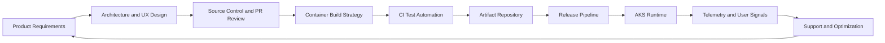

### Container-Centric CI Pipeline
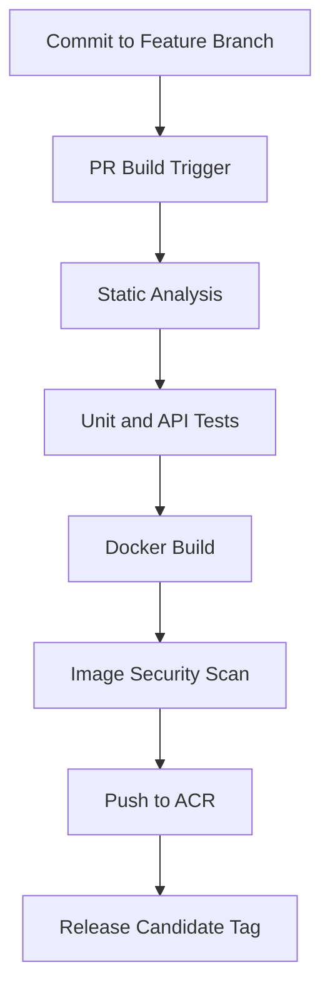

### Multi-Stage Release Promotion
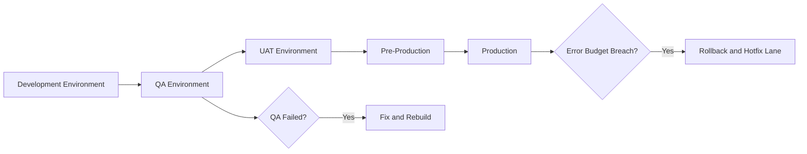

### Incident Escalation Workflow
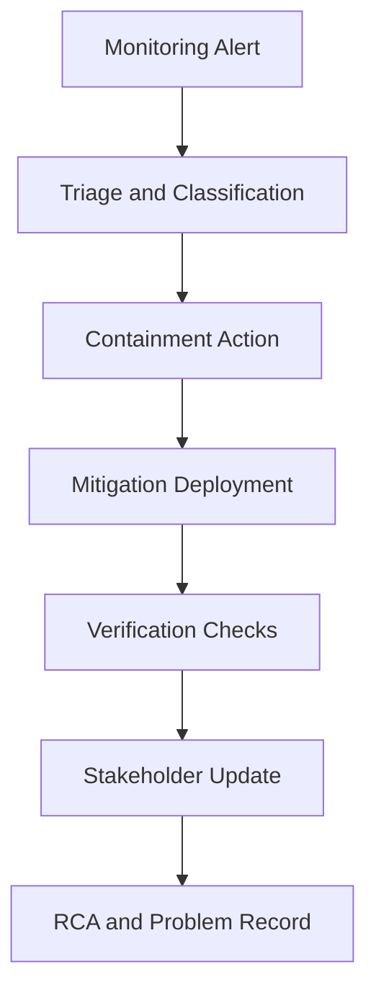

### Web Platform Security Flow
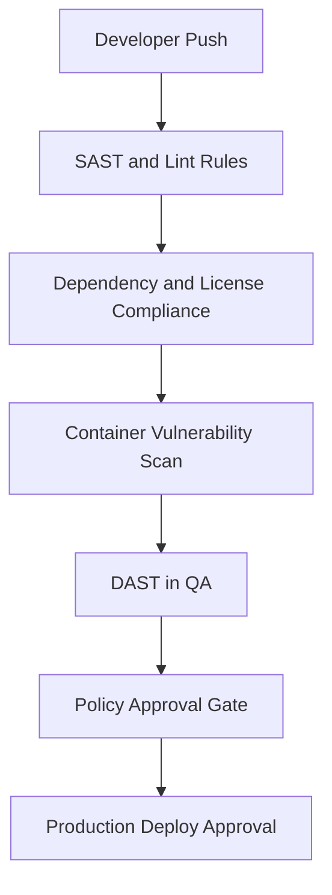

## Additional Advanced Diagrams

### Deployment Coordination Sequence
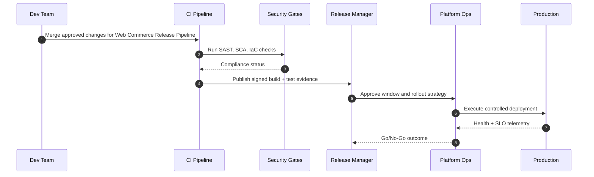

### Release and Incident State Lifecycle
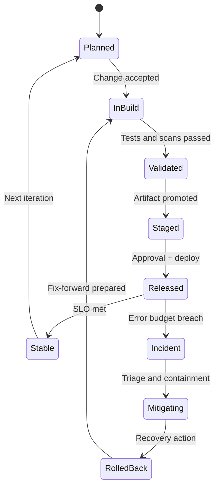

### Runtime Architecture and Data Path
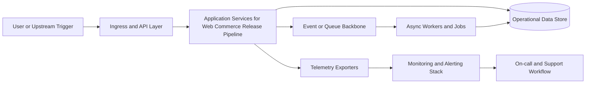

### Environment Promotion Dependency Graph
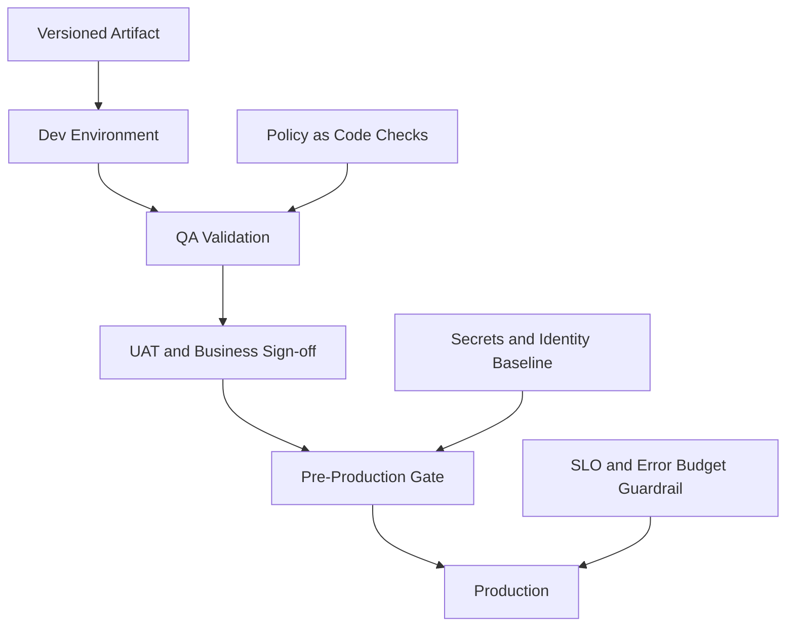

## Additional Module Flow Diagrams

### Terraform Plan-Apply Lifecycle (Ecommerce Web Platform Release Pipeline Automation Containerization)
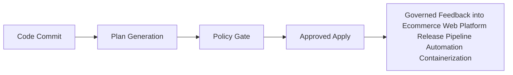

### Image Build-Sign-Scan-Push Chain (Ecommerce Web Platform Release Pipeline Automation Containerization)
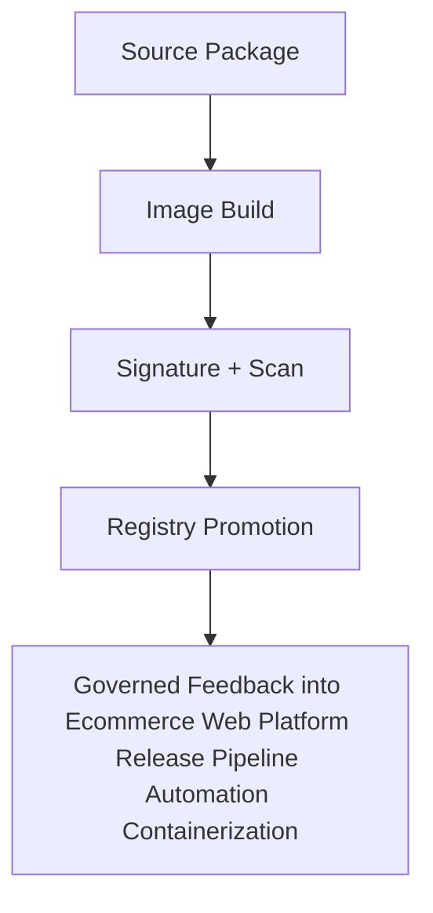

### Deployment Approval and Promotion Chain (Ecommerce Web Platform Release Pipeline Automation Containerization)
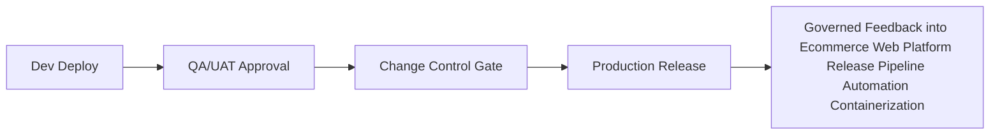

### AKS Runtime Scaling and Self-Healing Flow (Ecommerce Web Platform Release Pipeline Automation Containerization)
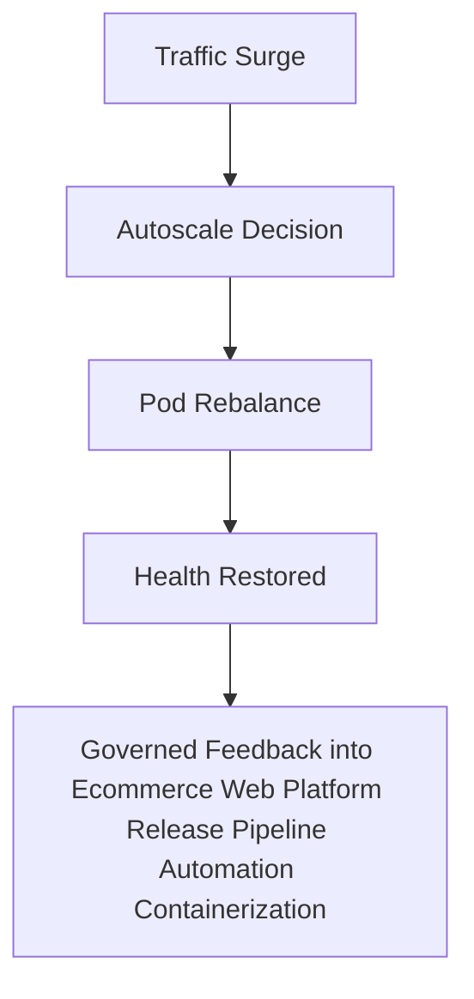

### Observability Signal Flow (Ecommerce Web Platform Release Pipeline Automation Containerization)
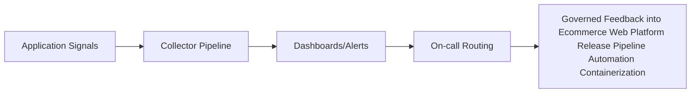

### Incident Escalation Sequence (Ecommerce Web Platform Release Pipeline Automation Containerization)
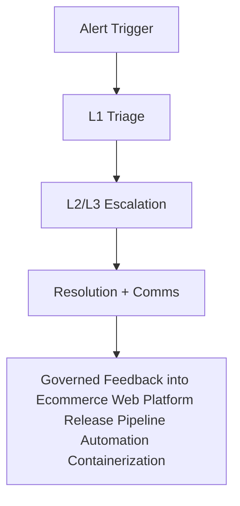

