# Production Support & Observability for Cloud-Based Retail Platform (Support Project)

## Project Introduction

This initiative was delivered in the retail production support space to create an end-to-end DevOps model around incident triage, service restoration, and trend-based reliability improvement. Before modernization, teams faced avoidable delays from manual handoffs, uneven environment controls, and limited release traceability. The project therefore focused on building a dependable, auditable delivery lifecycle that improved throughput without sacrificing reliability.

The implementation blueprint used Azure Monitor, Grafana, Kusto, Prometheus, on-call runbooks as the core stack, supported by governance decisions tailored to 24x7 support model with clear escalation and communication standards. Practical emphasis was placed on environment strategy, release controls, incident readiness, and measurable service performance so the model remained sustainable after initial rollout.

## DevOps Project Flow Structure

### 1. Business Context and Objectives
The program started with a clear business mandate: improve delivery reliability in retail production support while shortening time from approved change to production value. Teams mapped critical failure points and translated them into measurable objectives such as release success rate, MTTR, and deployment throughput.

Business objectives were benchmarked against current pain points in incident triage, service restoration, and trend-based reliability improvement
### Detailed Module Notes

This module is designed to **set measurable business outcomes** for the incident triage, service restoration, and trend-based reliability improvement landscape so execution remains auditable and predictable across delivery cycles. Typical inputs include demand forecasts, KPI baselines, customer pain themes, and the expected outputs are decision-ready records, approved actions, and operational evidence that can be reused by engineering and support teams.

Key activities include dependency walkthroughs, workflow hardening, control-point verification, and readiness reviews with product, platform, security, and SRE ownership clearly separated. Tooling usually spans Git/Azure DevOps workflows, CI/CD orchestrators, Terraform/Helm or equivalent automation, registry/policy scanners, and observability platforms mapped to named owners.

Quality and security controls focus on peer-review enforcement, policy-as-code checks, vulnerability and secret detection, approval gates, and traceable test/sign-off artifacts before promotion. Primary risks are timeline compression, cross-team handoff gaps, hidden dependency drift, and weak rollback preparation; mitigations include explicit RACI coverage, pre-approved fallback runbooks, release rehearsal, and tighter change-window governance. Expected deliverables from this module are a outcome charter with target metrics, updated runbooks, measurable KPI/SLO checkpoints, and improvement actions linked to business impact.

### 2. Scope, Stakeholders, and Delivery Model
Delivery governance was structured around cross-functional accountability: product prioritized value, engineering owned implementation, QA validated readiness, and operations enforced runtime standards. This reduced handoff ambiguity across sprints.

Stakeholder decisions in this phase were checked against 24x7 support model with clear escalation and communication standards to avoid late governance conflicts.
### Detailed Module Notes

This module is designed to **define decision rights and operating boundaries** for the incident triage, service restoration, and trend-based reliability improvement landscape so execution remains auditable and predictable across delivery cycles. Typical inputs include team capacity maps, stakeholder matrix, dependency register, and the expected outputs are decision-ready records, approved actions, and operational evidence that can be reused by engineering and support teams.

Key activities include dependency walkthroughs, workflow hardening, control-point verification, and readiness reviews with product, platform, security, and SRE ownership clearly separated. Tooling usually spans Git/Azure DevOps workflows, CI/CD orchestrators, Terraform/Helm or equivalent automation, registry/policy scanners, and observability platforms mapped to named owners.

Quality and security controls focus on peer-review enforcement, policy-as-code checks, vulnerability and secret detection, approval gates, and traceable test/sign-off artifacts before promotion. Primary risks are timeline compression, cross-team handoff gaps, hidden dependency drift, and weak rollback preparation; mitigations include explicit RACI coverage, pre-approved fallback runbooks, release rehearsal, and tighter change-window governance. Expected deliverables from this module are a RACI, cadence plan, and escalation map, updated runbooks, measurable KPI/SLO checkpoints, and improvement actions linked to business impact.

### 3. Architecture and Technology Baseline
Architecture reviews focused on minimizing coupling between workloads while preserving shared platform standards. The final baseline, anchored on Azure Monitor, Grafana, Kusto, Prometheus, on-call runbooks, supported both scale and controlled change management.

Architecture choices were stress-tested for maintainability and operational supportability in the retail production support context.
### Detailed Module Notes

This module is designed to **lock the reference architecture and integration contracts** for the incident triage, service restoration, and trend-based reliability improvement landscape so execution remains auditable and predictable across delivery cycles. Typical inputs include non-functional requirements, integration constraints, regulatory needs, and the expected outputs are decision-ready records, approved actions, and operational evidence that can be reused by engineering and support teams.

Key activities include dependency walkthroughs, workflow hardening, control-point verification, and readiness reviews with product, platform, security, and SRE ownership clearly separated. Tooling usually spans Git/Azure DevOps workflows, CI/CD orchestrators, Terraform/Helm or equivalent automation, registry/policy scanners, and observability platforms mapped to named owners.

Quality and security controls focus on peer-review enforcement, policy-as-code checks, vulnerability and secret detection, approval gates, and traceable test/sign-off artifacts before promotion. Primary risks are timeline compression, cross-team handoff gaps, hidden dependency drift, and weak rollback preparation; mitigations include explicit RACI coverage, pre-approved fallback runbooks, release rehearsal, and tighter change-window governance. Expected deliverables from this module are a architecture baseline and approved technology guardrails, updated runbooks, measurable KPI/SLO checkpoints, and improvement actions linked to business impact.

### 4. Environment Strategy and Promotion Path
The promotion model balanced speed and safety by pairing automated checks with risk-based approvals. Environment contracts clarified what data, access, and testing scope were allowed at each stage.

Promotion criteria included readiness checks tied to incident triage, service restoration, and trend-based reliability improvement before release approval.
### Detailed Module Notes

This module is designed to **standardize environment promotion and readiness checks** for the incident triage, service restoration, and trend-based reliability improvement landscape so execution remains auditable and predictable across delivery cycles. Typical inputs include environment configs, test evidence, release windows, and the expected outputs are decision-ready records, approved actions, and operational evidence that can be reused by engineering and support teams.

Key activities include dependency walkthroughs, workflow hardening, control-point verification, and readiness reviews with product, platform, security, and SRE ownership clearly separated. Tooling usually spans Git/Azure DevOps workflows, CI/CD orchestrators, Terraform/Helm or equivalent automation, registry/policy scanners, and observability platforms mapped to named owners.

Quality and security controls focus on peer-review enforcement, policy-as-code checks, vulnerability and secret detection, approval gates, and traceable test/sign-off artifacts before promotion. Primary risks are timeline compression, cross-team handoff gaps, hidden dependency drift, and weak rollback preparation; mitigations include explicit RACI coverage, pre-approved fallback runbooks, release rehearsal, and tighter change-window governance. Expected deliverables from this module are a promotion matrix and immutable deployment policy, updated runbooks, measurable KPI/SLO checkpoints, and improvement actions linked to business impact.

### 5. Source Control, Branching, and Code Quality
Branching policy favored short-lived feature work, strict pull-request review, and mandatory quality checks before merge. This reduced long-running divergence and improved codebase consistency.

Code review policies were tuned for retail production support teams to sustain engineering flow while preserving strict quality expectations.
### Detailed Module Notes

This module is designed to **improve code quality through governed collaboration** for the incident triage, service restoration, and trend-based reliability improvement landscape so execution remains auditable and predictable across delivery cycles. Typical inputs include branch naming rules, PR templates, quality thresholds, and the expected outputs are decision-ready records, approved actions, and operational evidence that can be reused by engineering and support teams.

Key activities include dependency walkthroughs, workflow hardening, control-point verification, and readiness reviews with product, platform, security, and SRE ownership clearly separated. Tooling usually spans Git/Azure DevOps workflows, CI/CD orchestrators, Terraform/Helm or equivalent automation, registry/policy scanners, and observability platforms mapped to named owners.

Quality and security controls focus on peer-review enforcement, policy-as-code checks, vulnerability and secret detection, approval gates, and traceable test/sign-off artifacts before promotion. Primary risks are timeline compression, cross-team handoff gaps, hidden dependency drift, and weak rollback preparation; mitigations include explicit RACI coverage, pre-approved fallback runbooks, release rehearsal, and tighter change-window governance. Expected deliverables from this module are a branch governance guide and merge-quality scorecard, updated runbooks, measurable KPI/SLO checkpoints, and improvement actions linked to business impact.

### 6. CI Pipeline Design and Build Automation
Build automation prioritized deterministic outputs and rapid failure detection. Pipeline optimization introduced parallel jobs and caching where safe, significantly reducing average feedback time.

CI validation included targeted checks relevant to incident triage, service restoration, and trend-based reliability improvement, improving confidence before artifact publication.
### Detailed Module Notes

This module is designed to **build fast, reliable CI with reusable templates** for the incident triage, service restoration, and trend-based reliability improvement landscape so execution remains auditable and predictable across delivery cycles. Typical inputs include repo triggers, build scripts, test suites, and the expected outputs are decision-ready records, approved actions, and operational evidence that can be reused by engineering and support teams.

Key activities include dependency walkthroughs, workflow hardening, control-point verification, and readiness reviews with product, platform, security, and SRE ownership clearly separated. Tooling usually spans Git/Azure DevOps workflows, CI/CD orchestrators, Terraform/Helm or equivalent automation, registry/policy scanners, and observability platforms mapped to named owners.

Quality and security controls focus on peer-review enforcement, policy-as-code checks, vulnerability and secret detection, approval gates, and traceable test/sign-off artifacts before promotion. Primary risks are timeline compression, cross-team handoff gaps, hidden dependency drift, and weak rollback preparation; mitigations include explicit RACI coverage, pre-approved fallback runbooks, release rehearsal, and tighter change-window governance. Expected deliverables from this module are a versioned pipeline templates and traceable artifacts, updated runbooks, measurable KPI/SLO checkpoints, and improvement actions linked to business impact.

### 7. Containerization and Artifact Governance
Containerization guidelines improved runtime predictability by enforcing deterministic dependency management and secure defaults. Registry management introduced expiration and tagging rules aligned to support and compliance needs.

Artifact handling standards for retail production support releases considered rollback speed and traceability expectations from production support teams.
### Detailed Module Notes

This module is designed to **govern images/artifacts as production assets** for the incident triage, service restoration, and trend-based reliability improvement landscape so execution remains auditable and predictable across delivery cycles. Typical inputs include base image policy, SBOM, signing keys, and the expected outputs are decision-ready records, approved actions, and operational evidence that can be reused by engineering and support teams.

Key activities include dependency walkthroughs, workflow hardening, control-point verification, and readiness reviews with product, platform, security, and SRE ownership clearly separated. Tooling usually spans Git/Azure DevOps workflows, CI/CD orchestrators, Terraform/Helm or equivalent automation, registry/policy scanners, and observability platforms mapped to named owners.

Quality and security controls focus on peer-review enforcement, policy-as-code checks, vulnerability and secret detection, approval gates, and traceable test/sign-off artifacts before promotion. Primary risks are timeline compression, cross-team handoff gaps, hidden dependency drift, and weak rollback preparation; mitigations include explicit RACI coverage, pre-approved fallback runbooks, release rehearsal, and tighter change-window governance. Expected deliverables from this module are a artifact trust chain and retention/rollback policy, updated runbooks, measurable KPI/SLO checkpoints, and improvement actions linked to business impact.

### 8. Infrastructure as Code and Platform Provisioning
This stage codified foundational resources and governance rules into repeatable infrastructure modules. Infrastructure changes gained the same review rigor as application code, strengthening operational confidence.

IaC ownership boundaries were documented clearly in the retail production support operating model to reduce ambiguity between platform and product squads.
### Detailed Module Notes

This module is designed to **deliver repeatable provisioning through IaC** for the incident triage, service restoration, and trend-based reliability improvement landscape so execution remains auditable and predictable across delivery cycles. Typical inputs include module catalogs, remote state, policy bundles, and the expected outputs are decision-ready records, approved actions, and operational evidence that can be reused by engineering and support teams.

Key activities include dependency walkthroughs, workflow hardening, control-point verification, and readiness reviews with product, platform, security, and SRE ownership clearly separated. Tooling usually spans Git/Azure DevOps workflows, CI/CD orchestrators, Terraform/Helm or equivalent automation, registry/policy scanners, and observability platforms mapped to named owners.

Quality and security controls focus on peer-review enforcement, policy-as-code checks, vulnerability and secret detection, approval gates, and traceable test/sign-off artifacts before promotion. Primary risks are timeline compression, cross-team handoff gaps, hidden dependency drift, and weak rollback preparation; mitigations include explicit RACI coverage, pre-approved fallback runbooks, release rehearsal, and tighter change-window governance. Expected deliverables from this module are a approved IaC modules and provisioned platform baseline, updated runbooks, measurable KPI/SLO checkpoints, and improvement actions linked to business impact.

### 9. Deployment Orchestration and Release Controls
Release orchestration introduced workload-aware deployment patterns, including rolling and canary strategies where appropriate. Approval policies were tuned to risk profile rather than applying a one-size-fits-all release gate.

Release controls reflected both technical risk and business timing constraints associated with 24x7 support model with clear escalation and communication standards.
### Detailed Module Notes

This module is designed to **control deployments with risk-aware promotion** for the incident triage, service restoration, and trend-based reliability improvement landscape so execution remains auditable and predictable across delivery cycles. Typical inputs include deployment manifests, change tickets, validation checks, and the expected outputs are decision-ready records, approved actions, and operational evidence that can be reused by engineering and support teams.

Key activities include dependency walkthroughs, workflow hardening, control-point verification, and readiness reviews with product, platform, security, and SRE ownership clearly separated. Tooling usually spans Git/Azure DevOps workflows, CI/CD orchestrators, Terraform/Helm or equivalent automation, registry/policy scanners, and observability platforms mapped to named owners.

Quality and security controls focus on peer-review enforcement, policy-as-code checks, vulnerability and secret detection, approval gates, and traceable test/sign-off artifacts before promotion. Primary risks are timeline compression, cross-team handoff gaps, hidden dependency drift, and weak rollback preparation; mitigations include explicit RACI coverage, pre-approved fallback runbooks, release rehearsal, and tighter change-window governance. Expected deliverables from this module are a promotion evidence pack with go/no-go records, updated runbooks, measurable KPI/SLO checkpoints, and improvement actions linked to business impact.

### 10. Security, Compliance, and Secrets Management
Compliance requirements were addressed through automated evidence capture in pipeline logs, approval trails, and deployment records. This reduced manual effort during internal and external audits.

Security controls in this project addressed data exposure and privilege risks common in incident triage, service restoration, and trend-based reliability improvement.
### Detailed Module Notes

This module is designed to **embed security/compliance controls in the path** for the incident triage, service restoration, and trend-based reliability improvement landscape so execution remains auditable and predictable across delivery cycles. Typical inputs include threat model, secret inventory, control catalog, and the expected outputs are decision-ready records, approved actions, and operational evidence that can be reused by engineering and support teams.

Key activities include dependency walkthroughs, workflow hardening, control-point verification, and readiness reviews with product, platform, security, and SRE ownership clearly separated. Tooling usually spans Git/Azure DevOps workflows, CI/CD orchestrators, Terraform/Helm or equivalent automation, registry/policy scanners, and observability platforms mapped to named owners.

Quality and security controls focus on peer-review enforcement, policy-as-code checks, vulnerability and secret detection, approval gates, and traceable test/sign-off artifacts before promotion. Primary risks are timeline compression, cross-team handoff gaps, hidden dependency drift, and weak rollback preparation; mitigations include explicit RACI coverage, pre-approved fallback runbooks, release rehearsal, and tighter change-window governance. Expected deliverables from this module are a control evidence archive and remediation backlog, updated runbooks, measurable KPI/SLO checkpoints, and improvement actions linked to business impact.

### 11. Observability, Monitoring, and SLO Management
This phase established a practical telemetry model spanning metrics, logs, and traces with consistent correlation keys. Better visibility reduced time spent in triage and improved confidence in release validation.

Dashboards and alerts were tuned around the reliability indicators that matter most for retail production support.
### Detailed Module Notes

This module is designed to **convert telemetry into actionable reliability signals** for the incident triage, service restoration, and trend-based reliability improvement landscape so execution remains auditable and predictable across delivery cycles. Typical inputs include metrics/logs/traces, SLO targets, alert policies, and the expected outputs are decision-ready records, approved actions, and operational evidence that can be reused by engineering and support teams.

Key activities include dependency walkthroughs, workflow hardening, control-point verification, and readiness reviews with product, platform, security, and SRE ownership clearly separated. Tooling usually spans Git/Azure DevOps workflows, CI/CD orchestrators, Terraform/Helm or equivalent automation, registry/policy scanners, and observability platforms mapped to named owners.

Quality and security controls focus on peer-review enforcement, policy-as-code checks, vulnerability and secret detection, approval gates, and traceable test/sign-off artifacts before promotion. Primary risks are timeline compression, cross-team handoff gaps, hidden dependency drift, and weak rollback preparation; mitigations include explicit RACI coverage, pre-approved fallback runbooks, release rehearsal, and tighter change-window governance. Expected deliverables from this module are a service dashboards, alert routing, and SLO reviews, updated runbooks, measurable KPI/SLO checkpoints, and improvement actions linked to business impact.

### 12. Incident Response and Production Support Workflow
Production support became more resilient through structured on-call rotations and measurable response objectives. Recovery quality improved because verification and closure criteria were explicitly documented.

Incident escalation pathways were rehearsed with scenarios typical to incident triage, service restoration, and trend-based reliability improvement and peak-load behavior.
### Detailed Module Notes

This module is designed to **reduce incident MTTR through clear response flow** for the incident triage, service restoration, and trend-based reliability improvement landscape so execution remains auditable and predictable across delivery cycles. Typical inputs include alert payloads, runbooks, severity rubric, and the expected outputs are decision-ready records, approved actions, and operational evidence that can be reused by engineering and support teams.

Key activities include dependency walkthroughs, workflow hardening, control-point verification, and readiness reviews with product, platform, security, and SRE ownership clearly separated. Tooling usually spans Git/Azure DevOps workflows, CI/CD orchestrators, Terraform/Helm or equivalent automation, registry/policy scanners, and observability platforms mapped to named owners.

Quality and security controls focus on peer-review enforcement, policy-as-code checks, vulnerability and secret detection, approval gates, and traceable test/sign-off artifacts before promotion. Primary risks are timeline compression, cross-team handoff gaps, hidden dependency drift, and weak rollback preparation; mitigations include explicit RACI coverage, pre-approved fallback runbooks, release rehearsal, and tighter change-window governance. Expected deliverables from this module are a incident timeline, comms log, and recovery actions, updated runbooks, measurable KPI/SLO checkpoints, and improvement actions linked to business impact.

### 13. Performance, Scalability, and Cost Optimization
Performance engineering combined load testing, capacity planning, and autoscaling policy validation. Cost controls were implemented in parallel so reliability gains did not create unmanaged cloud spend growth.

Capacity and spend decisions for retail production support workloads were reviewed together so resilience goals did not create avoidable cloud waste.
### Detailed Module Notes

This module is designed to **optimize performance and cloud cost together** for the incident triage, service restoration, and trend-based reliability improvement landscape so execution remains auditable and predictable across delivery cycles. Typical inputs include capacity trends, load-test output, cost reports, and the expected outputs are decision-ready records, approved actions, and operational evidence that can be reused by engineering and support teams.

Key activities include dependency walkthroughs, workflow hardening, control-point verification, and readiness reviews with product, platform, security, and SRE ownership clearly separated. Tooling usually spans Git/Azure DevOps workflows, CI/CD orchestrators, Terraform/Helm or equivalent automation, registry/policy scanners, and observability platforms mapped to named owners.

Quality and security controls focus on peer-review enforcement, policy-as-code checks, vulnerability and secret detection, approval gates, and traceable test/sign-off artifacts before promotion. Primary risks are timeline compression, cross-team handoff gaps, hidden dependency drift, and weak rollback preparation; mitigations include explicit RACI coverage, pre-approved fallback runbooks, release rehearsal, and tighter change-window governance. Expected deliverables from this module are a tuning actions with cost-benefit tracking, updated runbooks, measurable KPI/SLO checkpoints, and improvement actions linked to business impact.

### 14. Documentation, Enablement, and Operating Model
Documentation standards focused on operational usefulness rather than static project artifacts. Teams maintained practical guides for deployment, rollback, incident response, and environment-specific constraints.

Documentation from this stage was written to be actionable for retail production support handovers, not just for compliance archives.
### Detailed Module Notes

This module is designed to **institutionalize knowledge for sustained operations** for the incident triage, service restoration, and trend-based reliability improvement landscape so execution remains auditable and predictable across delivery cycles. Typical inputs include SOP drafts, onboarding gaps, support feedback, and the expected outputs are decision-ready records, approved actions, and operational evidence that can be reused by engineering and support teams.

Key activities include dependency walkthroughs, workflow hardening, control-point verification, and readiness reviews with product, platform, security, and SRE ownership clearly separated. Tooling usually spans Git/Azure DevOps workflows, CI/CD orchestrators, Terraform/Helm or equivalent automation, registry/policy scanners, and observability platforms mapped to named owners.

Quality and security controls focus on peer-review enforcement, policy-as-code checks, vulnerability and secret detection, approval gates, and traceable test/sign-off artifacts before promotion. Primary risks are timeline compression, cross-team handoff gaps, hidden dependency drift, and weak rollback preparation; mitigations include explicit RACI coverage, pre-approved fallback runbooks, release rehearsal, and tighter change-window governance. Expected deliverables from this module are a living runbooks, training pack, and ownership model, updated runbooks, measurable KPI/SLO checkpoints, and improvement actions linked to business impact.

### 15. Outcomes, Metrics, and Continuous Improvement
Results were consolidated into KPI scorecards and lessons-learned documentation for future phases. The operating model remained iterative, with periodic reassessment of tooling, process, and governance controls.

The improvement backlog for retail production support services was prioritized by measurable impact and implementation effort to sustain momentum post-launch.
### Detailed Module Notes

This module is designed to **close delivery loops with measurable improvements** for the incident triage, service restoration, and trend-based reliability improvement landscape so execution remains auditable and predictable across delivery cycles. Typical inputs include release metrics, incident learnings, technical debt list, and the expected outputs are decision-ready records, approved actions, and operational evidence that can be reused by engineering and support teams.

Key activities include dependency walkthroughs, workflow hardening, control-point verification, and readiness reviews with product, platform, security, and SRE ownership clearly separated. Tooling usually spans Git/Azure DevOps workflows, CI/CD orchestrators, Terraform/Helm or equivalent automation, registry/policy scanners, and observability platforms mapped to named owners.

Quality and security controls focus on peer-review enforcement, policy-as-code checks, vulnerability and secret detection, approval gates, and traceable test/sign-off artifacts before promotion. Primary risks are timeline compression, cross-team handoff gaps, hidden dependency drift, and weak rollback preparation; mitigations include explicit RACI coverage, pre-approved fallback runbooks, release rehearsal, and tighter change-window governance. Expected deliverables from this module are a quarterly improvement roadmap and value summary, updated runbooks, measurable KPI/SLO checkpoints, and improvement actions linked to business impact.

## Visual Flow Diagrams

### Production Support Lifecycle
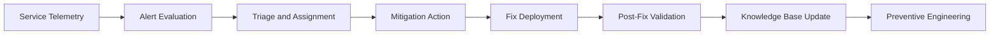

### Support-Centric CI Flow
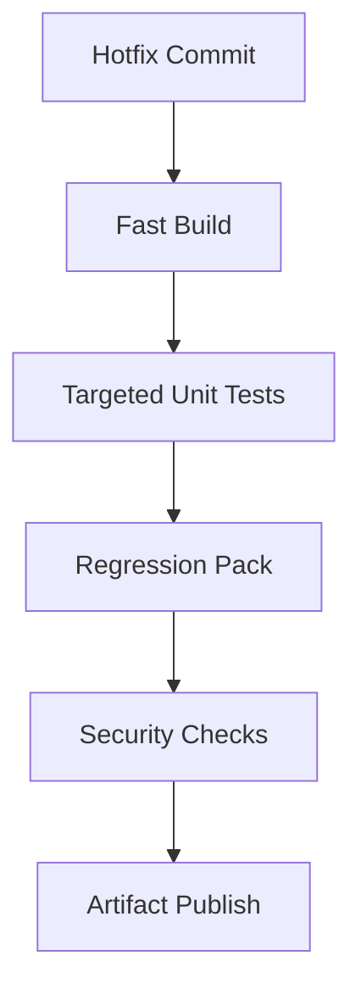

### Controlled Hotfix Promotion
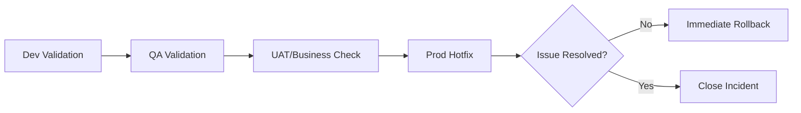

### Incident Escalation Playbook
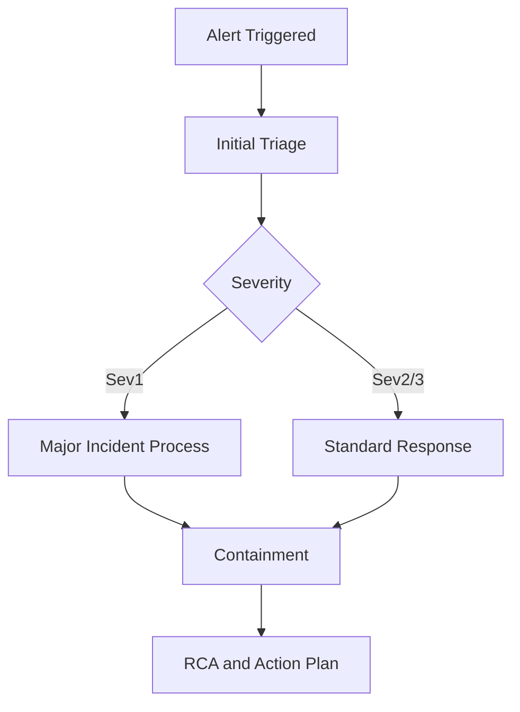

### Observability Control Gates
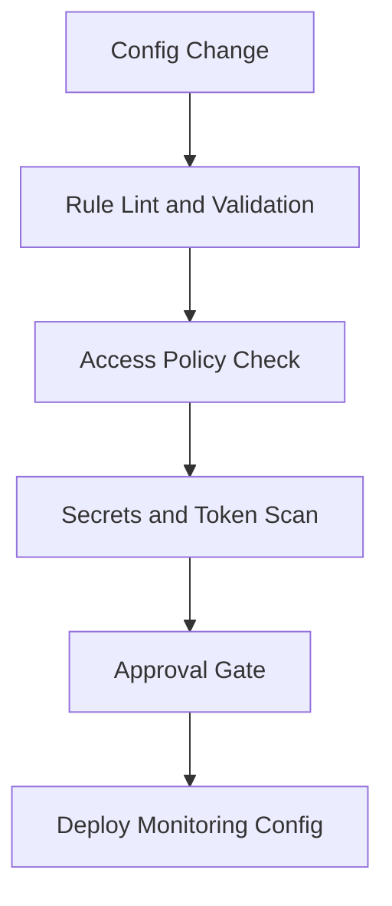

## Additional Advanced Diagrams

### Deployment Coordination Sequence
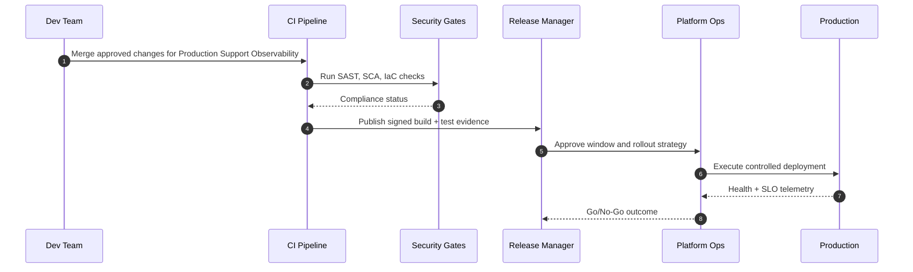

### Release and Incident State Lifecycle
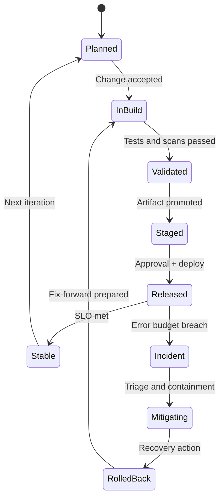

### Runtime Architecture and Data Path
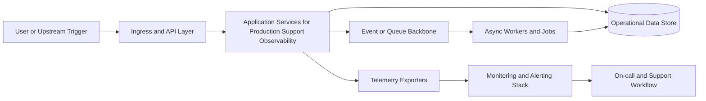

### Environment Promotion Dependency Graph
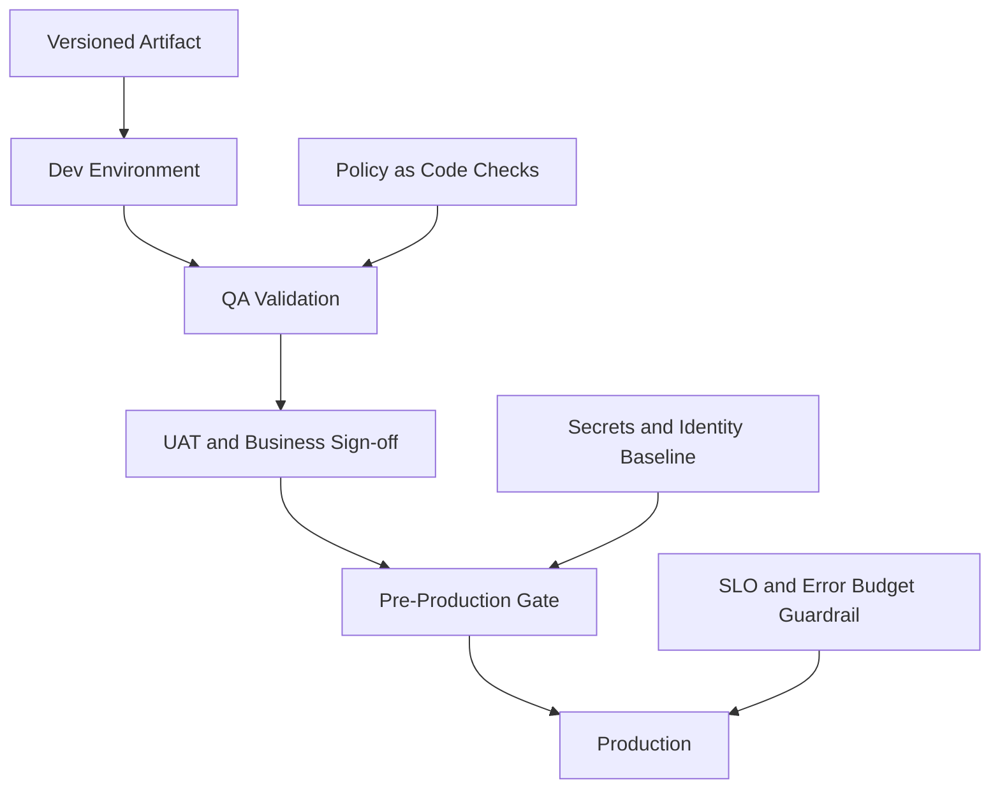

## Additional Module Flow Diagrams

### Change and Release CAB Flow (Production Support Observability Cloud Based Retail Platform Support Project)
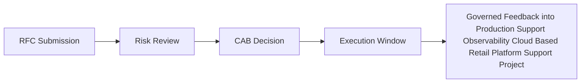

### RCA and Continuous Improvement Loop (Production Support Observability Cloud Based Retail Platform Support Project)
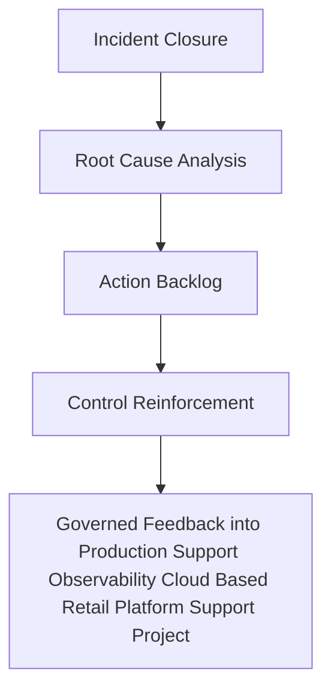

### Requirement-to-Backlog Flow (Production Support Observability Cloud Based Retail Platform Support Project)
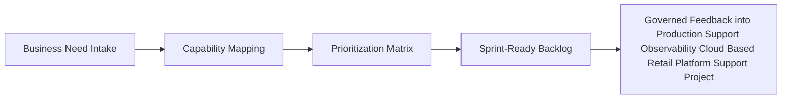

### Branch and PR Governance Flow (Production Support Observability Cloud Based Retail Platform Support Project)
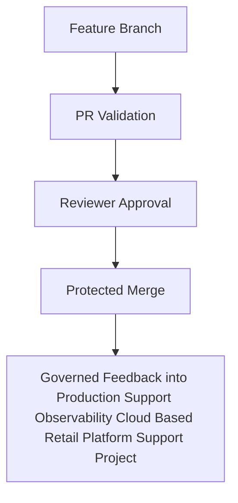

### Terraform Plan-Apply Lifecycle (Production Support Observability Cloud Based Retail Platform Support Project)
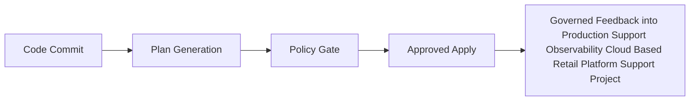

### Image Build-Sign-Scan-Push Chain (Production Support Observability Cloud Based Retail Platform Support Project)
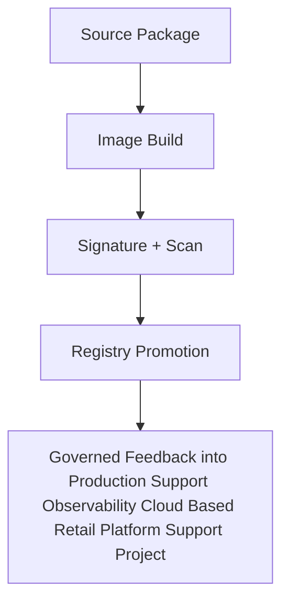

