# Centralized Observability Platform - Monitoring, Alerting & Incident Automation

## Project Introduction

This initiative was delivered in the central observability platform space to create an end-to-end DevOps model around enterprise telemetry standards, actionable dashboards, and alert lifecycle governance. Before modernization, teams faced avoidable delays from manual handoffs, uneven environment controls, and limited release traceability. The project therefore focused on building a dependable, auditable delivery lifecycle that improved throughput without sacrificing reliability.

The implementation blueprint used OpenTelemetry, Prometheus, Grafana, Alertmanager, ServiceNow integration as the core stack, supported by governance decisions tailored to incident automation that reduces MTTR and operator fatigue. Practical emphasis was placed on environment strategy, release controls, incident readiness, and measurable service performance so the model remained sustainable after initial rollout.

## DevOps Project Flow Structure

### 1. Business Context and Objectives
Initial planning focused on defining what success meant for central observability platform beyond technical completion. KPIs were tied to service reliability, change stability, and how quickly teams could recover from production defects.

Business objectives were benchmarked against current pain points in enterprise telemetry standards, actionable dashboards, and alert lifecycle governance
### Detailed Module Notes

This module is designed to **set measurable business outcomes** for the enterprise telemetry standards, actionable dashboards, and alert lifecycle governance landscape so execution remains auditable and predictable across delivery cycles. Typical inputs include demand forecasts, KPI baselines, customer pain themes, and the expected outputs are decision-ready records, approved actions, and operational evidence that can be reused by engineering and support teams.

Key activities include dependency walkthroughs, workflow hardening, control-point verification, and readiness reviews with product, platform, security, and SRE ownership clearly separated. Tooling usually spans Git/Azure DevOps workflows, CI/CD orchestrators, Terraform/Helm or equivalent automation, registry/policy scanners, and observability platforms mapped to named owners.

Quality and security controls focus on peer-review enforcement, policy-as-code checks, vulnerability and secret detection, approval gates, and traceable test/sign-off artifacts before promotion. Primary risks are timeline compression, cross-team handoff gaps, hidden dependency drift, and weak rollback preparation; mitigations include explicit RACI coverage, pre-approved fallback runbooks, release rehearsal, and tighter change-window governance. Expected deliverables from this module are a outcome charter with target metrics, updated runbooks, measurable KPI/SLO checkpoints, and improvement actions linked to business impact.

### 2. Scope, Stakeholders, and Delivery Model
Stakeholder mapping covered product, engineering, QA, security, operations, and business governance groups. A shared delivery calendar and decision matrix prevented approval bottlenecks during critical release windows.

Stakeholder decisions in this phase were checked against incident automation that reduces MTTR and operator fatigue to avoid late governance conflicts.
### Detailed Module Notes

This module is designed to **define decision rights and operating boundaries** for the enterprise telemetry standards, actionable dashboards, and alert lifecycle governance landscape so execution remains auditable and predictable across delivery cycles. Typical inputs include team capacity maps, stakeholder matrix, dependency register, and the expected outputs are decision-ready records, approved actions, and operational evidence that can be reused by engineering and support teams.

Key activities include dependency walkthroughs, workflow hardening, control-point verification, and readiness reviews with product, platform, security, and SRE ownership clearly separated. Tooling usually spans Git/Azure DevOps workflows, CI/CD orchestrators, Terraform/Helm or equivalent automation, registry/policy scanners, and observability platforms mapped to named owners.

Quality and security controls focus on peer-review enforcement, policy-as-code checks, vulnerability and secret detection, approval gates, and traceable test/sign-off artifacts before promotion. Primary risks are timeline compression, cross-team handoff gaps, hidden dependency drift, and weak rollback preparation; mitigations include explicit RACI coverage, pre-approved fallback runbooks, release rehearsal, and tighter change-window governance. Expected deliverables from this module are a RACI, cadence plan, and escalation map, updated runbooks, measurable KPI/SLO checkpoints, and improvement actions linked to business impact.

### 3. Architecture and Technology Baseline
Technology baseline decisions prioritized integration stability and lifecycle manageability. Using OpenTelemetry, Prometheus, Grafana, Alertmanager, ServiceNow integration, teams established consistent patterns for identity, secrets, networking, and telemetry across all services.

Architecture choices were stress-tested for maintainability and operational supportability in the central observability platform context.
### Detailed Module Notes

This module is designed to **lock the reference architecture and integration contracts** for the enterprise telemetry standards, actionable dashboards, and alert lifecycle governance landscape so execution remains auditable and predictable across delivery cycles. Typical inputs include non-functional requirements, integration constraints, regulatory needs, and the expected outputs are decision-ready records, approved actions, and operational evidence that can be reused by engineering and support teams.

Key activities include dependency walkthroughs, workflow hardening, control-point verification, and readiness reviews with product, platform, security, and SRE ownership clearly separated. Tooling usually spans Git/Azure DevOps workflows, CI/CD orchestrators, Terraform/Helm or equivalent automation, registry/policy scanners, and observability platforms mapped to named owners.

Quality and security controls focus on peer-review enforcement, policy-as-code checks, vulnerability and secret detection, approval gates, and traceable test/sign-off artifacts before promotion. Primary risks are timeline compression, cross-team handoff gaps, hidden dependency drift, and weak rollback preparation; mitigations include explicit RACI coverage, pre-approved fallback runbooks, release rehearsal, and tighter change-window governance. Expected deliverables from this module are a architecture baseline and approved technology guardrails, updated runbooks, measurable KPI/SLO checkpoints, and improvement actions linked to business impact.

### 4. Environment Strategy and Promotion Path
Environment strategy emphasized repeatability and change traceability. A single tested artifact was advanced through gated stages, reducing works-in-one-environment deployment surprises.

Promotion criteria included readiness checks tied to enterprise telemetry standards, actionable dashboards, and alert lifecycle governance before release approval.
### Detailed Module Notes

This module is designed to **standardize environment promotion and readiness checks** for the enterprise telemetry standards, actionable dashboards, and alert lifecycle governance landscape so execution remains auditable and predictable across delivery cycles. Typical inputs include environment configs, test evidence, release windows, and the expected outputs are decision-ready records, approved actions, and operational evidence that can be reused by engineering and support teams.

Key activities include dependency walkthroughs, workflow hardening, control-point verification, and readiness reviews with product, platform, security, and SRE ownership clearly separated. Tooling usually spans Git/Azure DevOps workflows, CI/CD orchestrators, Terraform/Helm or equivalent automation, registry/policy scanners, and observability platforms mapped to named owners.

Quality and security controls focus on peer-review enforcement, policy-as-code checks, vulnerability and secret detection, approval gates, and traceable test/sign-off artifacts before promotion. Primary risks are timeline compression, cross-team handoff gaps, hidden dependency drift, and weak rollback preparation; mitigations include explicit RACI coverage, pre-approved fallback runbooks, release rehearsal, and tighter change-window governance. Expected deliverables from this module are a promotion matrix and immutable deployment policy, updated runbooks, measurable KPI/SLO checkpoints, and improvement actions linked to business impact.

### 5. Source Control, Branching, and Code Quality
Repository governance standardized branch naming, commit traceability, and pull-request evidence. Quality gates became non-optional, which improved confidence in downstream pipeline execution.

Code review policies were tuned for central observability platform teams to sustain engineering flow while preserving strict quality expectations.
### Detailed Module Notes

This module is designed to **improve code quality through governed collaboration** for the enterprise telemetry standards, actionable dashboards, and alert lifecycle governance landscape so execution remains auditable and predictable across delivery cycles. Typical inputs include branch naming rules, PR templates, quality thresholds, and the expected outputs are decision-ready records, approved actions, and operational evidence that can be reused by engineering and support teams.

Key activities include dependency walkthroughs, workflow hardening, control-point verification, and readiness reviews with product, platform, security, and SRE ownership clearly separated. Tooling usually spans Git/Azure DevOps workflows, CI/CD orchestrators, Terraform/Helm or equivalent automation, registry/policy scanners, and observability platforms mapped to named owners.

Quality and security controls focus on peer-review enforcement, policy-as-code checks, vulnerability and secret detection, approval gates, and traceable test/sign-off artifacts before promotion. Primary risks are timeline compression, cross-team handoff gaps, hidden dependency drift, and weak rollback preparation; mitigations include explicit RACI coverage, pre-approved fallback runbooks, release rehearsal, and tighter change-window governance. Expected deliverables from this module are a branch governance guide and merge-quality scorecard, updated runbooks, measurable KPI/SLO checkpoints, and improvement actions linked to business impact.

### 6. CI Pipeline Design and Build Automation
CI pipelines were restructured into fast feedback and deep validation phases to protect developer productivity. Build outputs included versioned artifacts, test evidence, and metadata required for release auditability.

CI validation included targeted checks relevant to enterprise telemetry standards, actionable dashboards, and alert lifecycle governance, improving confidence before artifact publication.
### Detailed Module Notes

This module is designed to **build fast, reliable CI with reusable templates** for the enterprise telemetry standards, actionable dashboards, and alert lifecycle governance landscape so execution remains auditable and predictable across delivery cycles. Typical inputs include repo triggers, build scripts, test suites, and the expected outputs are decision-ready records, approved actions, and operational evidence that can be reused by engineering and support teams.

Key activities include dependency walkthroughs, workflow hardening, control-point verification, and readiness reviews with product, platform, security, and SRE ownership clearly separated. Tooling usually spans Git/Azure DevOps workflows, CI/CD orchestrators, Terraform/Helm or equivalent automation, registry/policy scanners, and observability platforms mapped to named owners.

Quality and security controls focus on peer-review enforcement, policy-as-code checks, vulnerability and secret detection, approval gates, and traceable test/sign-off artifacts before promotion. Primary risks are timeline compression, cross-team handoff gaps, hidden dependency drift, and weak rollback preparation; mitigations include explicit RACI coverage, pre-approved fallback runbooks, release rehearsal, and tighter change-window governance. Expected deliverables from this module are a versioned pipeline templates and traceable artifacts, updated runbooks, measurable KPI/SLO checkpoints, and improvement actions linked to business impact.

### 7. Containerization and Artifact Governance
The project implemented disciplined image governance: scan, sign, promote, and retain according to release policy. This made rollback operations faster because trusted image history was always available.

Artifact handling standards for central observability platform releases considered rollback speed and traceability expectations from production support teams.
### Detailed Module Notes

This module is designed to **govern images/artifacts as production assets** for the enterprise telemetry standards, actionable dashboards, and alert lifecycle governance landscape so execution remains auditable and predictable across delivery cycles. Typical inputs include base image policy, SBOM, signing keys, and the expected outputs are decision-ready records, approved actions, and operational evidence that can be reused by engineering and support teams.

Key activities include dependency walkthroughs, workflow hardening, control-point verification, and readiness reviews with product, platform, security, and SRE ownership clearly separated. Tooling usually spans Git/Azure DevOps workflows, CI/CD orchestrators, Terraform/Helm or equivalent automation, registry/policy scanners, and observability platforms mapped to named owners.

Quality and security controls focus on peer-review enforcement, policy-as-code checks, vulnerability and secret detection, approval gates, and traceable test/sign-off artifacts before promotion. Primary risks are timeline compression, cross-team handoff gaps, hidden dependency drift, and weak rollback preparation; mitigations include explicit RACI coverage, pre-approved fallback runbooks, release rehearsal, and tighter change-window governance. Expected deliverables from this module are a artifact trust chain and retention/rollback policy, updated runbooks, measurable KPI/SLO checkpoints, and improvement actions linked to business impact.

### 8. Infrastructure as Code and Platform Provisioning
Platform provisioning became modular so teams could reuse vetted building blocks instead of duplicating brittle scripts. This improved consistency and lowered operational risk during scaling.

IaC ownership boundaries were documented clearly in the central observability platform operating model to reduce ambiguity between platform and product squads.
### Detailed Module Notes

This module is designed to **deliver repeatable provisioning through IaC** for the enterprise telemetry standards, actionable dashboards, and alert lifecycle governance landscape so execution remains auditable and predictable across delivery cycles. Typical inputs include module catalogs, remote state, policy bundles, and the expected outputs are decision-ready records, approved actions, and operational evidence that can be reused by engineering and support teams.

Key activities include dependency walkthroughs, workflow hardening, control-point verification, and readiness reviews with product, platform, security, and SRE ownership clearly separated. Tooling usually spans Git/Azure DevOps workflows, CI/CD orchestrators, Terraform/Helm or equivalent automation, registry/policy scanners, and observability platforms mapped to named owners.

Quality and security controls focus on peer-review enforcement, policy-as-code checks, vulnerability and secret detection, approval gates, and traceable test/sign-off artifacts before promotion. Primary risks are timeline compression, cross-team handoff gaps, hidden dependency drift, and weak rollback preparation; mitigations include explicit RACI coverage, pre-approved fallback runbooks, release rehearsal, and tighter change-window governance. Expected deliverables from this module are a approved IaC modules and provisioned platform baseline, updated runbooks, measurable KPI/SLO checkpoints, and improvement actions linked to business impact.

### 9. Deployment Orchestration and Release Controls
Deployment execution moved from ad-hoc scripts to controlled orchestration with clear evidence at each gate. The result was better release predictability and fewer high-severity post-deployment incidents.

Release controls reflected both technical risk and business timing constraints associated with incident automation that reduces MTTR and operator fatigue.
### Detailed Module Notes

This module is designed to **control deployments with risk-aware promotion** for the enterprise telemetry standards, actionable dashboards, and alert lifecycle governance landscape so execution remains auditable and predictable across delivery cycles. Typical inputs include deployment manifests, change tickets, validation checks, and the expected outputs are decision-ready records, approved actions, and operational evidence that can be reused by engineering and support teams.

Key activities include dependency walkthroughs, workflow hardening, control-point verification, and readiness reviews with product, platform, security, and SRE ownership clearly separated. Tooling usually spans Git/Azure DevOps workflows, CI/CD orchestrators, Terraform/Helm or equivalent automation, registry/policy scanners, and observability platforms mapped to named owners.

Quality and security controls focus on peer-review enforcement, policy-as-code checks, vulnerability and secret detection, approval gates, and traceable test/sign-off artifacts before promotion. Primary risks are timeline compression, cross-team handoff gaps, hidden dependency drift, and weak rollback preparation; mitigations include explicit RACI coverage, pre-approved fallback runbooks, release rehearsal, and tighter change-window governance. Expected deliverables from this module are a promotion evidence pack with go/no-go records, updated runbooks, measurable KPI/SLO checkpoints, and improvement actions linked to business impact.

### 10. Security, Compliance, and Secrets Management
Security was embedded across the lifecycle using least-privilege access, policy checks, and automated vulnerability controls. Secrets were retrieved from managed vault integrations at runtime to avoid credential exposure.

Security controls in this project addressed data exposure and privilege risks common in enterprise telemetry standards, actionable dashboards, and alert lifecycle governance.
### Detailed Module Notes

This module is designed to **embed security/compliance controls in the path** for the enterprise telemetry standards, actionable dashboards, and alert lifecycle governance landscape so execution remains auditable and predictable across delivery cycles. Typical inputs include threat model, secret inventory, control catalog, and the expected outputs are decision-ready records, approved actions, and operational evidence that can be reused by engineering and support teams.

Key activities include dependency walkthroughs, workflow hardening, control-point verification, and readiness reviews with product, platform, security, and SRE ownership clearly separated. Tooling usually spans Git/Azure DevOps workflows, CI/CD orchestrators, Terraform/Helm or equivalent automation, registry/policy scanners, and observability platforms mapped to named owners.

Quality and security controls focus on peer-review enforcement, policy-as-code checks, vulnerability and secret detection, approval gates, and traceable test/sign-off artifacts before promotion. Primary risks are timeline compression, cross-team handoff gaps, hidden dependency drift, and weak rollback preparation; mitigations include explicit RACI coverage, pre-approved fallback runbooks, release rehearsal, and tighter change-window governance. Expected deliverables from this module are a control evidence archive and remediation backlog, updated runbooks, measurable KPI/SLO checkpoints, and improvement actions linked to business impact.

### 11. Observability, Monitoring, and SLO Management
Monitoring standards were refactored to reduce noisy alerts and improve ownership clarity. Signals were grouped by service criticality so response teams could prioritize issues that affected business flow first.

Dashboards and alerts were tuned around the reliability indicators that matter most for central observability platform.
### Detailed Module Notes

This module is designed to **convert telemetry into actionable reliability signals** for the enterprise telemetry standards, actionable dashboards, and alert lifecycle governance landscape so execution remains auditable and predictable across delivery cycles. Typical inputs include metrics/logs/traces, SLO targets, alert policies, and the expected outputs are decision-ready records, approved actions, and operational evidence that can be reused by engineering and support teams.

Key activities include dependency walkthroughs, workflow hardening, control-point verification, and readiness reviews with product, platform, security, and SRE ownership clearly separated. Tooling usually spans Git/Azure DevOps workflows, CI/CD orchestrators, Terraform/Helm or equivalent automation, registry/policy scanners, and observability platforms mapped to named owners.

Quality and security controls focus on peer-review enforcement, policy-as-code checks, vulnerability and secret detection, approval gates, and traceable test/sign-off artifacts before promotion. Primary risks are timeline compression, cross-team handoff gaps, hidden dependency drift, and weak rollback preparation; mitigations include explicit RACI coverage, pre-approved fallback runbooks, release rehearsal, and tighter change-window governance. Expected deliverables from this module are a service dashboards, alert routing, and SLO reviews, updated runbooks, measurable KPI/SLO checkpoints, and improvement actions linked to business impact.

### 12. Incident Response and Production Support Workflow
This phase introduced a repeatable incident response lifecycle supported by runbooks and escalation ladders. Blameless retrospectives converted recurring operational pain into prioritized engineering backlog items.

Incident escalation pathways were rehearsed with scenarios typical to enterprise telemetry standards, actionable dashboards, and alert lifecycle governance and peak-load behavior.
### Detailed Module Notes

This module is designed to **reduce incident MTTR through clear response flow** for the enterprise telemetry standards, actionable dashboards, and alert lifecycle governance landscape so execution remains auditable and predictable across delivery cycles. Typical inputs include alert payloads, runbooks, severity rubric, and the expected outputs are decision-ready records, approved actions, and operational evidence that can be reused by engineering and support teams.

Key activities include dependency walkthroughs, workflow hardening, control-point verification, and readiness reviews with product, platform, security, and SRE ownership clearly separated. Tooling usually spans Git/Azure DevOps workflows, CI/CD orchestrators, Terraform/Helm or equivalent automation, registry/policy scanners, and observability platforms mapped to named owners.

Quality and security controls focus on peer-review enforcement, policy-as-code checks, vulnerability and secret detection, approval gates, and traceable test/sign-off artifacts before promotion. Primary risks are timeline compression, cross-team handoff gaps, hidden dependency drift, and weak rollback preparation; mitigations include explicit RACI coverage, pre-approved fallback runbooks, release rehearsal, and tighter change-window governance. Expected deliverables from this module are a incident timeline, comms log, and recovery actions, updated runbooks, measurable KPI/SLO checkpoints, and improvement actions linked to business impact.

### 13. Performance, Scalability, and Cost Optimization
This stage treated efficiency as an operational capability: resources were tuned continuously based on workload behavior. The result was a better balance between service quality, elasticity, and spend discipline.

Capacity and spend decisions for central observability platform workloads were reviewed together so resilience goals did not create avoidable cloud waste.
### Detailed Module Notes

This module is designed to **optimize performance and cloud cost together** for the enterprise telemetry standards, actionable dashboards, and alert lifecycle governance landscape so execution remains auditable and predictable across delivery cycles. Typical inputs include capacity trends, load-test output, cost reports, and the expected outputs are decision-ready records, approved actions, and operational evidence that can be reused by engineering and support teams.

Key activities include dependency walkthroughs, workflow hardening, control-point verification, and readiness reviews with product, platform, security, and SRE ownership clearly separated. Tooling usually spans Git/Azure DevOps workflows, CI/CD orchestrators, Terraform/Helm or equivalent automation, registry/policy scanners, and observability platforms mapped to named owners.

Quality and security controls focus on peer-review enforcement, policy-as-code checks, vulnerability and secret detection, approval gates, and traceable test/sign-off artifacts before promotion. Primary risks are timeline compression, cross-team handoff gaps, hidden dependency drift, and weak rollback preparation; mitigations include explicit RACI coverage, pre-approved fallback runbooks, release rehearsal, and tighter change-window governance. Expected deliverables from this module are a tuning actions with cost-benefit tracking, updated runbooks, measurable KPI/SLO checkpoints, and improvement actions linked to business impact.

### 14. Documentation, Enablement, and Operating Model
Knowledge enablement included architecture notes, release checklists, support runbooks, and troubleshooting guides. Shadow support rotations were used to validate readiness before formal handover.

Documentation from this stage was written to be actionable for central observability platform handovers, not just for compliance archives.
### Detailed Module Notes

This module is designed to **institutionalize knowledge for sustained operations** for the enterprise telemetry standards, actionable dashboards, and alert lifecycle governance landscape so execution remains auditable and predictable across delivery cycles. Typical inputs include SOP drafts, onboarding gaps, support feedback, and the expected outputs are decision-ready records, approved actions, and operational evidence that can be reused by engineering and support teams.

Key activities include dependency walkthroughs, workflow hardening, control-point verification, and readiness reviews with product, platform, security, and SRE ownership clearly separated. Tooling usually spans Git/Azure DevOps workflows, CI/CD orchestrators, Terraform/Helm or equivalent automation, registry/policy scanners, and observability platforms mapped to named owners.

Quality and security controls focus on peer-review enforcement, policy-as-code checks, vulnerability and secret detection, approval gates, and traceable test/sign-off artifacts before promotion. Primary risks are timeline compression, cross-team handoff gaps, hidden dependency drift, and weak rollback preparation; mitigations include explicit RACI coverage, pre-approved fallback runbooks, release rehearsal, and tighter change-window governance. Expected deliverables from this module are a living runbooks, training pack, and ownership model, updated runbooks, measurable KPI/SLO checkpoints, and improvement actions linked to business impact.

### 15. Outcomes, Metrics, and Continuous Improvement
Program closure emphasized measurable impact: improved deployment frequency, lower change failure rates, and faster restoration. Follow-on actions were scheduled to continue maturity growth rather than treat delivery as complete.

The improvement backlog for central observability platform services was prioritized by measurable impact and implementation effort to sustain momentum post-launch.
### Detailed Module Notes

This module is designed to **close delivery loops with measurable improvements** for the enterprise telemetry standards, actionable dashboards, and alert lifecycle governance landscape so execution remains auditable and predictable across delivery cycles. Typical inputs include release metrics, incident learnings, technical debt list, and the expected outputs are decision-ready records, approved actions, and operational evidence that can be reused by engineering and support teams.

Key activities include dependency walkthroughs, workflow hardening, control-point verification, and readiness reviews with product, platform, security, and SRE ownership clearly separated. Tooling usually spans Git/Azure DevOps workflows, CI/CD orchestrators, Terraform/Helm or equivalent automation, registry/policy scanners, and observability platforms mapped to named owners.

Quality and security controls focus on peer-review enforcement, policy-as-code checks, vulnerability and secret detection, approval gates, and traceable test/sign-off artifacts before promotion. Primary risks are timeline compression, cross-team handoff gaps, hidden dependency drift, and weak rollback preparation; mitigations include explicit RACI coverage, pre-approved fallback runbooks, release rehearsal, and tighter change-window governance. Expected deliverables from this module are a quarterly improvement roadmap and value summary, updated runbooks, measurable KPI/SLO checkpoints, and improvement actions linked to business impact.

## Visual Flow Diagrams

### Central Observability Lifecycle
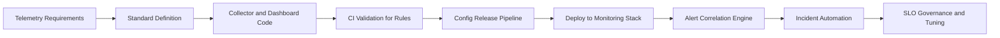

### Telemetry Data Flow
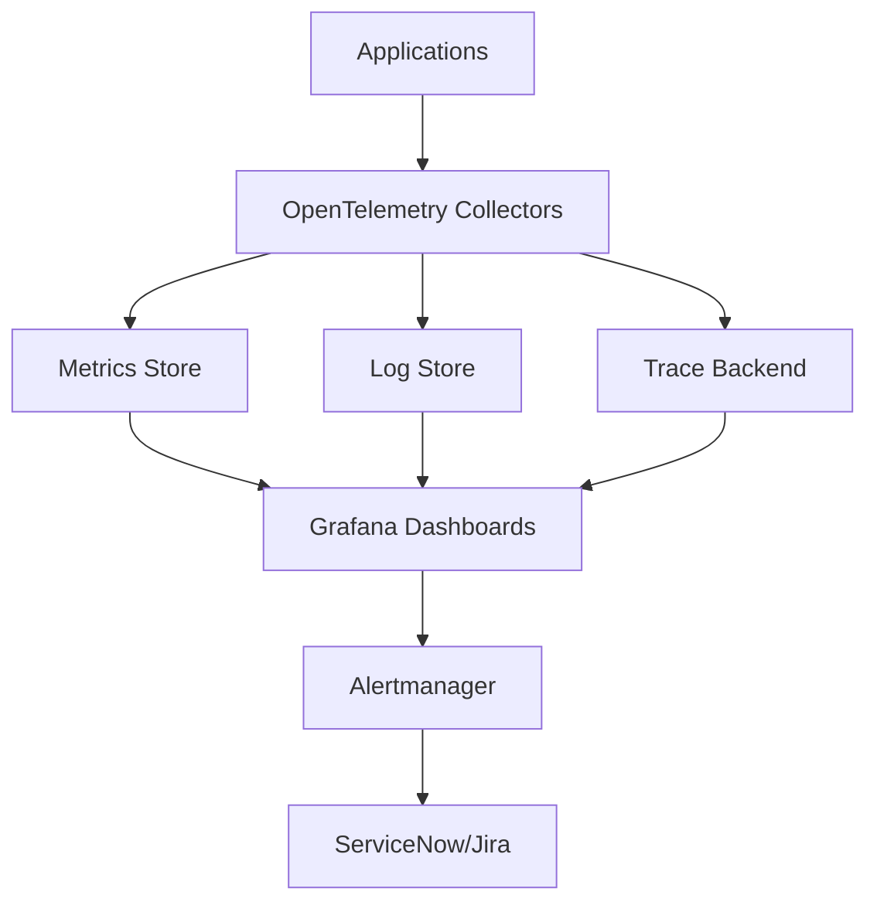

### Release Promotion with Alert Quality Gates
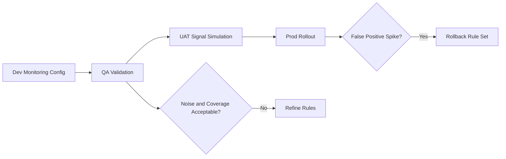

### Incident Automation Workflow
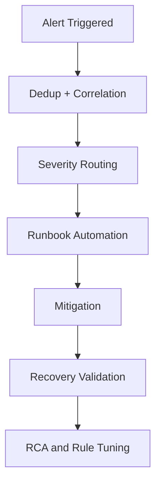

### Observability DevSecOps Flow
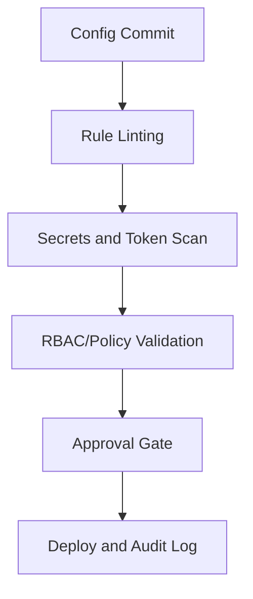

## Additional Advanced Diagrams

### Deployment Coordination Sequence
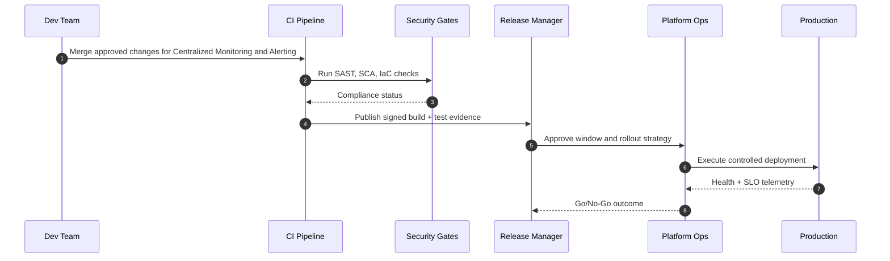

### Release and Incident State Lifecycle
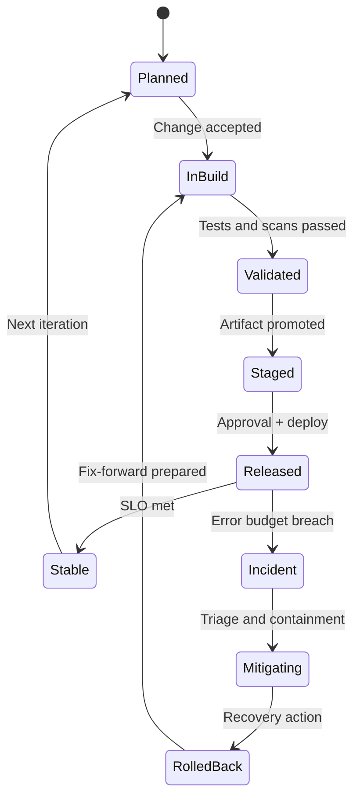

### Runtime Architecture and Data Path
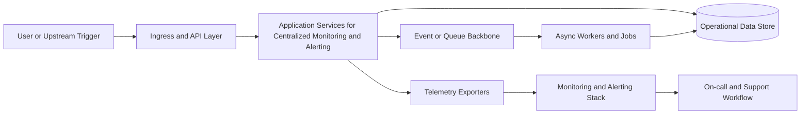

### Environment Promotion Dependency Graph
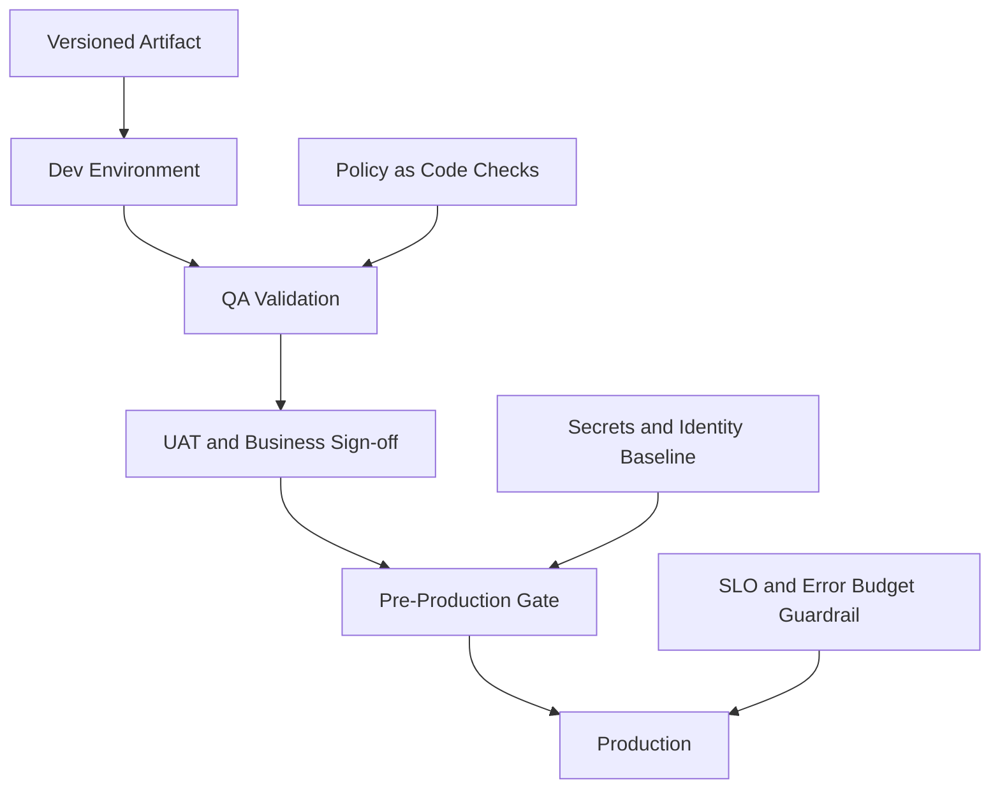

## Additional Module Flow Diagrams

### AKS Runtime Scaling and Self-Healing Flow (Centralized Observability Platform Monitoring Alerting Incident Automation)
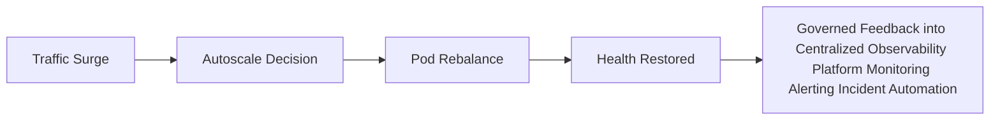

### Observability Signal Flow (Centralized Observability Platform Monitoring Alerting Incident Automation)
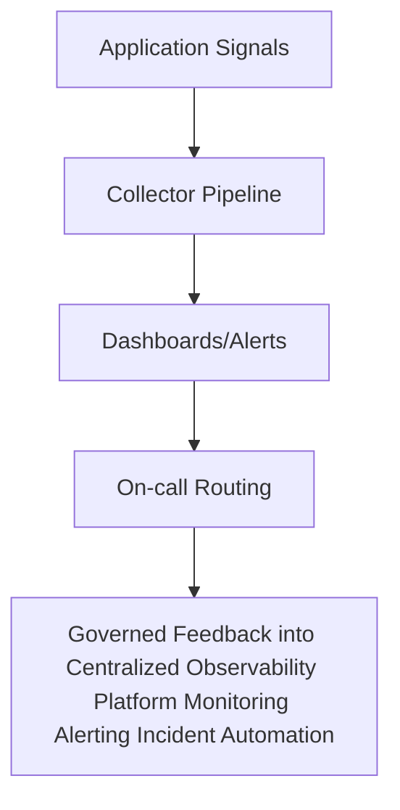

### Incident Escalation Sequence (Centralized Observability Platform Monitoring Alerting Incident Automation)
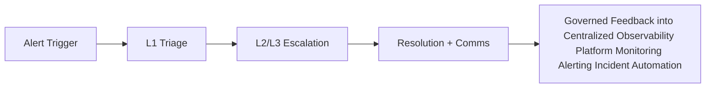

### Change and Release CAB Flow (Centralized Observability Platform Monitoring Alerting Incident Automation)
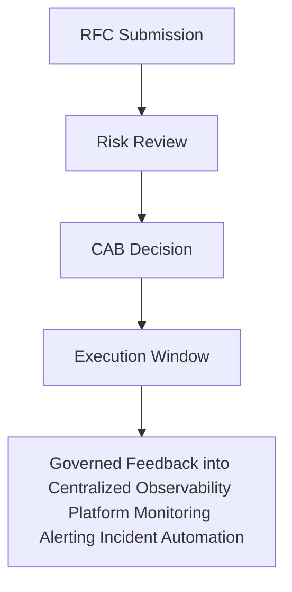

### RCA and Continuous Improvement Loop (Centralized Observability Platform Monitoring Alerting Incident Automation)
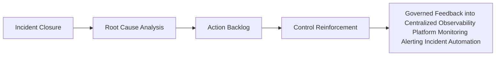

### Requirement-to-Backlog Flow (Centralized Observability Platform Monitoring Alerting Incident Automation)
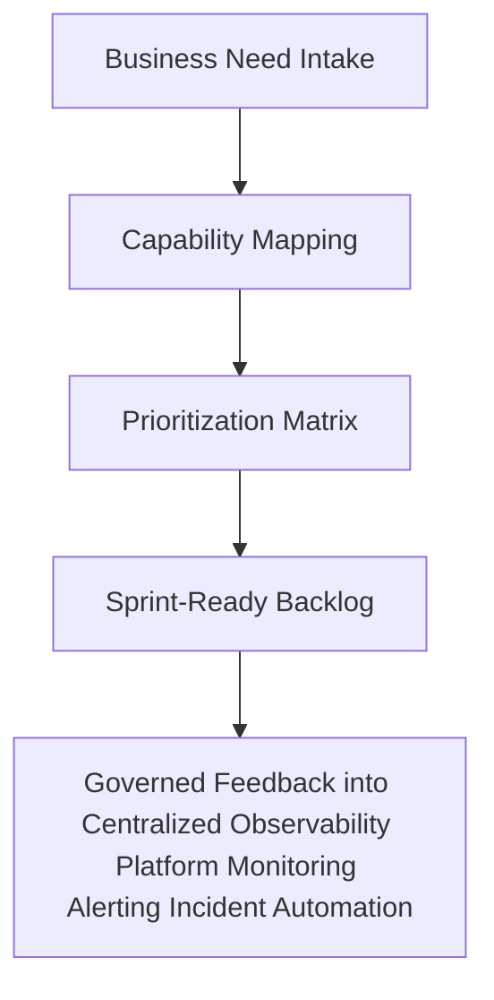

