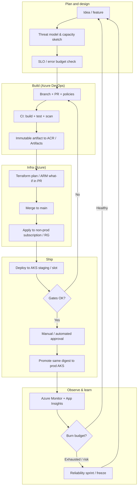
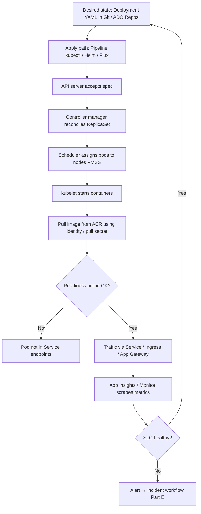
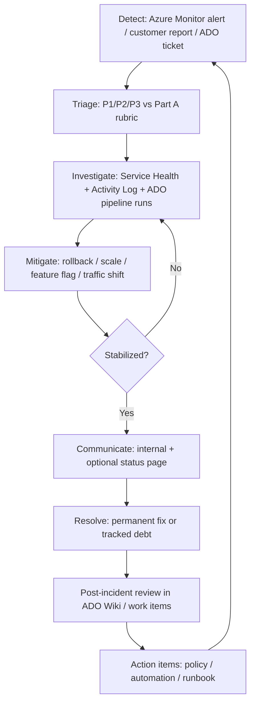
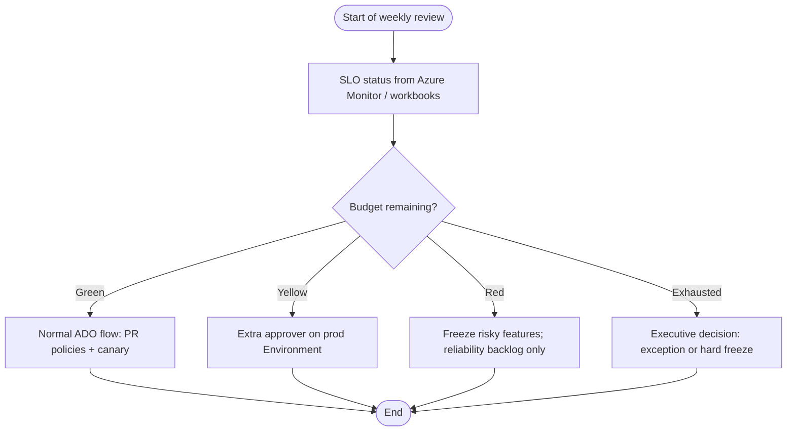
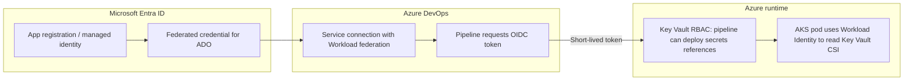

# SRE Notes for Microsoft Azure, Azure DevOps, AKS & Terraform

End-to-end study notes framed for **Microsoft Azure** and **Azure DevOps (ADO)** as the default platform: **Azure Kubernetes Service (AKS)**, **Azure Pipelines**, **Azure Repos / Boards / Wiki / Artifacts**, **Azure Monitor**, **Application Insights**, **Azure Key Vault**, **Microsoft Entra ID** (formerly Azure AD), **Azure Resource Manager (ARM)**, and **Terraform with the Azure (`azurerm` / `azapi`) providers**. Generic Kubernetes and Terraform ideas are kept, but **examples, portals, and incident workflows** assume this Azure + ADO stack unless stated otherwise.

**How to use this doc:** Each major part ends with or contains **Azure / ADO alignment** so you can map SRE work to real subscriptions, pipelines, and support paths. The **incident catalog (Part E)** includes **§ E.0** with a per-scenario Azure and ADO mapping table. **Part P** contains **lifecycle and flow diagrams** (Mermaid) with full explanations.

---

## Part A — SRE Foundations (Detailed)

### A.0 Microsoft Azure & Azure DevOps — platform map for SRE

**Paragraph — why a single map helps:** SRE work spans application code, cluster lifecycle, identity, observability, and change management. On Microsoft’s stack, those concerns split across **Azure** (runtime + data + security) and **Azure DevOps** (delivery + process). Without a written map, teams misplace responsibilities (“is slow deploy ADO or AKS?”) and incidents drag.

| SRE concern | Primary Azure services (examples) | Primary Azure DevOps features (examples) |
|-------------|-------------------------------------|------------------------------------------|
| **Immutable build & release** | Azure Container Registry (ACR); artifact storage | **Pipelines** YAML; **Artifacts** feeds; release retention |
| **Secrets & identity for automation** | Key Vault; **Microsoft Entra ID**; **federated workload identity** | **Service connections** (Workload identity federation recommended over long-lived secrets); variable groups (references, not secrets in YAML) |
| **Production Kubernetes** | **AKS**; Azure CNI / overlay; Azure Disk/File/blob CSI | Pipeline **environments** + approvals; deployment jobs to AKS (`kubectl`, Helm, Flux GitOps from repo) |
| **Observability & SLO evidence** | **Azure Monitor**; **Log Analytics** workspaces; **Application Insights**; diagnostic settings | Wiki SLO definitions; work items linking to **pipeline run IDs** and **resource tags** (`release`, `commit`) |
| **Incident & debt tracking** | Azure resource health; **Microsoft Defender for Cloud** alerts | **Boards** (bugs/incidents); **Queries**; **Wiki** runbooks |
| **IaC governance** | **Azure Policy**; resource locks; management groups | PR policies; Terraform plan artifacts; optional **branch policies** requiring work item links |
| **Support & escalation** | **Azure Support** cases (platform); Service Health | **Azure DevOps status**; org/project permissions for break-glass |

**Paragraph — subscriptions and landing zones:** In mature Azure estates, **management group → subscription → resource group** boundaries are how you scope pipeline identities and Terraform backends. SRE-relevant tags often include `Environment`, `Criticality`, `Owner`, `CostCenter`, and `BuildId` / `ReleaseId` for correlation. **Azure Resource Graph** (`az graph query`) is the fastest way to answer “how many AKS clusters run this old Kubernetes version across the estate?”

### A.1 What SRE Adds to Traditional Ops

Traditional operations often optimizes for **tickets closed** and **uptime narratives**. SRE optimizes for **defined reliability targets**, **measurable user experience**, and **sustainable engineering load**.

| Idea | Plain meaning | Why it matters in practice |
|------|----------------|----------------------------|
| **Reliability is a product feature** | You design, fund, and measure reliability like any product capability. | Prevents “infinite nine” culture; product can trade features vs stability using data. |
| **Toil reduction** | Automate repetitive manual work; track toil as a % of time. | On-call burns out if every page requires 20 manual steps forever. |
| **Error budget** | Allowed unreliability derived from the SLO; “budget” is what remains after incidents and degradation. | When budget is gone, **stop** shipping risky changes until reliability work restores headroom. |
| **Blameless culture** | Post-incidents improve systems and process, not assign personal fault. | People report near-misses; RCA goes deeper than “human error.” |
| **SLO-driven operations** | Alerts and reviews align with **user-visible** thresholds, not raw infra vanity metrics. | Reduces noisy pages; pages correlate with customer pain. |

**Azure DevOps role:** Repositories store code and IaC; **Pipelines** implement automation; **Boards** track incidents and reliability work; **Wiki** holds runbooks and severity definitions; **Artifacts** store immutable build outputs. That makes reliability work **auditable** (who deployed what, when, with which approval).

### A.2 SLIs, SLOs, SLAs (With Measurement Detail)

| Term | Meaning | How to express it well |
|------|---------|-------------------------|
| **SLI** | A **quantifiable** aspect of service health from the user’s perspective. | Good: “Ratio of successful `GET /api/orders` requests completing < 300 ms.” Bad: “CPU < 70%” (not inherently user-facing). |
| **SLO** | A **target** for an SLI over a **window** (often 30 days). | Example: “99.9% of eligible requests meet the SLI each month.” |
| **SLA** | A **contract** (often financial or reputational) tied to thresholds; may be **stricter** or **looser** than internal SLOs. | Many teams set internal SLO **tighter** than external SLA to create buffer. |

**Implementation notes**

- **Good SLIs** are **durable** under architecture changes (prefer semantic HTTP + latency buckets over “pod count”).
- **Bad SLIs** move when you refactor (e.g. “errors in Service X log line Z”) unless you maintain contracts.
- **Multi-window burn alerts** (e.g. fast burn + slow burn) reduce “silent SLO violation until month end.”

**Azure DevOps practice:** Put SLO definitions in **Wiki** or **work item templates** so incidents reference the same text as dashboards. Link **Application Insights** availability tests and custom metrics to those definitions in review meetings.

### A.3 Error Budgets and Release Policy (How Teams Use Them)

**Error budget** (conceptually): if your monthly availability SLO is 99.9%, you have roughly **43.8 minutes** of bad availability per month before violation (order-of-magnitude; exact math depends on how you define “bad” and your measurement granularity).

**Policy examples (tune to your org)**

- **Budget healthy:** Normal releases; still use canaries and mandatory checks.
- **Budget burning fast:** Require additional approvers; freeze non-critical changes; prioritize removal of flaky deploy gates that block **rollback**.
- **Budget exhausted:** Stop feature releases to production; only fixes, security, and reliability work until budget recovers (or executive exception with written risk acceptance).

**Azure DevOps levers**

- **Branch policies:** required reviewers, build validation, linked work items.
- **Environments & checks:** manual approval, Azure Function checks, **invoke REST API** gates.
- **Deployment patterns:** ring/canary in pipeline stages; automatic rollback on metric regression if implemented.

**Paragraph — how product uses the budget in meetings:** A useful ritual is a monthly **error budget review** with product management. Engineering brings charts: SLO burn by service, top incidents, and upcoming risky migrations. Product brings the roadmap. If the budget is thin, the meeting output is explicit: “We ship only reliability and small fixes for two weeks.” If the budget is healthy, the team might still choose reliability investments, but the decision is **informed**, not superstitious.

| Budget state (example labels) | Engineering posture (examples) | Product posture (examples) |
|------------------------------|----------------------------------|-----------------------------|
| **Green** (>50% remaining) | Normal releases; continue refactors | Feature work proceeds |
| **Yellow** (25–50% remaining) | Extra scrutiny on risky changes; more canary time | De-scope risky launches |
| **Red** (<25% or policy threshold) | Approvals tightened; on-call focus time | Delay non-critical launches |
| **Exhausted** | Freeze or near-freeze on prod features | Negotiate exception with written risk |

### A.4 Incident Severity Rubric (P1 / P2 / P3) — Expanded

Use **one** rubric organization-wide. If you also use **SEV1–SEV4**, publish a mapping table (e.g. SEV1 = P1).

| Priority | User / business impact | Work pattern | Customer / leadership comms |
|----------|------------------------|--------------|-----------------------------|
| **P1** | Critical: total or near-total loss of primary function; **data integrity** at risk; **regulatory** or **security** breach; no practical workaround | All-hands on deck as needed; incident commander optional but common for long P1 | Status page + stakeholders per comms plan |
| **P2** | Serious: large minority affected; major workflow broken; workaround exists but costly; **SLO burn** high | On-call engages quickly; escalate if trending to P1 | May need summary updates; depends on duration |
| **P3** | Limited: dev/test; small user slice; cosmetic; documented workaround | Queue in backlog; fix in business hours unless trivial | Usually none |

**Definitions you must write down**

- **“Production”** vs **pre-production** vs **internal-only**.
- **“Degraded”** numerically (e.g. error rate > X% for Y minutes).
- **When P2 becomes P1** (e.g. duration > N hours, or error rate crosses Z%).

### A.5 Pipelines as Reliability Infrastructure — Detail

- **Immutable artifacts:** The **same** container digest or package version promoted from test → staging → prod. Rebuilding at prod stage reintroduces “works on my machine” and non-reproducible incidents.
- **Secrets:** Prefer **short-lived** credentials via **OIDC/federation** to cloud identity; **Key Vault** references in Azure Pipelines; rotate and audit. PATs in variable groups are a common leak and rotation headache.
- **IaC in PR:** Every Terraform/OpenTofu change produces a **stored `plan`** artifact for audit; policy checks block dangerous patterns before merge.
- **Flaky tests:** Flakes **train** teams to ignore red builds; then real failures ship. Track flake rate; quarantine **only** with owner + **expiry date** + linked bug.

### A.6 Observability and Release Correlation — Detail

| Signal | What it tells you | Typical tooling |
|--------|-------------------|-------------------|
| **Metrics** | Rates, saturation, latency distributions | Azure Monitor, Prometheus |
| **Logs** | Why a specific request failed; config values (redacted) | Log Analytics, ELK, Loki |
| **Traces** | Cross-service latency and dependency failures | App Insights, Jaeger, Tempo |
| **Synthetic** | “Is it up?” from outside your network | Availability tests, black-box probes |

**Correlation contract:** Every deploy should stamp **build ID**, **git SHA**, and **environment** into structured logs and (where possible) metric labels. During an incident, the first question is often: **“What changed?”** Without correlation, you burn hours guessing.

### A.6.1 Azure Monitor & Application Insights — SRE-oriented setup

**Paragraph — workspace layout:** A common pattern is **one Log Analytics workspace per environment** (or one prod workspace per compliance boundary) with **diagnostic settings** sending AKS control plane, Application Gateway, SQL, and Key Vault logs to that workspace. **Application Insights** (workspace-based) stores app traces and dependency calls. SRE teams create **alert rules** (metric or log) that reference **SLO queries**—for example, a log query on `requests` where `resultCode >= 500` grouped by `cloud_RoleName` and `customDimensions.deploymentId`.

**Paragraph — tagging for Azure resources:** Apply ARM tags such as `Application`, `Environment`, `Owner`, and `BuildId` / `ReleaseId` from Azure Pipelines using built-in **tagging tasks** or Terraform `default_tags`. **Azure Resource Graph** can then answer cross-subscription questions during incidents (“show all public IPs tagged `Environment=prod`”).

| Signal type | Azure-native option | ADO linkage |
|-------------|---------------------|-------------|
| Uptime synthetics | **Application Insights availability tests** | Fail gate or notify on release |
| Infra metrics | **Azure Monitor metrics** on AKS, SQL, Gateway | Optional: **Azure Monitor pipeline gate** |
| Audit “who changed infra” | **Activity Log** → LA | Correlate with pipeline **service principal** object ID |

### A.7 Boards, Runbooks, Post-Incident Reviews — Detail

**Incident work item fields (recommended)**

- Severity, start/end time, customer impact statement, **user count or %** if known.
- **Linked** pipeline runs, commits, Terraform applies, change tickets.
- Current **hypothesis**, **mitigation**, **owner** for comms.
- **Customer-facing** message drafts (even if internal-only).

**Runbook structure**

1. **Symptom** (what the on-call sees).
2. **Confirm impact** (which SLO, which region).
3. **Safe checks** (read-only `kubectl`, dashboards).
4. **Mitigation** (rollback, scale, feature flag).
5. **Escalation** (who to call, cloud support ticket criteria).

**PIR (post-incident review)**

- Timeline with **UTC**; no blame language.
- **Root cause** and **contributing factors** (why safeguards failed).
- **Action items**: owner, due date, **type** (eliminate / automate / detect faster / reduce blast radius).

### A.8 Toil Budget — Detail

**Toil** scales with traffic or fleet size unless automated: certificate renewals done by hand, manual scaling runbooks, copying logs into tickets every week. SRE practice: measure **toil hours per sprint** and cap it (common guideline: **≤50%** of time for teams doing heavy ops). The remainder goes to **engineering**: permanent fixes, self-service, better alerts.

### A.9 Expanded Practices Checklist

- [ ] SLIs/SLOs written and agreed with product; **internal** vs **external** SLOs separated  
- [ ] **Multi-window** burn alerts or equivalent for SLOs  
- [ ] Symptom-based alerts; paging rules reviewed quarterly  
- [ ] Error budget policy documented (freeze, exceptions, who approves exceptions)  
- [ ] Rollback / fast-forward fix path **tested** (game day)  
- [ ] On-call rotation + escalation in ADO/wiki; **shadow** and **reverse-shadow** for new hires  
- [ ] Secrets: no plaintext in git; rotation; **break-glass** audited  
- [ ] DR / backup restore tested; **RPO/RTO** documented  
- [ ] Capacity review before known peaks  
- [ ] Dependency inventory: Terraform providers, K8s version skew, critical SaaS, certificate expiries  

### A.10 Risk, capacity, and compliance (fuller notes)

**Paragraph — risk registers:** Many teams keep a **risk register** (spreadsheet or ADO epics) listing “what could take us down,” its likelihood, impact, and mitigations. SRE-minded teams review this quarterly alongside **error budget** reviews. The register is not pessimism; it is **prioritization**. Examples of rows: “Single region for Tier-0,” “One person knows Terraform state surgery,” “No tested restore for object storage.”

**Paragraph — capacity planning:** Capacity is not only “CPU headroom.” It includes **connection pools**, **egress bandwidth**, **API rate limits** from cloud vendors, **Kubernetes scheduler** headroom for sudden rescheduling, and **human** capacity (on-call coverage during holidays). A simple annual exercise is to take last year’s peak traffic, multiply by a growth factor, and stress-test staging at that level **before** marketing announces a major launch.

| Capacity question | Example evidence to collect |
|-------------------|-----------------------------|
| What is peak RPS / QPS? | Ingress metrics, last Black Friday |
| What breaks first under load? | DB saturation vs app threads vs DNS |
| How fast can we add nodes? | Cluster autoscaler logs, quota limits |
| What is our largest blast-radius deploy? | Ingress chart, shared Redis |

**Paragraph — compliance touchpoints:** Regulated environments (PCI-DSS, HIPAA-style controls, SOC 2) often require **separation of duties**, **audit trails**, and **change records**. Azure DevOps can supply evidence: PR history, pipeline logs, environment approvals, and artifact immutability. SRE work still centers on reliability, but **controls** reduce the chance that reliability fixes bypass governance. Always involve your **security/compliance** partners when writing break-glass procedures—otherwise auditors see “emergency” as “policy does not exist.”

| Control theme | Example engineering behavior |
|-----------------|------------------------------|
| Change traceability | Work items linked to releases |
| Least privilege | Pipeline identity scoped to one subscription/resource group |
| Evidence of testing | Required checks on `main` merges |
| Break-glass | Named approvers + ticket + post-facto review |

### A.11 Example SEV ↔ Priority mapping (table)

If your org uses both **SEV** and **P** labels, publish a single mapping poster in the wiki.

| SEV (example) | Typical P mapping | Example situations |
|---------------|-------------------|---------------------|
| SEV1 | P1 | Full outage, integrity breach |
| SEV2 | P1 or P2 (policy choice) | Major degradation approaching outage |
| SEV3 | P2 | Partial degradation with workaround |
| SEV4 | P3 | Minor, localized |

**Paragraph:** Some companies map **SEV2 → P1** if duration exceeds N hours even when impact is partial. The mapping is a **policy** decision, not a technical law.

### A.12 Azure identity, governance, and cost hooks for SRE

**Paragraph — workload identity vs secrets:** For Azure Pipelines deploying to AKS or running Terraform against Azure, **Microsoft Entra workload identity federation** (OIDC) avoids storing Azure client secrets in variable groups. The pipeline obtains short-lived tokens; compromise surface shrinks and rotation toil drops. Legacy **service principal + client secret** patterns still appear in older orgs—treat secret expiry as a **P2** class of risk because it blocks releases at the worst time.

**Paragraph — governance that prevents “oops” applies:** **Azure Policy** (deny public IPs on AKS nodes, require tags, restrict regions) and **resource locks** (`CanNotDelete` on state storage, production databases) are complements to Terraform `prevent_destroy`. **Microsoft Defender for Cloud** adds posture alerts (e.g. overly permissive `kube-system` access); route critical findings to the same on-call or security queue as application pages.

| Azure area | SRE-relevant setting / feature | Typical ADO touchpoint |
|------------|--------------------------------|-------------------------|
| **Cost & capacity** | VM reservations for steady node pools; autoscale profiles | Pipeline schedules for env scale-down in non-prod |
| **Backup** | **Azure Backup** for AKS (where used); DB PITR | Runbook + wiki links to RPO/RTO |
| **Networking** | Private ACR, private cluster API, **Application Gateway** / **Front Door** | Document which pipeline stage updates DNS or certificates |

---

## Part B — Kubernetes (SRE View, Expanded)

### B.0 AKS (Azure Kubernetes Service) — Azure-specific SRE notes

**Paragraph — shared responsibility:** For **AKS**, Microsoft operates the **Kubernetes control plane** (API server, etcd in managed form); you operate **node pools**, **workloads**, **ingress**, and **integrations** (ACR pull, Key Vault secrets, Azure AD Workload ID). Control plane outages or regional degradation are **Azure platform** incidents—check [Azure Service Health](https://status.azure.com/) and open a support case with **resource ID** from the AKS blade. Data plane issues (nodes, CNI, CSI) often still need your diagnosis but may involve **Azure VM / disk** limits.

**Paragraph — networking choices:** **Azure CNI** (pod IPs on VNet) vs **kubenet** affects IP planning and **Network Security Groups**. **Overlay** modes change how you reason about routing. **Private cluster** disables public API access patterns—ensure **Azure DevOps** agents (Microsoft-hosted or self-hosted) can reach the API (bastion, self-hosted agents in VNet, or **Azure Private Link** patterns). Misaligned agent networking is a classic “pipeline cannot deploy” **P2**.

**Paragraph — ingress on Azure:** Teams often front AKS with **Application Gateway** (including **Application Gateway Ingress Controller — AGIC**), **Azure Front Door**, or in-cluster **NGINX / Traefik**. Certificates may come from **Key Vault** (CSI driver) or **cert-manager** with DNS-01 against Azure DNS. TLS incidents (Part E) on Azure almost always involve **Key Vault access policy / RBAC**, **managed identity** on the ingress controller, or **Front Door** origin health.

| AKS topic | What to monitor / alert (Azure angle) | Where in Azure Portal |
|-----------|----------------------------------------|-------------------------|
| **Control plane** | API server availability (provider metrics) | AKS → **Insights** / metrics; Service Health |
| **Node pools** | CPU/memory/disk pressure; **not ready** nodes | AKS → **Node pools**; Monitor VMSS metrics |
| **Workloads** | Pod restarts; failed scheduling | AKS → **Kubernetes resources** (preview features vary) or Grafana/Azure Monitor workbooks |
| **Image pulls** | `ImagePullBackOff` correlated with **ACR** firewall / identity | ACR → **Networking**; AKS kubelet logs via Monitor |
| **Storage** | Disk throttling; attach errors | Managed disks metrics; AKS **PVC** events |

### B.1 Core Concepts for Reliability

- **Control plane:** API server, etcd, scheduler, controller-manager. If the API is down, **declarative reconciliation stops**; you cannot trust cluster state vs reality until restored. Usually **P1** if production cannot schedule or update workloads.
- **Data plane:** Nodes, kubelet, container runtime, **CNI** (pod networking), **CSI** (storage). Failures are often **zonal** unless misconfigured (e.g. single replica global ingress).
- **Workloads:** Deployments (stateless), StatefulSets (stable identity + storage), DaemonSets (per-node agents). Choose correctly; stateful semantics on Deployments cause data incidents.
- **PDBs (PodDisruptionBudgets):** Limit voluntary evictions during node drain / upgrade. Too **strict** PDBs → upgrades stall; too **loose** → availability loss during maintenance.
- **Ingress / Gateway / mesh:** High blast radius: TLS, routing, timeouts, retries at the edge can mask or amplify app bugs.
- **Resources:** `requests` drive scheduling; `limits` cap usage. **OOMKilled** and CPU throttling manifest as latency and 5xx at the load balancer.

### B.2 Operational Golden Paths

- **Version skew:** Cluster version, node pool version, **API versions** in manifests (`policy/v1beta1` removals bite on upgrade).
- **Change discipline:** Small diffs, progressive delivery, feature flags in application config.
- **etcd:** Managed clouds abstract it, but **backup/restore** and **limiting huge objects** (e.g. massive ConfigMaps) still matter for self-managed or edge cases.

### B.3 Investigation Starters (Runbook Hints)

| Symptom | First checks |
|---------|----------------|
| Pods **Pending** | `kubectl describe pod`; node resources; taints/tolerations; **PDB** blocking eviction elsewhere; **PriorityClass** |
| **CrashLoopBackOff** | `kubectl logs --previous`; probe timing; missing env/volume mounts; crash-only on prod data |
| **Intermittent** failures | DNS (`dig` / `nslookup` from debug pod); **NetworkPolicy**; MTU issues; conntrack exhaustion |
| **Storage** issues | `kubectl describe pvc`; CSI driver pods; zone of PV vs pod; **volume attachment** stuck |

### B.4 AKS incident workflow — Azure CLI, Portal, and ADO links

**Paragraph — evidence chain:** During an AKS incident, preserve **Azure Activity Log** entries (scale, upgrade, stop/start cluster), **ADO pipeline run URLs**, and **container logs** in Log Analytics. For support, Azure often requests `az aks show` output, **resource ID**, and approximate **UTC** window.

| Step | Azure / CLI (examples) | ADO |
|------|-------------------------|-----|
| Confirm cluster & RG | `az aks list -o table` | Open last successful **deployment job** to prod |
| API / node health | Portal: AKS → **Diagnose and solve problems** | Compare deploy time with incident start |
| Logs | `az monitor log-analytics query` or Workbooks | Pipeline variables: `BUILD_BUILDID`, `RELEASE_RELEASEID` stamped into app logs |
| Change history | Activity Log → filter **AKS** resource | **Repos** → compare commits; **Artifacts** digest promoted |

**Azure support tip:** Open a ticket under **Technical → Kubernetes Service (AKS)** with severity aligned to business impact; attach **cluster autoscaler** / **upgrade** history if relevant.

---

## Part C — Terraform (SRE View, Expanded)

### C.0 Terraform on Microsoft Azure — backends, identity, and ADO pipelines

**Paragraph — remote state on Azure:** The common pattern is an **Azure Storage Account** (blob container) for `backend "azurerm" {}` with **state locking** via blob leases. Lock stuck incidents (Part E) map directly to **lease state** on the `.tfstate` blob—resolve by fixing the pipeline, not by deleting state blindly. Restrict access with **RBAC** (pipeline identity **Storage Blob Data Contributor** on container only, not entire subscription).

**Paragraph — identity from Azure Pipelines:** Prefer **OIDC federation** so the pipeline becomes a **federated credential** on a **Microsoft Entra app registration** or user-assigned **managed identity** that Terraform uses (`ARM_USE_OIDC`, `ARM_CLIENT_ID`, etc., per current Terraform Azure auth docs). This ties **Part C** to **Part A § A.12**—one identity model for Terraform and for `az aks get-credentials` automation.

**Paragraph — `azurerm` vs `azapi`:** Most teams use **`azurerm`** for first-class resources. **`azapi`** (AzureRM provider family) helps when Azure ships new APIs before full `azurerm` resource coverage—useful for platform teams, but increases review burden because plans are harder to read for app teams.

| Artifact | Azure piece | ADO piece |
|----------|-------------|-----------|
| **State** | Storage account + container + optional versioning | Pipeline **secure files** / variable group for backend config (non-secret names) |
| **Plan output** | (Optional) upload to Storage for audit | **Publish pipeline artifact** task on `terraform plan` |
| **Apply** | Activity Log shows resource writes | **Environment** approval on `terraform apply` stage |
| **Drift** | **Azure Policy** compliance; **Terraform Cloud/Enterprise** or manual drift scan | Scheduled pipeline comparing `plan -refresh-only` |

### C.1 Why Terraform Incidents Hurt

**State** maps configuration to real resource IDs. Lose or corrupt state → Terraform may propose **recreate** (downtime) or lose track of orphans. Wrong **workspace** or wrong **backend config** → applying **dev** code against **prod** resources (catastrophic).

**Drift:** Manual console edits mean the next `plan` surprises the team; someone “fixes” prod in UI, CI applies, **reverts** the fix or fights unknown attributes.

**Provider / module upgrades:** Can change defaults and schemas; treat upgrades like **application releases**: changelog, staged rollout, stored plans.

### C.2 Safe Workflow Patterns (Step-Level)

1. **Remote state** with locking (e.g. Azure Storage account + blob container); restrict access with RBAC.
2. **Every PR:** `terraform fmt -check`, validate, **plan** (read-only) on ephemeral credentials scoped to non-prod where possible.
3. **Apply:** Only from designated pipeline + branch; **manual approval** for prod; **plan artifact** archived.
4. **State operations:** `terraform state rm` / `mv` only with **two-person** review for prod; document in ticket.
5. **Emergency `-target`:** Document ticket reason; follow up with full apply to reconcile.

### C.3 Common Failure Modes — What They Look Like

- **Stuck lock:** Pipeline crashed mid-apply; lock blob remains → all applies fail with **lock id** error.
- **Auth expiry:** SPN secret rotated; federated token misconfigured → `Error building ARM` style failures at plan time.
- **API throttling:** Large `count` or wide modules hit cloud rate limits; plan/apply timeouts.
- **Lifecycle / replace:** Accidental `replace` triggers destroy-create of DB; **prevent_destroy** and policies reduce risk but require discipline.

### C.3.1 Azure-specific throttling and subscription limits (notes)

**Paragraph:** Terraform `apply` can issue thousands of ARM API calls. Azure enforces **subscription-scoped read/write throttling**; symptoms include HTTP **429** in provider logs and long hangs. Mitigations: reduce parallelism (`-parallelism=n`), split stacks by lifecycle (network vs data plane), use **data sources** sparingly in hot paths, and request **quota increases** when legitimate (e.g. public IPs, cores). For **ADO**, increase job timeout only after confirming the job is not stuck in a retry loop hammering Azure.

---

## Part D — “Rest of Project” (Expanded) — Azure service alignment

The table below extends the generic reliability themes with **representative Azure services** your app and platform teams likely operate next to AKS. Use it when writing **dependency registers** and **runbooks** (“our checkout reads **Azure SQL** and writes to **Service Bus**”).

| Area | Reliability focus | Detail (generic) | Example Azure services & notes |
|------|-------------------|------------------|--------------------------------|
| **Application** | Timeouts, retries, idempotency, circuit breakers | Retries must be **idempotent** on POST; bulkheads; **degraded** mode | **Azure App Service** / **Container Apps** (if not only AKS); **API Management** for edge throttling and policies |
| **Data** | RPO/RTO, replication, pools | Connection storms; **lag** on replicas | **Azure SQL** (HA / failover groups), **Azure Database for PostgreSQL**, **Cosmos DB** (RUs, partition keys), **Azure Cache for Redis** |
| **Messaging** | Backlogs, DLQ, ordering | Poison messages | **Service Bus**, **Event Hubs** (throughput units), **Event Grid** |
| **Network** | TLS, DNS, firewalls | Cert expiry; private DNS | **Azure DNS**, **Private Link / Private Endpoint**, **Application Gateway**, **Azure Front Door** (WAF, caching), **NSG** / **ASG** rules |
| **Security** | Least privilege, rotation | Over-broad pipeline rights | **Microsoft Entra ID** roles, **Key Vault** RBAC, **Defender for Cloud**, **AKS Azure RBAC** vs local accounts disabled |
| **CI/CD** | Agents, queueing | Hotfix blocked | **Azure Pipelines** Microsoft-hosted vs **self-hosted agents** on Azure VMs/VMSS; **scale set agents** networking to private ACR/AKS |
| **Dependencies** | Vendor SLOs | Circuit breakers | **Azure OpenAI**, **Cognitive Services**, payment gateways—expose health in **Application Insights** dependency telemetry |

**Paragraph — Azure Monitor as the hub:** Standardize on a **Log Analytics workspace** per environment (or per compliance boundary) and send **AKS control plane diagnostics**, **resource logs** for Application Gateway / Front Door, and **Application Insights** for app traces. SLO dashboards built in **Azure Monitor workbooks** or **Grafana (Azure managed)** give leadership one place to read error budgets tied to Azure resources.

---

## Part E — Detailed Incident Catalog (10 × P1, 10 × P2, 10 × P3)

Each item includes: **scenario**, **impact**, **symptoms**, **common causes**, **immediate actions**, **diagnosis**, **recovery / stabilization**, **when to downgrade**, **post-incident**. **§ E.0** maps every scenario to **Azure** and **Azure DevOps** tooling so you can open the right blade and pipeline view during a bridge call.

### E.0 Azure + Azure DevOps — how to use this catalog

**Paragraph — one incident, two planes:** Most production incidents touch **both** the workload on Azure (AKS, SQL, Gateway…) **and** the last change delivered through **Azure DevOps** (commit, pipeline run, Helm chart version). Successful bridges assign **one owner** to “Azure resource + health” and ensure **someone** pulls ADO history in parallel—often the same engineer in small teams.

#### E.0.1 During any incident — Azure + ADO checklist (repeatable)

1. **Azure Service Health** — active events affecting subscription, region, AKS, SQL, etc.  
2. **Azure Monitor** — fired alerts; workbook / dashboard for the service SLO.  
3. **Resource Health** blade on the specific resource (AKS, SQL, Gateway).  
4. **Activity Log** — who changed what (scaling, secret rotation, policy assignment).  
5. **Azure DevOps** — **Pipelines → Runs** filtered by time; **Releases** or multi-stage YAML; **Commits** diff.  
6. **Microsoft Entra ID** — sign-in / managed identity issues if auth broke after rotation.  
7. **Support** — Azure support for platform; ADO support / status page for org-wide CI issues.

#### E.0.2 Catalog cross-reference — Azure services & ADO artifacts by scenario

| ID | Scenario (summary) | Azure services / areas (typical) | Azure DevOps artifacts to capture |
|----|--------------------|----------------------------------|-------------------------------------|
| **E.1.1** | K8s API unreachable | **AKS** control plane; Service Health; private DNS / private cluster connectivity | Last **deploy** / **kubectl** task run; agent pool location |
| **E.1.2** | Ingress 100% 5xx | **Application Gateway** / **Front Door** / in-cluster ingress; **Key Vault** TLS secrets | Helm/Kustomize commit; **environment** approval record |
| **E.1.3** | Payment integrity | **App on AKS**; **Azure SQL** / **Cosmos**; Service Bus outbox | Release tag; database migration step in pipeline |
| **E.1.4** | etcd / control plane data risk | **AKS**; backup snapshots if configured | Freeze **terraform** or **ARM** that touches cluster RG |
| **E.1.5** | Terraform destroyed DB | **Azure SQL** / managed disk; **Storage** (blob) state | Pipeline run with **plan** artifact; `terraform show` log |
| **E.1.6** | Exploitation / ransomware | **Defender for Cloud**; **Microsoft Entra ID**; **NSG** | Audit PAT / service connection usage; disable compromised connections |
| **E.1.7** | Multi-region down | **Front Door** / **Traffic Manager**; paired regions; **Cosmos** multi-region | Traffic shift pipeline; DNS change history |
| **E.1.8** | TLS total failure | **Key Vault**; **App Gateway** / **Front Door**; **Azure DNS** | Cert import/renew pipeline; secret version IDs |
| **E.1.9** | StatefulSet / disk corruption | **Azure Disk** CSI; **AKS** zones; snapshots | StatefulSet chart version in Git tag |
| **E.1.10** | CI/CD blocked (hotfix) | **Azure VMSS** agents; **Microsoft-hosted** capacity; **Key Vault** auth to ARM | **Organization settings**; agent pool diagnostics; service connection **OIDC** config |
| **E.2.1** | AZ loss / Pending pods | **AKS** zonal node pools; VMSS | Cluster upgrade / scale pipeline |
| **E.2.2** | Elevated 5xx after canary | **AKS** + **Application Insights** | Canary **stage** YAML; feature flag variable group |
| **E.2.3** | Terraform state lock | **Storage account** blob lease | Stuck pipeline job ID holding lock |
| **E.2.4** | Drift / partial apply | **Azure Policy** non-compliance; manual portal edits | Drift scan pipeline results |
| **E.2.5** | CoreDNS flaky | **AKS** add-on; **Network Policy** | CNI / policy Git commit |
| **E.2.6** | Image pull failures | **ACR**; private endpoint; **managed identity** | `acrTasks` / build service connection; firewall IP ranges |
| **E.2.7** | DB replication lag | **Azure SQL** geo-secondaries / HA | DTU/vCore metrics; elastic query jobs |
| **E.2.8** | HPA / metrics stuck | **AKS** metrics-server; **Azure Monitor** adapter (if used) | Metrics-server manifest pipeline |
| **E.2.9** | Pipeline test gate blocks prod | **Azure Pipelines** test stage | Flaky test work item; waiver approval log |
| **E.2.10** | Third-party API down | **Application Insights** dependencies | Retry policy config in repo |
| **E.3.1** | Dev node NotReady | **AKS** non-prod cluster | Low priority board item |
| **E.3.2** | `terraform fmt` CI fail | — | PR build policy |
| **E.3.3** | K8s API deprecation | **AKS** supported versions | Upgrade backlog in **Boards** |
| **E.3.4** | Occasional OOM pod | **AKS** limits; **Container Insights** | Resource tuning PR |
| **E.3.5** | Dev namespace quota | **AKS** `ResourceQuota` | Platform team epic |
| **E.3.6** | Stale branch / variable group | — | Variable group **Library** audit |
| **E.3.7** | Dashboard no data | **Azure Monitor** workbook query | Dashboard JSON in Git |
| **E.3.8** | Wrong runbook | **Wiki** | PR to wiki |
| **E.3.9** | Terraform module hygiene | Module registry (Git or **Artifacts** feed) | Renovate pipeline |
| **E.3.10** | Flaky e2e | **Azure Pipelines** test analytics | Test impact / quarantine ticket |

**Paragraph — deepening any single E.x.y entry:** When you triage a row in **E.0.2**, open the linked **Azure resource** in Portal, pin **metrics** (Requests, Errors, Latency for gateways; **kube-apiserver** metrics for AKS where available), and in ADO open the **exact pipeline run** that last mutated that resource group. That pairing answers “what changed?” faster than either side alone.

---

### E.1 — Priority 1 (P1)

#### E.1.1 — Production Kubernetes API unreachable

**Scenario:** The Kubernetes API server (managed or self-hosted) stops accepting authenticated requests, or etcd backing store is unavailable. Controllers cannot reconcile; new pods cannot be scheduled; existing pods may keep running but **no safe orchestration**.

**User / business impact:** Cannot deploy fixes; cannot scale; cluster-wide **change freeze** in practice. Any incident requiring rescheduling worsens. Usually **total** loss of ability to operate the platform for engineers; user impact depends on whether workloads are **already** healthy.

**Symptoms & detection:** `kubectl` timeouts or TLS errors; cloud portal shows control plane unhealthy; massive alert storm on **API server latency** / **5xx from apiserver**; GitOps / Argo / Flux failing sync.

**Common causes:** Cloud provider incident; etcd quorum loss; misconfiguration of API aggregation layer; certificate rotation failure on apiserver; overload (unbounded list/watch from buggy controllers).

**Immediate actions (first 15–30 minutes)**

1. Confirm scope: one cluster vs all clusters; one region vs global (provider status page).
2. **Stop** mass `kubectl` scripts and Terraform applies that touch the cluster until scope is clear.
3. Open **cloud support** ticket if managed control plane; attach timestamps, cluster ID, correlation IDs.
4. Assign **incident comms** owner; send initial “investigating” message per policy.
5. If workloads still serve traffic, avoid changes that trigger **large rescheduling** until API returns.

**Diagnosis (deeper):** Provider diagnostics; audit logs for RBAC or admission webhook failures; check **webhook** timeouts (ValidatingWebhookConfiguration) that can brick API if webhook backend is down.

**Recovery / stabilization:** Provider fixes or restoring etcd/quorum per runbook; remove or bypass **broken webhooks** only with extreme care and senior review (security implications).

**When to downgrade:** API consistently healthy; successful staged read/write checks; controllers catching up without errors.

**Post-incident:** PIR; load test admission path; webhook HA and **failurePolicy** review; chaos test for API dependency.

**Azure / ADO elaboration:** For **AKS**, capture **resource ID** and **Kubernetes version** in the incident ticket. In Portal, use **Diagnose and solve problems** and **Insights** for the cluster. If **private cluster** is enabled, document whether agents use **VNet injection** or self-hosted agents—network misconfigurations often masquerade as “API down.” In ADO, attach **pipeline run URLs** only from service connections that use **workload identity** or scoped RBAC so post-PIR credential rotation is traceable.

---

#### E.1.2 — 100% ingress 5xx for customer-facing hostname

**Scenario:** All HTTP(S) traffic to the primary hostname returns **5xx** at the edge (ingress controller, API gateway, or load balancer), not isolated to one pod.

**User / business impact:** Complete loss of web or API access for customers; revenue and support load spike; SEO/reputation risk for prolonged outages.

**Symptoms & detection:** Synthetic checks all red; CDN origin errors; `Ingress` or `Gateway` status shows backend not ready; uniform 502/503 in access logs.

**Common causes:** Bad **Ingress** / Gateway config push; TLS secret missing after cert rotation; **all** readiness probes failing upstream; ingress controller DaemonSet/Deployment scaled to zero; wrong `serviceName` / port; WAF or DDoS rule blocking origin incorrectly.

**Immediate actions**

1. Identify **last change**: Git commit, pipeline run, Helm release revision.
2. If correlation is strong, **rollback** ingress Helm/chart or GitOps revision first (fastest win).
3. Verify **TLS secret** exists in namespace; check cert `notAfter`.
4. Check **Service endpoints**: `kubectl get endpoints` — empty endpoints → selector/labels mismatch.
5. Scale ingress controller replicas if crashed; check **OOMKilled** on controller pods.

**Diagnosis:** Compare canary vs stable; packet capture rarely needed; controller logs often show reload errors.

**Recovery:** Rollback or hotfix manifest; restore TLS secret from Key Vault backup; fix Service selectors.

**When to downgrade:** Synthetics green; error rate under SLO threshold for sustained window (e.g. 15–30 min).

**Post-incident:** Staged rollout for ingress changes; **pre-deploy** diff checks; cert expiry automation with alerts at multiple horizons.

**Azure / ADO elaboration:** If using **Application Gateway + AGIC**, verify **Backend health** in the Gateway blade and compare with **Key Vault** secret **version** referenced by the listener SSL certificate. **Front Door** adds another layer—check **origin health** and **WAF** logs in Log Analytics. In ADO, store **Helm values** or **Gateway YAML** in **Repos** with mandatory reviewers for files touching hostnames or TLS secret names.

---

#### E.1.3 — Confirmed payment path double-charge or lost orders

**Scenario:** Idempotency broken, duplicate message processing, or transaction boundary bug causes **duplicate charges** or **lost** paid orders.

**User / business impact:** Direct financial harm; regulatory (PCI) and legal exposure; mandatory executive and finance comms.

**Symptoms & detection:** Support spike; payment provider dashboard shows duplicate captures; DB uniqueness violations; reconciliation job flags mismatched totals.

**Common causes:** Retry storm without idempotency keys; **at-least-once** messaging without dedup; race in read-modify-write; partial failure after capture.

**Immediate actions**

1. **Freeze** non-essential deploys to payment services.
2. **Disable** risky feature flags or **read-only** mode for affected endpoint if safe (may block revenue—decision with leadership).
3. Notify **finance**, **legal**, **compliance** per playbook.
4. Preserve **logs** and DB **PITR** pointers (do not destroy evidence).
5. Open **war room** with senior engineer + product + finance lead.

**Diagnosis:** Trace single failing `order_id` through message IDs; compare ledger vs operational DB; reproduce in sandbox with anonymized data.

**Recovery:** Compensating transactions, refunds, manual reconciliation scripts **with four-eyes** approval; fix forward only after root reproduction.

**When to downgrade:** No new duplicates; reconciliation complete for window; monitoring proves stable behavior.

**Post-incident:** Mandatory PIR; idempotency middleware; **outbox** pattern; integration tests for retry scenarios; SLO on payment success + integrity checks.

**Azure / ADO elaboration:** Use **Application Insights** **transaction search** on `operation_Id` for failed payments; enable **SQL / Cosmos** diagnostic logs for deadlocks and timeouts. **Service Bus** sessions or duplicate detection support idempotent consumption patterns. In ADO, link the incident work item to the **exact release** and **database migration** task; freeze further **EF migrations** or **Flyway** steps until RCA is documented.

---

#### E.1.4 — etcd or managed control plane incident with data loss risk

**Scenario:** Underlying etcd corruption, snapshot restore in progress, or severe control plane degradation where **cluster state** may not match reality.

**User / business impact:** Risk of **wrong** workloads deleted/recreated; **volume** attachment chaos; extended inability to manage cluster.

**Symptoms & detection:** Provider-declared incident; apiserver intermittent; `etcd` alarms in self-managed logs; backup jobs failing for days unnoticed.

**Common causes:** Disk full; defragmentation issues; buggy etcd version; operator error on restore; thundering herd of writes.

**Immediate actions**

1. Follow **cloud provider** critical incident guidance first.
2. **Do not** run destructive `terraform destroy` or mass `kubectl delete` during ambiguity.
3. Verify **last good backup** time (RPO reality check).
4. Reduce **write** churn to API (disable non-critical controllers/GitOps sync if advised).

**Diagnosis:** Provider support timeline; etcd metrics (DB size, slow applies); audit who ran restore operations.

**Recovery:** Provider-led repair or restore to new control plane; **migrate** workloads to new cluster in worst case.

**When to downgrade:** Stable API; etcd healthy; no divergence alerts; GitOps drift resolved.

**Post-incident:** Backup monitoring with **alert on failure**; game day restore; limit large CRD/ConfigMap abuse.

---

#### E.1.5 — Terraform apply destroyed critical DB or storage

**Scenario:** A `terraform apply` (often unintended `replace` or module refactor) **destroys** production database, storage account with irreplaceable blobs, or other Tier-0 resource.

**User / business impact:** Immediate outage; potential **permanent** data loss if backups invalid; multi-hour/multi-day recovery.

**Symptoms & detection:** Apply log shows `destroy`; monitoring shows DB **gone**; app connection errors 100%; finance batch jobs failing.

**Common causes:** Renamed resource without `moved` block; removed `prevent_destroy`; `-replace=` misuse; wrong workspace targeting prod subscription; manual state edit.

**Immediate actions**

1. **Stop all further applies** to that stack; lock pipeline.
2. Incident commander; page **DBA + cloud + app** on-call.
3. Initiate **restore** from latest verified backup (PITR); parallel path: assess state file backups.
4. Document **exact** Terraform revision and person/process that approved.

**Diagnosis:** Diff last good plan vs bad apply; identify resource address that triggered destroy.

**Recovery:** Restore DB to new instance; **rewire** apps via secret/config; replay events if event-sourced; validate **data integrity** before traffic.

**When to downgrade:** Read/write traffic validated; backups re-enabled; monitoring clean.

**Post-incident:** Policy-as-code blocking destroy of tagged prod resources; mandatory **second approver** for destroy-capable plans; `lifecycle { prevent_destroy = true }` on Tier-0; regular **restore drills**.

**Azure / ADO elaboration:** For **Azure SQL**, initiate **geo-restore** or **PITR** from Portal or CLI and validate **logical server** / **database** names match Terraform addresses before re-importing state. Use **resource locks** on production databases. In ADO, require **manual validation** on the `terraform apply` stage for prod and archive **`terraform plan`** JSON as a pipeline artifact for auditors and PIR.

---

#### E.1.6 — Ransomware or active exploitation of cluster admin credentials

**Scenario:** Attacker holds valid **cluster-admin** or cloud owner credentials; cryptomining pods; data exfiltration; ransomware in attached storage.

**User / business impact:** Regulatory breach; customer trust loss; potential legal hold on systems.

**Symptoms & detection:** Unfamiliar namespaces; unexpected `ClusterRoleBinding`; spike in egress; security tool alerts; pods named randomly with high CPU.

**Common causes:** Leaked kubeconfig or PAT; compromised laptop; supply chain in base image; vulnerable exposed dashboard.

**Immediate actions**

1. **Revoke** credentials (invalidate tokens, rotate keys, disable compromised accounts).
2. **Isolate** affected subnets if possible; snapshot evidence **before** mass delete if forensics required.
3. Engage **security incident response** and legal.
4. Preserve **audit logs** centrally (not only on cluster).

**Diagnosis:** K8s audit log analysis; cloud IAM last-used reports; compare deployed images to approved registry.

**Recovery:** Rotate **all** secrets in blast radius; rebuild nodes or whole cluster **clean** if rootkit suspected; restore workloads from trusted artifacts.

**When to downgrade:** Containment verified; no new malicious activity for agreed window; IR sign-off.

**Post-incident:** Eliminate long-lived admin creds; **OIDC** with short TTL; policy engines; network egress restrictions; image signing.

---

#### E.1.7 — Multi-region failure for Tier-0 service

**Scenario:** Both primary and secondary region unhealthy for the same service (shared dependency, DNS misconfig, or correlated failure).

**User / business impact:** Total service loss despite DR investment; highest executive visibility.

**Symptoms & detection:** Global health checks red; both regions’ error budgets burning; status page updates needed.

**Common causes:** **Shared** control plane (global DNS, identity provider, single vendor API); bad failover automation; misconfigured **active/active** with split-brain.

**Immediate actions**

1. Execute **DR runbook** step-by-step (declared RTO).
2. Identify **shared fate** dependency (e.g. global auth).
3. Comms per crisis plan every N minutes.

**Diagnosis:** Dependency graph; traffic routing (GeoDNS / anycast); data plane vs control plane split.

**Recovery:** Failover to third site if exists; **degrade** features; read-only mode if safer than wrong writes.

**When to downgrade:** SLO recovered in at least one region with capacity for traffic.

**Post-incident:** Remove shared fate where feasible; **game days** across regions; chaos testing.

---

#### E.1.8 — Certificate expiry causing total TLS failure

**Scenario:** Public or private TLS cert for ingress or API **expires**; clients cannot connect.

**User / business impact:** Same as full outage for HTTPS services; mobile apps may hard-fail.

**Symptoms & detection:** Browser `NET::ERR_CERT_DATE_INVALID`; TLS handshake failures in synthetic checks; cert `notAfter` in past.

**Common causes:** Manual cert process; ACME DNS challenge failure silenced; wrong secret referenced in Ingress; clock skew (rare).

**Immediate actions**

1. Emergency issuance (commercial CA or renewed ACME); update **Secret** or Key Vault reference.
2. Roll **ingress** to pick up new cert if not hot-reloaded.
3. Invalidate CDN caches if cert pinned at edge incorrectly.

**Diagnosis:** Inventory all certs for hostname; check **cert-manager** `Certificate` status.

**Recovery:** Valid cert live; synthetics green on all POPs if using CDN.

**When to downgrade:** TLS handshake success globally; no related auth errors.

**Post-incident:** Automated renewal; alerts at **30/14/7/1** days; document ownership per hostname.

---

#### E.1.9 — StatefulSet storage corruption or wrong PVC reattach

**Scenario:** Stateful pod loses data, wrong PV mounted, or filesystem corruption makes shard data **unusable** without restore.

**User / business impact:** Inconsistent reads/writes; permanent loss if no backup; long rebuild for large shards.

**Symptoms & detection:** DB startup errors; checksum failures; pod on wrong AZ vs volume; single shard 5xx.

**Common causes:** **zone** mismatch after reschedule; manual PV edit; incomplete volume snapshot; bug in CSI driver upgrade.

**Immediate actions**

1. **Stop writes** to affected shard (route traffic away if possible).
2. Identify **last consistent backup**; verify restore procedure **before** announcing ETA.
3. Avoid **delete** on StatefulSet PVCs during confusion.

**Diagnosis:** `kubectl describe pvc,pv`; events; storage class zone topology; compare node AZ.

**Recovery:** Restore volume from snapshot; **resync** replicas; validate indexes.

**When to downgrade:** Data validated against checksums; traffic shifted back with monitoring.

**Post-incident:** Pod anti-affinity / topology spread; CSI upgrade policy; automated backup verification.

---

#### E.1.10 — CI/CD blocked: cannot ship hotfix during ongoing P1

**Scenario:** Org-wide Azure DevOps **agent outage**, misconfigured pool, or policy that blocks **every** pipeline including rollback/hotfix.

**User / business impact:** **Operational paralysis**: you know the fix but cannot deploy it—extends customer pain.

**Symptoms & detection:** All jobs queued; agent offline; service connection auth failure for scale set agents.

**Common causes:** VMSS agent disk full; PAT/secret expired for service connection; Azure DevOps service incident; firewall rule change blocking org URL.

**Immediate actions**

1. Enable **alternate** pool (hosted vs self-hosted) per break-glass doc.
2. Use **manual** deploy only if policy allows and **log** deviation for PIR.
3. Check [Azure DevOps status](https://status.dev.azure.com/) for platform incident.
4. For auth: rotate service principal / federated credential per runbook.

**Diagnosis:** Agent diagnostics logs; network trace to `dev.azure.com`; job timeline stuck on “Waiting for agent.”

**Recovery:** Agents healthy; unblock with minimal policy relaxation **with named approver**.

**When to downgrade:** Hotfix pipeline succeeded; queue times normal.

**Post-incident:** Dedicated **break-glass** pool; redundant agents; secret expiry alerts tied to pipeline identity.

---

### E.2 — Priority 2 (P2)

#### E.2.1 — Single AZ node loss; pods Pending; HPA cannot scale

**Scenario:** One availability zone loses nodes (provider fault, cooling, networking). New pods cannot schedule; **HPA** may error if metrics depend on missing nodes.

**User / business impact:** Elevated errors for zonal services; partial customer impact; risk of cascade if load concentrates.

**Symptoms & detection:** Node `NotReady` in one zone; Pending pods; alerts on **PodUnschedulable**; HPA `FailedGetResourceMetric`.

**Common causes:** Zone outage; taints without tolerations; **insufficient** CPU/memory in remaining zones; PDB prevents enough evictions to free capacity.

**Immediate actions**

1. Confirm zonal scope on provider status.
2. Add **cross-zone** capacity if using zonal node pools (add nodes in healthy zones).
3. Review **PDBs**: temporarily adjust **only** with policy for non-critical workloads.
4. If safe, **cordon** bad nodes; drain when replacement capacity exists.

**Diagnosis:** `kubectl get nodes -L topology.kubernetes.io/zone`; scheduler events; quota limits.

**Recovery:** Workloads reschedule; HPA metrics pipeline healthy; traffic balanced.

**When to downgrade:** Pending count zero; error rate under P2 threshold for sustained period.

**Post-incident:** **Topology spread constraints**; multi-zone pools; zonal PDB review; capacity headroom.

---

#### E.2.2 — Elevated 5xx after canary (SLO burn high)

**Scenario:** Canary release shows **5–20%** error rate increase while majority traffic still on stable—or full shift after canary promoted too early.

**User / business impact:** Noticeable customer pain; SLO budget burns quickly but not 100% down.

**Symptoms & detection:** SLO burn alert; elevated `5xx` rate in ingress metrics; latency regression on traces.

**Common causes:** Bug in new code; **DB migration** incompatible with old code during rolling update; dependency timeout change; resource limits too low on new version.

**Immediate actions**

1. **Rollback** canary traffic weight to 0% or revert deployment.
2. Compare **golden signals** (latency, errors, saturation) between versions.
3. If DB migration involved, invoke **DBA** runbook (forward fix vs rollback migration).

**Diagnosis:** Trace sampling on error paths; diff configmaps; compare JVM/CLR metrics if applicable.

**Recovery:** Stable version taking 100% traffic; optional hotfix after RCA.

**When to downgrade:** Error rate near baseline for agreed duration.

**Post-incident:** Automated **rollback on SLO** regression; stricter canary analysis window; feature flags.

---

#### E.2.3 — Terraform state lock held for hours

**Scenario:** Lock from failed or killed pipeline prevents **all** applies; infra changes queue up during an incident window.

**User / business impact:** Cannot ship infra fixes or app dependencies that require Terraform; **coordination** nightmare.

**Symptoms & detection:** Error: `Error acquiring the state lock`; lock ID shows foreign job.

**Common causes:** CI job killed without unlock; **stale** lock after crash; someone ran local `apply` and closed laptop.

**Immediate actions**

1. Identify **lock owner** from error message (workspace + lock ID).
2. Confirm no active `apply` in progress (check pipeline + cloud activity).
3. **`terraform force-unlock`** only per **governance** (two-person rule for prod); capture audit trail.

**Diagnosis:** Backend access logs; pipeline run that died at apply step.

**Recovery:** Lock cleared; queued applies **serialized** with fresh plans.

**When to downgrade:** Applies succeed; no conflicting runs.

**Post-incident:** **Timeout** on jobs; automatic lock release hooks; forbid local prod applies.

---

#### E.2.4 — Drift + failed apply → partially updated environment

**Scenario:** Console changes + failed mid-apply leave modules at **different versions** or half-created resources.

**User / business impact:** Unpredictable behavior; next plan may propose destructive changes; app/env mismatch.

**Symptoms & detection:** `terraform plan` shows large unexpected destroys; resources missing tags; apps point to wrong subnet.

**Common causes:** Manual SG rule; hotfix in portal during outage; provider bug mid-apply; partial module upgrade.

**Immediate actions**

1. **Freeze** manual console edits for affected subscription (policy reminder).
2. Export **current reality** (read-only inventory) vs state.
3. Senior engineer writes **reconciliation plan**: import vs targeted apply vs refresh-only.

**Diagnosis:** `terraform state list` vs cloud inventory; use `terraform plan -refresh-only` cautiously as signal.

**Recovery:** Import or adjust config to match safe reality; apply in **maintenance window** if risky.

**When to downgrade:** Plan is clean or only expected deltas; apps healthy.

**Post-incident:** Azure Policy **deny** mutating changes outside Terraform SP; periodic drift detection job.

---

#### E.2.5 — CoreDNS degraded; intermittent DNS in cluster

**Scenario:** In-cluster DNS resolution fails sporadically; services flap when calling dependencies by name.

**User / business impact:** Intermittent 5xx; hard-to-debug “flaky” app behavior; CI jobs in cluster fail randomly.

**Symptoms & detection:** `ndots` issues; CoreDNS OOM or restarts; upstream DNS timeouts; high QPS on `kube-dns` Service.

**Common causes:** Too low CoreDNS replicas vs cluster size; **loop** plugin misconfig; upstream resolver outage; NetworkPolicy blocking UDP.

**Immediate actions**

1. Scale CoreDNS **Deployment** (temporary horizontal scale).
2. Check **memory** limits and OOMKilled events.
3. Validate **NetworkPolicy** allows DNS to CoreDNS pods.

**Diagnosis:** CoreDNS logs; `dig` from netshoot pod; node-level resolver settings.

**Recovery:** Stable CoreDNS; appropriate **autoscaler** or HPA on CoreDNS where supported.

**When to downgrade:** DNS error rate negligible; synthetics stable.

**Post-incident:** Right-size CoreDNS; **NodeLocal DNSCache** where appropriate; limit noisy namespaces.

---

#### E.2.6 — Image pull failures for new deploys

**Scenario:** New ReplicaSet cannot pull image; rollout **stuck**; old pods may still run or may be evicted.

**User / business impact:** Cannot deploy fixes; security patches blocked; stale version remains exposed.

**Symptoms & detection:** `ImagePullBackOff`; `401 Unauthorized` to registry; firewall deny to ACR.

**Common causes:** **ACR** firewall IP allowlist missing new nodes; expired `imagePullSecret`; wrong tag deleted; rate limit from Docker Hub.

**Immediate actions**

1. `kubectl describe pod` for exact pull error.
2. Fix **ACR integration** (managed identity, federated creds) or firewall rules.
3. If emergency, retag known-good image already on nodes (last resort; document risk).

**Diagnosis:** Registry auth logs; ACR diagnostic settings; compare node egress IPs to allowlist.

**Recovery:** Pull succeeds; rollout completes.

**When to downgrade:** New pods `Running`; deploy pipeline green.

**Post-incident:** Use **managed identity** over long-lived secrets; automated allowlist sync for node pools.

---

#### E.2.7 — Database replication lag beyond safe threshold

**Scenario:** Read replicas or async replicas lag by **minutes**; read-your-writes violated; batch jobs read stale data.

**User / business impact:** Wrong business decisions; checkout sees “out of stock” incorrectly; support tickets.

**Symptoms & detection:** Lag metrics; increasing **replay** queue; slow queries on primary saturating IO.

**Common causes:** Large batch on primary; missing indexes; replica under-provisioned; network issues; long transactions.

**Immediate actions**

1. Reduce **non-critical** write load; pause heavy batch if allowed.
2. Scale up replica IO/CPU if cloud-managed lever exists.
3. Route **critical reads** to primary temporarily (app config flag).

**Diagnosis:** Slow query log; lock waits; disk IO caps; replication slot bloat (Postgres).

**Recovery:** Lag under threshold; restore normal read routing.

**When to downgrade:** Lag stable under SLO for sustained window.

**Post-incident:** Index fixes; batch scheduling; **synchronous** tier for critical reads if required.

---

#### E.2.8 — HPA stuck; metrics server unavailable

**Scenario:** HPA cannot read metrics; replica count **frozen** during traffic spike or drop.

**User / business impact:** Under-scaling → latency and errors; over-scaling → cost (usually P3 unless tied to outage).

**Symptoms & detection:** `kubectl describe hpa` shows failed metrics; `metrics-server` pods crashlooping.

**Common causes:** Upgraded cluster without metrics-server compatibility; cert rotation for aggregated API; network to metrics-server.

**Immediate actions**

1. **Manual** `kubectl scale` for affected Deployment per approval.
2. Restart/fix **metrics-server** installation.
3. Verify **APIService** `v1beta1.metrics.k8s.io` available.

**Diagnosis:** API aggregation logs; metrics-server logs; firewall to kubelet.

**Recovery:** HPA functional; remove manual scale override.

**When to downgrade:** HPA shows current metrics; autoscale tested with load test.

**Post-incident:** Add **synthetic** load test after cluster upgrades; monitor metrics-server SLO.

---

#### E.2.9 — Production deploy pipeline fails on test gate

**Scenario:** Tests fail in release pipeline; **policy** blocks prod promotion; prod unchanged but **train blocked**.

**User / business impact:** Security/bug fixes queue behind failing unrelated test; pressure to bypass.

**Symptoms & detection:** Red test stage; queue of pending releases.

**Common causes:** Flaky e2e; upstream test env down; data fixture drift; tightened policy.

**Immediate actions**

1. **Triage** failing test: flake vs real regression.
2. If flake, **quarantine** with expiry + owner OR rerun with evidence.
3. If waiver needed, **named approvers** only per policy; document risk.

**Diagnosis:** Test logs; artifact comparison vs last green main.

**Recovery:** Green pipeline or approved exception with follow-up ticket.

**When to downgrade:** Train unblocked; comms to stakeholders on ETA slip.

**Post-incident:** Flake budget; parallel **fast** path for hotfix pipelines with **minimal** required tests (pre-approved list).

---

#### E.2.10 — Third-party API hard down; no circuit breaker

**Scenario:** External SaaS API returns 5xx or timeouts; your service **cascades** failures because every call blocks threads.

**User / business impact:** Your SLA violated even though root cause is vendor; customers still blame you.

**Symptoms & detection:** Dependency graph all red; thread pool exhaustion; retry storms hammering vendor.

**Common causes:** No **timeout**; infinite retries; no **bulkhead**; synchronous call in hot path.

**Immediate actions**

1. **Shorten timeouts** and reduce retries (config push).
2. Enable **cached** or **degraded** responses if product agrees.
3. Open vendor ticket + status page monitoring.

**Diagnosis:** Trace span times to vendor; measure retry rate.

**Recovery:** Vendor restored OR your degradation path carries acceptable traffic.

**When to downgrade:** Error budget recovery or stable degraded mode agreed with product.

**Post-incident:** **Circuit breaker** library; async processing; SLA with vendor or multi-vendor abstraction.

---

### E.3 — Priority 3 (P3)

#### E.3.1 — Non-prod node NotReady; workloads reschedule

**Scenario:** One dev cluster node unhealthy; scheduler places pods elsewhere; **no** user-facing prod impact.

**Impact:** Slightly higher dev noise; possible slower builds if CI runs on that pool.

**Symptoms:** Node `NotReady`; pod evictions in dev namespace only.

**Causes:** Kernel patch pending reboot; transient cloud agent issue; disk pressure on node.

**Actions:** Cordon node; open low-priority ticket to replace or reboot in window; drain when convenient.

**Post-incident:** Node image upgrade automation; alerts only if **scheduling** fails in dev.

---

#### E.3.2 — `terraform fmt` / lint fails on PR

**Scenario:** CI fails on formatting or tflint rules; **no** infrastructure changed in cloud.

**Impact:** Developer friction only.

**Symptoms:** Red PR check with fmt diff.

**Actions:** Run `terraform fmt`; fix tflint warnings; merge.

**Post-incident:** Pre-commit hook optional; editor format on save doc.

---

#### E.3.3 — Kubernetes API deprecation warnings

**Scenario:** `kubectl apply` warns that `extensions/v1beta1` Ingress (example) will be removed in next minor version.

**Impact:** Future **upgrade blocker**; not immediate outage.

**Actions:** Backlog item to migrate manifests; track in cluster upgrade checklist.

**Post-incident:** CI policy fails on deprecated APIs using tools like **pluto** or **kubeconform** with version skew.

---

#### E.3.4 — Single pod occasional OOMKilled on low-traffic job

**Scenario:** Batch or cron job sometimes exceeds memory limit and restarts; succeeds on retry.

**Impact:** Minor delay; noisy logs; rare missed schedule.

**Symptoms:** `OOMKilled` in `kubectl describe pod`; exit code 137.

**Actions:** Profile memory; raise **limit** with justified request; fix leak if any.

**Post-incident:** Right-size from historical max; alerts if failure rate crosses threshold.

---

#### E.3.5 — Dev namespace quota at 80%

**Scenario:** `ResourceQuota` in dev almost consumed; still able to schedule small pods.

**Impact:** None until 100%; prevents large test deployments.

**Symptoms:** Warning events on namespace.

**Actions:** Cleanup old resources; raise quota request through platform team.

**Post-incident:** Quota dashboards per team; TTL on preview envs.

---

#### E.3.6 — Stale feature branch pipeline fails (variable group)

**Scenario:** Old branch references deleted variable group or wrong subscription variable.

**Impact:** Branch author only; no mainline impact.

**Symptoms:** Pipeline fails at “initialize job” or download variables.

**Actions:** Update YAML or delete branch; document variable group naming.

**Post-incident:** Template pipelines with **required** parameters validated at compile time.

---

#### E.3.7 — Dashboard panel shows “no data”

**Scenario:** Grafana/Azure Dashboard widget broken after query or datasource rename.

**Impact:** Internal visibility gap; no direct user impact.

**Actions:** Backlog fix; verify datasource permissions and time range.

**Post-incident:** Dashboard-as-code in git with PR review.

---

#### E.3.8 — Runbook documentation wrong at step 3

**Scenario:** Wiki says wrong `kubectl` namespace or wrong Terraform workspace name.

**Impact:** Slower future incidents if someone follows bad doc; no active incident.

**Actions:** Wiki PR; quick peer review; link fix in **PIR** if discovered during incident.

**Post-incident:** Quarterly runbook **drills** with fresh eyes.

---

#### E.3.9 — Terraform module minor version hygiene

**Scenario:** Module pinned far behind; no CVE; housekeeping PR to bump patch version.

**Impact:** None immediate; reduces future upgrade cliff.

**Actions:** Schedule maintenance merge after plan in non-prod.

**Post-incident:** Renovate/bot PRs with auto-merge for patch in lower envs.

---

#### E.3.10 — Intermittent flaky e2e (~1% failure)

**Scenario:** Selenium/Playwright test fails randomly in CI.

**Impact:** Noise; erodes trust in pipeline if ignored.

**Actions:** Quarantine with **expiry** + owner OR fix synchronization/waits.

**Post-incident:** Track flake rate metric; fail build if flake rate exceeds team SLO for CI reliability.

### E.4 Additional Azure / Azure DevOps elaboration (remaining catalog items)

The following paragraphs extend **§ E.0.2** for scenarios where a dedicated **Azure / ADO elaboration** block is not repeated under every subsection. Use them as **paste-in** context during triage.

**E.1.4 (etcd / control plane data risk — AKS):** Microsoft manages AKS etcd; your levers are **supported versions**, **uptime SLA** tier, and **backup strategies** (Velero to blob, Azure Backup where applicable). Open an **Azure Support** case with cluster resource ID; avoid customer-initiated **stop/deallocate** on node pools during ambiguity. In ADO, pause GitOps/sync pipelines that hammer the API with full-cluster applies.

**E.1.6 (exploitation / ransomware):** In Azure, immediately **disable** compromised **service principals**, rotate **Key Vault** secrets in blast radius, and review **Defender for Cloud** alerts and **Microsoft Entra ID** sign-in risk. Use **Activity Log** to find `Microsoft.Authorization/roleAssignments/write`. In ADO, audit **Organization Settings → Policies** and **Audit log** for PAT usage; revoke **service connections** tied to leaked credentials.

**E.1.7 (multi-region):** Validate **Azure Traffic Manager** or **Front Door** profile health; confirm **Cosmos** multi-region write policy vs RTO assumptions. **Paired regions** are a design concept—your app must actually use them. ADO: ensure **multi-region pipeline** or manual runbook exists to flip traffic **without** a code deploy if that is the architecture.

**E.1.8 (TLS total failure):** On **Application Gateway**, attach renewed **Key Vault** certificate version and wait for propagation. **Front Door** uses its own certificate object for custom domains—do not fix only the AKS secret while Front Door still serves the old cert. Automate with **Key Vault + App Gateway integration** or managed certificates where product allows.

**E.1.9 (StatefulSet / disk):** **Azure Disk** is zonal; pods rescheduled to another zone may not reattach the same disk. Use **topology-aware scheduling** and verify **storage class** `volumeBindingMode`. Restore from **Azure Disk snapshot** or application-level backup; document RPO in wiki.

**E.1.10 (CI/CD blocked):** Check [Azure DevOps status](https://status.dev.azure.com/). For **self-hosted agents**, inspect VMSS / VM **disk space**, **Microsoft Entra** auth to Azure for deployments, and **service connection** validation tasks. For Microsoft-hosted, regional capacity issues occur—have a **secondary region** pool or self-hosted break-glass documented.

**E.2.1 (AZ / Pending):** Use **AKS multiple node pools** across zones with **cluster autoscaler** profiles sized for peak. Portal: **Node pools** blade shows distribution. ADO: cluster upgrade pipelines should run in **maintenance windows** with PDB review.

**E.2.2 (5xx after canary):** Use **Application Insights Release Annotations** or custom `deploymentId` dimension to compare error rates pre/post. **Front Door** rules can route percentages—align canary % with observability filters.

**E.2.3 (state lock):** In Azure Storage, the lock is a **lease** on the state blob; `terraform force-unlock` clears Terraform’s view but verify no running **ADO agent** still holds an apply. Prefer **exclusive pipeline** enforcement with **environments** and **exclusive lock** patterns.

**E.2.4 (drift):** Run **Azure Policy** compliance export; compare with `terraform plan -refresh-only`. Remediate by re-importing or fixing code—**never** “fix” prod only in Portal without a ticket that closes the drift loop.

**E.2.5 (CoreDNS):** On AKS, confirm **Azure CNI** IP exhaustion is not masquerading as DNS failure (check subnet size). Scale CoreDNS; review **NetworkPolicy** egress to `kube-system`.

**E.2.6 (image pull):** **ACR** behind private endpoint requires agents inside VNet or **data endpoint** + firewall rules. Prefer **AKS kubelet identity** with `AcrPull` over long-lived dockerconfig secrets.

**E.2.7 (replication lag):** **Azure SQL** geo-secondary: monitor **Replica lag** metric; scale primary or offload reads via **read-only routing** intentionally, not accidentally.

**E.2.8 (HPA stuck):** AKS **metrics server** must be healthy; if using **Azure Monitor metrics adapter**, validate adapter pods and Azure metrics egress.

**E.2.9 (test gate blocks):** Use **Azure Test Plans** or pipeline **flaky test detection**; for waivers, use **environment checks** with named approvers and **audit trail**.

**E.2.10 (third-party down):** **Application Insights** dependency failures show vendor URL; configure **smart detection** carefully to avoid duplicate pages.

**E.3.x (non-prod / hygiene):** Route to **Boards** area paths; use **Azure DevOps Wiki** for namespace/subscription naming standards; use **Azure Artifacts** or Git submodules for Terraform module versioning; enable **Pipeline analytics** for flaky tests.

---

## Part F — Severity × Domain Quick Matrix (Study Aid)

The matrix below is a **conversation starter**, not a law. Two teams can label the same signal differently if their customer contracts differ. What matters is **consistency inside a product line** and **written thresholds**.

| Domain | P1 sketch | P2 sketch | P3 sketch |
|--------|-----------|-----------|-----------|
| **Kubernetes** | API/ingress totally broken; etcd/data loss risk | Partial outage, scheduling/HPA/DNS serious | Single dev node; warnings; minor tuning |
| **Terraform** | Destructive wrong apply; corrupt state for prod | Lock/drift blocking releases; partial inconsistent env | fmt/lint; doc; non-prod hygiene |
| **Azure DevOps** | Cannot ship hotfix during major incident | Train blocked; agent pool degraded | Branch hygiene; flaky test |
| **App / Data** | Integrity breach; total functional loss | High error rate; lag threatening SLO | Small leak; internal noise |

### F.1 Example response-time targets (illustrative only)

Organizations often publish **internal** SLAs for how quickly a human acknowledges an alert or ticket—not the same as customer-facing product SLAs. The table below is **one** possible pattern; replace hours with your real on-call contract.

| Priority | Example acknowledgement | Example update cadence during incident | Example resolution expectation |
|----------|-------------------------|----------------------------------------|--------------------------------|
| **P1** | ≤ 15 minutes | Every 15–30 minutes until mitigated | Mitigate ASAP; full RCA later |
| **P2** | ≤ 60 minutes | Every 1–2 hours if still open | Same business day / next day |
| **P3** | Next business day | Weekly in standup | Backlog prioritization |

**Paragraph note:** “Mitigation” and “resolution” are different. A payment outage might **mitigate** in 20 minutes by disabling a broken feature, but **resolve** only after a code fix ships days later. Your severity doc should say whether the incident **closes** at mitigation or at permanent fix.

### F.2 Example escalation path (roles)

| Role | Typical responsibility during P1 |
|------|-------------------------------------|
| **On-call engineer** | Triage, evidence gathering, first-line mitigation |
| **Service owner** | Prioritizes risk (rollback vs fix-forward); product trade-offs |
| **Incident commander (optional)** | Coordinates comms, timers, parallel tracks; may not be deepest technical expert |
| **Comms owner** | Status page, internal executives, support scripts |
| **Cloud / vendor support** | Provider-side defects, quota, platform incidents |

### F.3 Example Azure Monitor signals by domain (for severity triage)

Use this table when deciding **P1 vs P2** from dashboards: combine **user-facing** Application Insights metrics with **Azure platform** metrics.

| Domain | Example Azure Monitor / App Insights signals | Portal starting points |
|--------|---------------------------------------------|-------------------------|
| **AKS workload** | Pod restart count, `kube_pod_status_ready`, CPU/memory on nodes | AKS → Insights; Container Insights workbooks |
| **Ingress / edge** | Application Gateway **Unhealthy host count**, **Failed requests**; Front Door **5xx** | Gateway / Front Door → Metrics + Logs |
| **Data** | SQL **DTU / CPU %**, **deadlocks**; Cosmos **429** throttling | SQL server → Metrics; Cosmos → Insights |
| **CI/CD** | (Custom) pipeline duration, queue time, **agent pool** availability | ADO analytics; Log Analytics if agents emit logs |

---

## Part G — Further Reading

### G.1 Vendor-neutral

- [Google SRE](https://sre.google/)  
- [OpenTelemetry](https://opentelemetry.io/docs/)  
- [CNCF TAG App Delivery / GitOps](https://github.com/cncf/tag-app-delivery)  
- [Kubernetes documentation](https://kubernetes.io/docs/home/)  
- [Terraform documentation](https://developer.hashicorp.com/terraform/docs)  

### G.2 Microsoft Azure & Azure DevOps (official)

- [Azure Well-Architected — Reliability](https://learn.microsoft.com/azure/architecture/framework/resiliency/principles)  
- [Azure DevOps documentation](https://learn.microsoft.com/azure/devops/)  
- [AKS documentation](https://learn.microsoft.com/azure/aks/)  
- [Azure Monitor documentation](https://learn.microsoft.com/azure/azure-monitor/)  
- [Application Insights overview](https://learn.microsoft.com/azure/azure-monitor/app/app-insights-overview)  
- [Terraform on Azure guidance](https://learn.microsoft.com/azure/developer/terraform/)  
- [Azure Resource Manager overview](https://learn.microsoft.com/azure/azure-resource-manager/management/overview)  
- [Connect to Microsoft Azure with OIDC / workload identity federation](https://learn.microsoft.com/azure/devops/pipelines/library/connect-to-azure)  
- [Microsoft Azure status](https://status.azure.com/)  
- [Azure DevOps service status](https://status.dev.azure.com/)  

---

## Part H — Glossary (Quick Reference)

Long-form notes benefit from a **shared vocabulary**. New engineers can skim this table in onboarding.

| Term | Short definition | Example sentence |
|------|------------------|------------------|
| **SLO** | Target level for a service measure over time | “Our monthly availability SLO is 99.95%.” |
| **SLI** | The measure itself | “Successful HTTP requests under 500 ms.” |
| **SLA** | Contractual consequence if you miss commitments | “Enterprise customers receive service credits below 99.9%.” |
| **Error budget** | Allowed bad events implied by the SLO | “We burned 30% of the budget on one bad deploy.” |
| **Toil** | Repetitive manual work that should be automated | “Rotating TLS certs by hand every quarter is toil.” |
| **Blameless PIR** | Post-incident review focused on systems | “We missed the alert because the dashboard was wrong.” |
| **Blast radius** | How far failure spreads | “A bad Ingress class broke every hostname on the cluster.” |
| **Mitigation** | Stops or reduces customer pain quickly | “We rolled back the Deployment.” |
| **Root cause** | Deepest technical reason (still blameless) | “The migration lacked a backward-compatible read path.” |
| **Symptom-based alert** | Pages on user pain, not only CPU | “Checkout success rate < 99% for 5 minutes.” |
| **Golden signals** | Latency, traffic, errors, saturation (see Part I) | “Errors spiked while saturation hit 100% on the DB.” |
| **Drift** | Real infra differs from IaC state | “Someone opened port 22 in the portal; Terraform wants to remove it.” |
| **Immutable artifact** | Build once, promote same bits | “Image `sha256:abc…` is what prod runs.” |
| **Canary** | Small % traffic on new version | “5% of users hit v2 while we watch SLO burn.” |
| **PDB** | Limits voluntary pod disruption | “We could not drain the node because PDB blocked eviction.” |
| **Workaround** | Temporary operational relief | “Tell support to use the legacy URL until DNS is fixed.” |

---

## Part I — Worked Examples: Numbers, Budgets, and Golden Signals

**Azure alignment:** Implement golden signals using **Application Insights standard metrics** (`requests/duration`, `dependencies`, `exceptions`) plus **Azure Monitor** platform metrics for AKS, SQL, and Application Gateway. **Log-based alerts** in a Log Analytics workspace can encode an SLI such as “percentage of requests where `resultCode` starts with 5” over a bin window.

### I.1 Availability math (30-day month)

Availability is usually expressed as **good time / total time** for a defined measurement. For a **30-day** month, total minutes ≈ **43,200**. The table converts a few common targets into **allowed bad minutes per month** (approximate).

| Monthly availability target | Approx. allowed “bad” minutes / month | Plain-language interpretation |
|----------------------------|---------------------------------------|-------------------------------|
| 99.0% | ~432 min (~7.2 hours) | Many consumer apps start here or looser internally |
| 99.9% | ~43.8 min | Common “three nines” internal bar for important APIs |
| 99.95% | ~21.9 min | Stricter; requires mature release and on-call |
| 99.99% | ~4.3 min | Very strict; expensive to build and operate |

**Worked example (paragraph):** Suppose your **Checkout API** SLO is **99.9%** successful requests per month, and “bad” means HTTP `5xx` or latency **> 1 s**. If a failed deployment causes **12 minutes** of continuous `5xx` for all checkout traffic, you have consumed roughly **12 / 43.8 ≈ 27%** of a simplistic monthly error budget for availability—**before** counting smaller incidents. That is why teams pair **SLO dashboards** with **release freezes** when burn accelerates.

**Caveat paragraph:** Real systems measure at finite granularity (1-min buckets, sampling, etc.). Edge effects, partial outages, and **excluded** maintenance windows change the exact numbers. Treat the table as **planning intuition**, not accounting.

### I.2 Golden signals (RED + extras)

Google’s **four golden signals** remain a useful mental model when designing dashboards and alerts.

| Signal | What to watch | Simple Kubernetes / Azure example |
|--------|----------------|-------------------------------------|
| **Latency** | Time to serve work | Ingress P95/P99; `apiserver_request_duration_seconds` |
| **Traffic** | Demand intensity | RPS at ingress; Kafka messages/sec |
| **Errors** | Failed work | HTTP 5xx ratio; `ImagePullBackOff` rate |
| **Saturation** | How “full” a resource is | CPU throttling; DB connection pool 100%; disk queue depth |

**Paragraph:** Latency and errors together catch many incidents. **Saturation** explains *why* latency grew (DB disk capped, thread pool maxed). **Traffic** distinguishes “we broke something” from “Black Friday succeeded.” Add **availability** synthetics for paths that users care about but backends might not log uniformly.

### I.3 Example “good” vs “weak” SLI definitions

| Weak SLI (avoid as primary) | Why it misleads | Stronger alternative |
|-----------------------------|-----------------|----------------------|
| “Average CPU < 70%” | Users do not experience CPU | User-visible latency + error rate at edge |
| “Pod count == desired” | Crash loops can still satisfy counts | Ready endpoints + successful probes |
| “No ERROR lines in one pod’s log” | Single slice; log loss | Aggregated error budget on golden signals |

---

## Part J — Azure DevOps: Deeper Notes, Tables, and Examples

**Azure alignment:** Everything in this part assumes pipelines deploy to **Azure** (ARM, Bicep, Terraform, AKS, App Service, etc.). **Service connections** should use **workload identity federation** to Microsoft Entra instead of long-lived secrets where possible; see [Connect to Azure with an Azure Resource Manager service connection](https://learn.microsoft.com/azure/devops/pipelines/library/connect-to-azure).

### J.1 How Azure DevOps pieces fit reliability work

Azure DevOps is not only CI/CD; it is the **system of record** for engineering process when used well. **Boards** answer “what reliability debt exists?” **Repos + PRs** answer “what changed in code?” **Pipelines** answer “what ran in the world?” **Artifacts** answer “exactly which bits did we promote?” **Wiki** answers “what did we intend humans to do under stress?”

### J.2 Example branch policy checklist (table)

| Policy | Reliability benefit | Example configuration idea |
|--------|----------------------|----------------------------|
| Minimum reviewers | Catches obvious mistakes | 2 reviewers for `main` |
| Build validation | Broken code does not merge | Required YAML pipeline on PR |
| Linked work items | Traceability for changes | Require AB#123 on merge |
| Comment resolution | Conversations finish | All threads resolved |
| Require up-to-date | Reduces “green PR, red main” | Merge latest main before complete |

**Paragraph:** Branch policies are **human latency** trade-offs. Too heavy policies during a P1 can block hotfixes. A mature org documents a **hotfix lane** (narrow approver list, minimal checks that still cannot be zero for regulated environments).

### J.3 Example multi-stage pipeline *concept* (YAML sketch)

This is **illustrative** pseudo-YAML showing **stages** and **gates**, not a drop-in production file. It demonstrates separation of **build**, **test**, **security scan**, and **deploy with approval**.

```yaml
# Illustrative only — adapt names, pools, and auth to your org.
trigger:
  branches:
    include: [ main ]

stages:
  - stage: Build
    jobs:
      - job: compile_and_test
        steps:
          - script: echo "build + unit tests"
          - script: echo "publish immutable artifact (image digest)"

  - stage: Security
    dependsOn: Build
    jobs:
      - job: scan
        steps:
          - script: echo "container scan + dependency scan"

  - stage: DeployStaging
    dependsOn: Security
    jobs:
      - deployment: deploy_stg
        environment: staging   # can have checks / approvals
        strategy:
          runOnce:
            deploy:
              steps:
                - script: echo "deploy same digest to staging"

  - stage: DeployProd
    dependsOn: DeployStaging
    jobs:
      - deployment: deploy_prd
        environment: production  # manual approval common here
        strategy:
          runOnce:
            deploy:
              steps:
                - script: echo "canary 5% then full promote + smoke tests"
```

**Paragraph:** The reliability win is **promoting the same artifact** from staging to production. If `DeployProd` rebuilds instead of pulling the signed digest, you reintroduce nondeterminism and make incidents harder to bisect.

### J.4 Example variable layout (concept table)

| Variable group | Typical contents | Who owns rotation |
|----------------|------------------|---------------------|
| `app-nonprod` | Non-secret toggles, feature flags | Platform |
| `app-prod-secrets` | Key Vault secret names / IDs, not raw secrets in git | App team + security |
| `terraform-backend` | Storage account name for remote state (non-secret) | Platform |
| `pipeline-identity` | Federated credential config references | Cloud IAM team |

**Example failure story (paragraph):** A developer copies a feature branch that still points at an old variable group name. CI fails with an obscure “variable not found” error. That is **P3** noise for the org, but it wastes hours if docs are wrong. Standardizing **naming** and providing a **template repo** reduces this class of failure.

### J.5 Example environment “check” types

| Check type | When it helps | Risk if misconfigured |
|------------|---------------|-------------------------|
| Manual approval | Human gate on prod | On-call bottleneck during P1 |
| Azure Function | Custom policy (SLO query) | Flaky function blocks deploys |
| Invoke REST API | Integration with change management | Timeout causes false failures |

---

## Part K — Kubernetes: Narrative Examples and Tables

**Azure alignment:** Treat the stories below as **AKS** scenarios unless noted: node pools map to **Azure VMSS**, disks to **Azure Managed Disks**, and ingress to **Application Gateway / Front Door** or in-cluster controllers.

### K.1 Story: rolling update hides a breaking schema change

**Narrative:** Team ships a new API version that **requires** a new column in the database. They use a **RollingUpdate** `maxUnavailable: 0`, `maxSurge: 1`. Old pods keep running while new pods start. New pods **crash** on startup because migrations have not run yet. Rollout **stalls** halfway: some nodes still run old code, new pods never become Ready, ingress health checks flap between versions. Customers see intermittent **500** errors.

**Lessons table**

| Mistake pattern | Safer pattern |
|-----------------|---------------|
| Deploy code before backward-compatible DB state | Expand–contract migrations; feature flags |
| Rely only on default rollout params | Tune surge/unavailable with capacity math |
| No synthetic check on the critical path | Post-deploy smoke hitting DB read/write |

### K.2 Story: NetworkPolicy “success” that breaks DNS

**Narrative:** A team adds a **NetworkPolicy** allowing their namespace to talk only to their database and another microservice. They forget **UDP/TCP to kube-dns** or CoreDNS endpoints. Intermittently, `curl` to dependencies works when IP is cached, then fails when DNS must refresh. Incidents look like “random” app flakiness.

**Symptom table**

| Observation | Likely meaning |
|-------------|----------------|
| Works after pod restart briefly | DNS cache refreshed |
| Fails only for new dependencies | New DNS lookups blocked |
| `nslookup` fails from debug pod | Policy or CoreDNS path |

### K.3 Example resource settings (illustrative)

| Workload style | requests (CPU/mem) idea | limits (CPU/mem) idea | Notes |
|----------------|-------------------------|------------------------|-------|
| Web API | 250m / 256Mi | 1 / 512Mi | Watch P95 latency under throttling |
| Batch job | whole node fraction | equal to requests | Avoid OOM thrash |
| Java service | profile JVM heap | heap + native headroom | Container limit must exceed heap |

**Paragraph:** `requests` influence **scheduling density**; `limits` trigger **throttling and OOMKill**. Teams that set limits **too close** to working set create **latency cliffs** under small traffic increases. Teams that set no limits create **noisy neighbor** risk. SRE-minded teams **measure** and revisit after load tests.

### K.4 Example probes (conceptual)

| Probe | What it proves | Common pitfall |
|-------|----------------|----------------|
| `startupProbe` | Slow-start apps become ready | Too short → never becomes ready |
| `readinessProbe` | Pod receives traffic | Checks a dependency that is “nice to have” → unnecessary removal from Service |
| `livenessProbe` | Pod is restarted if stuck | Too aggressive → restart loops amplify outages |

---

## Part L — Terraform: Narrative Examples and Tables

**Azure alignment:** All stories assume **remote state in Azure Storage** and **`azurerm`** resources in Azure subscriptions governed by **Azure Policy** and **management groups**.

### L.1 Story: the “rename” that planned to destroy production

**Narrative:** An engineer refactors Terraform by renaming a module from `module "db"` to `module "database"` without a `moved` block (Terraform 1.1+). The next `plan` shows **destroy** of the old address and **create** of a new address. If applied, managed cloud **deletes** the database or forces replacement depending on provider semantics. A reviewer who only skims the plan output misses it because the destroy is buried in hundreds of resources.

**Prevention table**

| Control | Purpose |
|---------|---------|
| `terraform plan` in PR with **stored artifact** | Auditable diff |
| Policy denying destroy on tags `env=prod` | Hard guardrail |
| `moved` blocks or `terraform state mv` with process | Preserve identity |
| `lifecycle { prevent_destroy = true }` on Tier-0 | Extra friction before destroy |

### L.2 Story: state lock during a freeze

**Narrative:** Two pipelines accidentally target the same workspace. Pipeline A dies mid-apply. Pipeline B pages the on-call with **state lock** errors during a freeze window when leadership expects a hotfix infra change. Stress rises because **force-unlock** is scary.

**Paragraph:** Treat **force-unlock** like **surgery**: confirm no writer is alive, capture lock metadata, require **two-person** rule for production, and post an audit note in the incident ticket. Afterward, add **pipeline mutex** / serial queue for that workspace.

### L.3 Example backend responsibilities (Azure-flavored)

| Component | Responsibility |
|-----------|------------------|
| Storage account | Durability of state blob |
| Container (blob) | Per-stack or per-env separation |
| Lock blob | Prevents concurrent writers |
| RBAC / network rules | Who may read/write state |

### L.4 Example `terraform plan` interpretation cues

| Plan symbol | Usually means | On-call instinct |
|-------------|---------------|------------------|
| `+ create` | New resource | Verify intended |
| `- destroy` | Resource removal | **Stop** if unexpected |
| `-/+ replace` | Destroy then recreate | Often **dangerous** for stateful |
| `~ update in-place` | Change without replacement | Usually lower risk |

---

## Part M — Communication Templates, RACI, and On-Call Checklist

**Azure alignment:** Major customer-facing incidents often warrant a **Service Health / communications** process internal to your company; link **Azure Service Health** “Service issues” in internal status updates when Microsoft confirms a platform event affecting your subscription.

### M.1 Example internal status update (template)

Copy and fill during incidents; keep timestamps in **UTC**.

```text
Subject: [P1] <service> — <short symptom> — Update #<n>
Time (UTC): <HH:MM>
Customer impact: <who cannot do what>
Current status: <mitigating / investigating / resolved>
Actions in progress: <bullets>
Next update in: <minutes> or "when status changes"
Links: <incident channel> <ADO work item> <dashboard>
```

### M.2 Example customer-facing status (tone template)

```text
We are investigating reports of <symptom>. Some customers may experience <impact>.
Our team is working to restore normal service as quickly as possible.
We will post an update by <UTC time> with new information.
```

**Paragraph:** Customer text should avoid blaming vendors unless confirmed, and should avoid speculative root causes (“database exploded”) until facts exist.

### M.3 Example RACI for production deploy (table)

| Activity | Responsible | Accountable | Consulted | Informed |
|----------|-------------|-------------|-----------|----------|
| Authoring change | Engineer | Service owner | Security (if needed) | Team channel |
| PR review | Peer(s) | Service owner | Architecture | — |
| Pipeline apply (prod) | Pipeline + approver | Service owner | SRE/platform | Stakeholders if risky |
| Post-deploy validation | Engineer on-call | Service owner | QA | Support if user-facing |

*(RACI is flexible; the point is no ambiguous “someone should have checked prod.”)*

### M.4 On-call shift start checklist (table)

| Step | Why |
|------|-----|
| Confirm phone/laptop can receive pages | Obvious but common miss |
| Open primary dashboards + runbook index | Speed under stress |
| Check ongoing incidents + deploy calendar | Context for new alerts |
| Verify secrets/tokens not expired today | Prevents false “platform down” |
| Skim infra drift / maintenance windows | Explains odd graphs |

---

## Part N — Anti-Patterns, Game Days, and Continuous Learning

**Azure alignment:** Game days should include **Azure-specific** injections: revoke a **federated credential** temporarily in a sandbox subscription, fill an AKS subnet until IP exhaustion, or simulate **Key Vault** access denial to the ingress identity—always with a written rollback.

### N.1 Anti-pattern catalog (paragraph + table)

**Paragraph:** Reliability cultures **decay** quietly: alerts multiply, runbooks rot, and people route around process. Naming anti-patterns helps new hires avoid repeating history.

| Anti-pattern | What goes wrong | Better direction |
|--------------|-----------------|------------------|
| **Paging on low-severity** | Fatigue; real pages ignored | Tier alerts; business-hours routing |
| **Hero culture** | Bus factor = 1 | Pairing, shared ownership, docs |
| **“We’ll add monitoring later”** | Blind outages | Minimum viable SLO per service |
| **Manual prod edits** | Drift and untraceable changes | IaC + break-glass policy |
| **No rollback rehearsal** | Rollback fails during P1 | Game days |
| **SLO without product buy-in** | SLO ignored in planning | Joint error budget reviews |

### N.2 Game day example agenda (table)

| Phase | Duration (example) | Activities |
|-------|---------------------|------------|
| Prep | 1 hour | Scope, safety checks, rollback plan |
| Inject failure | 15–30 min | Kill one pod, block dependency, expire cert in staging |
| Observe | 30–60 min | Measure detection time, runbook accuracy |
| Retro | 30 min | File ADO items for gaps |

**Paragraph:** Game days should be **safe in non-prod first**, then carefully controlled in prod (e.g., business-hours fault injection with executive approval). The output is always **action items**, not blame.

### N.3 Learning path (self-study outline)

| Week | Topic | Practical exercise | Azure / ADO angle |
|------|-------|---------------------|-------------------|
| 1 | SLIs/SLOs | Write one SLO for a service you know | Model SLI in **Application Insights** or **Log Analytics** query |
| 2 | Dashboards | Build golden signal dashboard | **Azure Monitor workbook** or Grafana on Azure |
| 3 | Kubernetes | Break staging with NetworkPolicy mistake; fix | **AKS** non-prod cluster + **Container Insights** |
| 4 | Terraform | Practice `moved` and reading dangerous plans | **azurerm** against sandbox subscription; **Storage** state |
| 5 | Incident craft | Tabletop from Part E catalog | Use **§ E.0** checklist with Portal + ADO runs |

---

## Part O — Consolidated Azure + Azure DevOps service map (quick lookup)

**Paragraph — purpose of Part O:** Parts A–N are narrative. Part O is a **single lookup table** for engineers asking “which Azure thing do I touch for this SRE task?” Link rows to your internal wiki naming (subscription IDs, landing zone names, and **ADO project** names).

| SRE task category | Microsoft Azure (typical services) | Azure DevOps (typical features) |
|-------------------|-------------------------------------|----------------------------------|
| **Source of truth for code** | *(Git can live in Azure Repos or GitHub)* | **Azure Repos** (branch policies, PRs) |
| **Build & test** | **Azure Compute** (build agents), **ACR** for `docker push` | **Pipelines** (YAML), **Test Plans** / test analytics |
| **Artifact promotion** | **ACR**, **Storage accounts** for blobs, **Azure Artifacts** for packages | **Artifacts** feeds; pipeline **retention** and **immutable** tags |
| **Deploy to AKS** | **AKS**, **Deployment** / **Helm** | **Pipelines** `KubernetesManifest@0`, **Environments**, approvals |
| **Secrets in runtime** | **Key Vault**, **CSI Secret Store** driver, **Entra Workload ID** | **Variable groups** linked to Key Vault; **service connections** |
| **Observability** | **Log Analytics**, **Application Insights**, **Azure Monitor alerts** | Wiki links to dashboards; work items for alert tuning |
| **IaC** | **ARM**, **Bicep**, **Terraform** (`azurerm`), **Policy** | PR pipelines with `az deployment group what-if` or `terraform plan` |
| **Incident tickets** | **Resource Health**, **Support** cases | **Boards** (bugs), **Queries**, **Wiki** runbooks |
| **Security posture** | **Defender for Cloud**, **Entra ID** Conditional Access | **Audit log**, **Permissions** on pipelines and feeds |

### O.1 Example tagging policy (Azure + ADO correlation)

| Tag / field | Set by | Example value |
|-------------|--------|----------------|
| `Environment` | Terraform / pipeline | `prod` |
| `DeployedBy` | Pipeline | `AzureDevOps` |
| `BuildId` | Pipeline | `$(Build.BuildId)` |
| `Repository` | Pipeline | `$(Build.Repository.Name)` |
| `Commit` | Pipeline | `$(Build.SourceVersion)` |

**Paragraph:** When these tags exist on **resource groups** or key resources, **Activity Log** + **Resource Graph** queries during incidents immediately show **which ADO build** last touched infrastructure—closing the loop promised in **§ A.6**.

---

## Part P — Lifecycles & flow diagrams (Mermaid + explanations)

This part is **visual**: each diagram is followed by a **plain-language walkthrough** tied to **Microsoft Azure** and **Azure DevOps**. If your Markdown viewer does not render Mermaid, paste the fenced blocks into [Mermaid Live Editor](https://mermaid.live/) or use VS Code with a Mermaid extension.

---

### P.1 End-to-end change lifecycle (idea → production)

This is the **macro lifecycle** SRE cares about: change moves left-to-right, while **feedback** (metrics, incidents, budgets) moves back into planning.



**Explanation (paragraph walk):** Work starts as an idea; SRE-minded teams add **early** reliability inputs (capacity, dependencies, security). **Azure Repos** enforces branch policies before merge. **Azure Pipelines** produces **one** container image digest stored in **Azure Container Registry** or a package in **Azure Artifacts**—that artifact is what later stages promote. Infrastructure changes flow through **Terraform** (`azurerm`) or **ARM/Bicep** with plans stored as pipeline artifacts. Non-production **subscriptions** or **resource groups** catch integration failures cheaply. Promotion to **AKS** production should not rebuild; it reuses the **same** artifact and often passes through an **ADO Environment** with approvals. **Azure Monitor** and **Application Insights** close the loop: if SLO burn is high, the error budget policy feeds back into **fewer features** or a **reliability sprint** (the arrow to `Reliability sprint / freeze`).

**ASCII sketch (environments on Azure):** same artifact crosses boundaries left-to-right.

```text
Dev RG / AKS          Staging RG / AKS           Prod RG / AKS
+----------------+    +----------------+    +----------------+
|  PR build      |    |  release train |    |  approvals +   |
|  + tf plan     | -> |  + smoke tests | -> |  same digest   |
+----------------+    +----------------+    +----------------+
        ^                                              |
        +----------- rollback / hotfix loop ----------+
```

---

### P.2 Azure DevOps CI/CD pipeline flow (YAML multi-stage)

Typical **linear** flow with feedback only shown as “fail fast” back to the developer.

```mermaid
flowchart LR
  subgraph trigger["Trigger"]
    T1[Push / PR to Azure Repos]
  end
  subgraph ci["CI stage"]
    T1 --> C1[Checkout + restore deps]
    C1 --> C2[Unit tests]
    C2 --> C3[SAST / dependency scan]
    C3 --> C4[Build container image]
    C4 --> C5[Push digest to ACR]
    C5 --> C6[Publish pipeline artifact: Helm / manifests]
  end
  subgraph cd["CD stages"]
    C6 --> D1[Deploy to dev AKS]
    D1 --> D2[Integration tests]
    D2 --> D3[Deploy to staging AKS]
    D3 --> D4[Smoke + synthetic checks]
    D4 --> D5{Prod approval}
    D5 -->|Reject| X[Stop; fix in new PR]
    D5 -->|Approve| D6[Deploy to prod AKS]
  end
  subgraph post["Post-deploy"]
    D6 --> P1[Release annotations / tags on resources]
    P1 --> P2[Azure Monitor alerts evaluate]
  end
```



**Explanation:** **Triggers** fire on `main` or on PRs depending on policy. **CI** must finish before any CD stage runs in a well-structured YAML file (`stages:` with `dependsOn`). **C5** is the immutability anchor: note **digest**, not `:latest` alone. **CD** stages use **deployment jobs** targeting **ADO Environments** (`environment: staging`) so that **approvals** and **checks** attach to Azure resources conceptually (staging vs prod). **D5** is often a **manual validation** or **Azure Function** gate. **Post-deploy**, stamp **BuildId** / **Commit** onto Azure resources (tags) and emit **Application Insights** release metadata so Part **E.0** correlation works during incidents.

---

### P.3 Terraform lifecycle on Azure (plan → apply → drift)

```mermaid
stateDiagram-v2
  [*] --> LocalEdit: Engineer edits .tf in Azure Repos
  LocalEdit --> PRPlan: Open PR
  PRPlan --> PlanCI: ADO pipeline runs terraform plan
  PlanCI --> Review: Human + policy review
  Review --> RejectPR: Issues found
  RejectPR --> LocalEdit
  Review --> MergeMain: Approve merge
  MergeMain --> ApplyLock: Acquire state lock in Storage blob
  ApplyLock --> ApplyRun: terraform apply from protected pipeline
  ApplyRun --> StateUpdate: State blob updated + Activity Log writes
  StateUpdate --> DriftWatch: Time passes; humans or Azure Policy may change resources
  DriftWatch --> DriftDetected: plan -refresh-only shows delta
  DriftDetected --> Reconcile: Import / code fix / policy exception
  Reconcile --> DriftWatch
```



**Explanation:** The **PR** stage is your cheapest inspection surface: `terraform plan` output stored as an **ADO pipeline artifact** gives auditors a before picture. **Merge to main** should be the only path that can **apply** to shared environments in mature setups. **State locks** in **Azure Storage** prevent two applies from corrupting state—see **Part E** state-lock scenarios. After apply, **Azure Activity Log** records ARM changes. **Drift** arrives when someone uses the **Azure Portal** or a separate tool to change resources; **Azure Policy** can flag non-compliance, while Terraform expresses drift as unexpected plan output. **Reconcile** means either revert the manual change, **import** into state, or intentionally align code—never leave “silent drift” undocumented.

---

### P.4 AKS reconcile and rollout flow (declarative loop)

High-level view of what happens after `kubectl apply` or GitOps sync.



**Explanation:** SRE relevance is the **middle chain**: most “mysterious” outages are either **scheduler** (capacity, taints, PDB), **image pull** (ACR firewall / identity), **probes** (readiness too strict), or **ingress** (AGIC / NGINX / Front Door). Observability at **K** is what makes the outer loop visible. The small loop back to **Desired state** represents **GitOps** or **helm upgrade** cycles, not automatic self-healing of bad code—Kubernetes reconciles **presence**, not **correctness** of business logic.

---

### P.5 Incident response lifecycle (operations)



**Explanation:** **Detect** should prefer **symptom-based** alerts (Part **I**) routed through **Azure Monitor Action Groups** (email, SMS, ITSM, Azure Logic Apps, etc.). **Triage** uses your severity definitions; wrong severity wastes executive attention or starves real fires. **Investigate** is where **§ E.0** checklist shines: Azure plane + ADO plane in parallel. **Mitigate** prioritizes **time-to-recover** over root cause. **Communicate** may include **Azure Service Health** links if Microsoft confirms a platform incident. **PIR** produces **ADO** backlog items with owners; the arrow back to **Detect** represents improved alerts or runbooks reducing future detection time.

---

### P.6 Error budget → release policy decision flow



**Explanation:** This is a **governance** flowchart, not a technical pipeline. Data should come from the same SLIs you alert on (often **Log Analytics** or **Application Insights** queries summarized in a workbook). **ADO** implements outcomes: **branch policies**, **environment approvals**, and optional **Azure Function checks** that query Monitor before allowing `DeployProd`. **Executive exception** should be rare and documented so PIRs can ask why the budget was overdrawn.

---

### P.7 On-call handoff lifecycle (shift continuity)

```mermaid
sequenceDiagram
  participant Out as Outgoing on-call
  participant ADO as Azure DevOps Boards
  participant Az as Azure Monitor
  participant In as Incoming on-call
  Out->>ADO: Update active incidents + links to pipeline runs
  Out->>Az: Silence stale alerts / verify firing alerts documented
  Out->>In: Verbal + written handoff (known risks, deploy calendar)
  In->>ADO: Acknowledge ownership on incident work items
  In->>Az: Pin dashboards; test paging path
```

**Explanation:** Handoffs fail when **tribal knowledge** stays in chat. **Boards** should hold canonical state: incident ID, customer impact sentence, last mitigation, next steps. **Azure Monitor** alert rules and suppressions must be visible; “hidden silences” cause missed pages later. The incoming engineer confirms they can **receive** pages (phone, authenticator, email routing) before accepting the shift—see **Part M** checklist.

---

### P.8 Secret & identity lifecycle (Entra + Key Vault + ADO)



**Explanation:** Modern Azure estates prefer **no long-lived client secrets** in variable groups for production. **Federated credentials** bind a specific **ADO organization, project, and ref** (branch/tag) to an **Entra** app or **user-assigned managed identity**. Pipelines use that to authenticate to **ARM** for Terraform or `az aks run-command`. Runtime workloads on **AKS** use **Workload Identity** (or managed identities where applicable) to pull secrets from **Key Vault** via the **Secrets Store CSI** driver. SRE teams document **rotation** (Key Vault secret **new version**) and the **pipeline step** that updates referencing **Kubernetes SecretProviderClass** without downtime.

---

### P.9 How to extend these diagrams for your org

| Goal | What to add to the diagrams |
|------|------------------------------|
| **Finer ADO** | Split `CI` into parallel jobs; show **template** repos |
| **Multi-region** | Duplicate `prod AKS` node with **Front Door** in front |
| **Compliance** | Add a “SoD approval” diamond before prod apply |
| **Chaos** | Add dashed arrows from `Inject` to `Mitigate` for game days |

**Paragraph:** Treat diagrams as **living documentation** stored in **Azure DevOps Wiki** (Mermaid is supported in Wiki in many orgs) or next to pipelines in **Repos** under `/docs/diagrams/`. Update them when you change regions, identity model, or approval chain—stale diagrams are an incident risk.

---

*These notes are a study and planning aid for teams building on **Microsoft Azure** and delivering with **Azure DevOps**. Align severities, SLOs, and runbooks with your organization’s contracts, regulatory context, on-call capacity, and Azure landing-zone standards. Numbers in examples are illustrative—always verify against your observability implementation, Azure subscription limits, and contractual definitions.*
