# Git & GitHub Notes

## How to use these notes
- **If you’re new**: read sections 1 → 5 first, then section 7 (practical strategy).
- **If you’re working in teams**: focus on sections 6 → 8 + 11 (protections/CI).
- **If you break something**: section 9 (undo & recovery) + `git reflog`.
- **Golden rule**: prefer **small, frequent commits** with clear messages, and use PRs for review.

## Glossary (quick)
- **Commit**: a snapshot (plus metadata) in history.
- **SHA / hash**: commit identifier like `a1b2c3d...` (usually shown shortened).
- **Branch**: a movable name that points to a commit (e.g. `main`).
- **Tag**: a usually-stable name pointing to a commit (often releases).
- **HEAD**: “where you are now” (points to a branch or directly to a commit).
- **Origin**: the default name for the main remote repository you cloned from.
- **Upstream**: common name for the original repo when you work from a fork.
- **Staging area (index)**: the “next commit” snapshot you’re building.
- **Fast-forward**: merge where the branch pointer just moves forward (no merge commit).
- **Merge commit**: commit with 2 parents created by a merge.
- **Rebase**: replays commits onto a new base (rewrites commit SHAs).
- **Detached HEAD**: you checked out a commit (not a branch); commits can be “lost” unless you create a branch.
- **Working tree clean**: no uncommitted changes.

#### Extra glossary terms (you will see these in teams)
- **Remote**: a named connection to another repo (usually on GitHub), e.g. `origin`.
- **Remote-tracking branch**: your local read-only pointer to a remote branch, e.g. `origin/main`.
- **Upstream branch (tracking)**: a local branch linked to a remote branch (enables simpler `git pull`/`git push`).
- **Merge base**: the best common ancestor of two commits (important for `A...B` comparisons).
- **Squash**: combine multiple commits into one (often done when merging PRs).
- **Cherry-pick**: copy a commit onto another branch (useful for hotfixes).
- **Reflog**: local log of where HEAD/branches pointed recently (recovery tool).
- **Stash**: temporary storage for uncommitted work.
- **Worktree**: additional checkout of the same repo for another branch.
- **Protected branch**: GitHub rules that prevent risky operations (force push, direct push) and require checks/reviews.

## Syllabus (Git + GitHub Notes)
- **1. What Git is**: concepts, repo anatomy, working tree vs index vs history
- **2. Installing & first-time setup**: `git config`, SSH vs HTTPS, GitHub auth
- **3. Daily Git basics**: init/clone, add/commit, status/diff, log, restore/reset
- **4. Version history (the “full” model)**: commits as a DAG, SHAs, parents, HEAD, refs, remotes
- **5. Branching & merging**: branches as pointers, merge commits, fast-forward, rebase
- **6. Branching strategies**: Trunk-based, GitHub Flow, GitFlow, Release branches, Hotfix flow
- **7. Practical branching strategy**: naming, PR templates, protections, end-to-end workflow
- **8. Collaboration**: remotes, fetch/pull/push, pull requests, code review, conflict resolution
- **9. Undo & recovery**: revert vs reset, reflog, cherry-pick, bisect (debugging)
- **10. Tags & releases**: annotated tags, semantic versioning, release notes
- **11. GitHub features**: Issues, Projects, Actions (CI/CD), Pages, Packages, Wikis
- **12. Repo hygiene & advanced topics**: `.gitignore`, `.gitattributes`, hooks, LFS, signing, stash, worktrees, submodules/subtrees, sparse checkout, security

---

## Full Notes (Git + GitHub)

### 1) What Git is
- **Git**: a *distributed version control system* that stores your project history as a graph of commits.
- **GitHub**: a hosting/collaboration platform for Git repositories (PRs, reviews, CI, issues, etc.).

#### Visual: Git working areas (full flow)
```mermaid
flowchart LR
  A[Working tree<br/>(your files)] -->|git add| B[Staging area / Index<br/>(next commit)]
  B -->|git commit| C[Local repository<br/>(commit history)]
  C -->|git push| D[Remote repository<br/>(GitHub)]
  D -->|git fetch| E[Remote-tracking refs<br/>(origin/main)]
  E -->|git merge / git rebase| A
```

**Explanation**
- You **edit** in the working tree, **select** changes in staging, and **save** snapshots as commits.
- `git push` shares commits to GitHub; `git fetch` downloads commits without changing your branch; `merge/rebase` integrates them.

#### Why Git is different from “file history”
- Git stores **snapshots**, not “diff files.” Each commit represents a complete project state (internally optimized).
- Your local repo has the **full history**, so you can inspect and branch offline.
- Collaboration is built around **sharing commits** (push/pull) rather than locking files.

#### What Git actually tracks
- Git tracks **content** (file contents) and **names/paths** at each commit snapshot.
- Git does **not** truly store “renames” as a first-class change; renames are **detected** based on similarity.
- Permissions: Git tracks the **executable bit** on files, but not all Windows ACL metadata.

#### What Git does NOT handle for you
- It is not a backup system by itself (though it helps a lot).
- It does not enforce code quality automatically unless you add:
  - hooks (local) and/or
  - CI checks (team-wide).

#### Repo anatomy (what’s inside `.git/`)
- `.git/` contains the database and pointers for your repo:
  - **objects**: compressed content-addressed data (blobs/trees/commits/tags)
  - **refs**: branch/tag pointers (names → commit IDs)
  - **HEAD**: your current position
  - **config**: repo-local config

You usually don’t edit `.git/` manually, but knowing it exists explains why cloning is “copy the database + refs.”

#### Core areas in your local repo
- **Working tree**: your files on disk (what you edit).
- **Staging area (index)**: the “next commit” snapshot you are preparing.
- **Repository (history)**: committed snapshots + metadata.

#### Table: Working tree vs staging vs history
| Area | What it contains | How it changes | Most-used commands |
|---|---|---|---|
| Working tree | your current files on disk | edit files | `git status`, `git diff` |
| Staging (index) | exact snapshot for the next commit | add/remove hunks/files | `git add`, `git add -p`, `git restore --staged` |
| Local history | commits (snapshots + metadata) | commit/merge/rebase | `git commit`, `git log`, `git show` |

#### A mental model of the three areas
1. Edit files (working tree)
2. Select changes (staging)
3. Save snapshot (commit to history)

#### Common beginner mistakes (and fixes)
- **Mistake**: “I committed the wrong thing.”  
  - **Fix**: amend (if not pushed) or revert (if already shared). See section 9.
- **Mistake**: “I can’t find my commit.”  
  - **Fix**: use `git reflog` to recover.
- **Mistake**: “I edited on `main` by accident.”  
  - **Fix**: create a branch from your current state, then reset `main`.

#### Best practices that scale (solo → teams)
- **Commit small, logical units** (one idea per commit).
- **Write messages for reviewers**: your future self and teammates.
- **Prefer feature branches + PRs** for anything non-trivial.
- **Keep `main` green**: CI should pass on `main` always.
- **Avoid long-lived branches** unless you have a real release-support reason.

---

### 2) Installing & first-time setup (Windows / PowerShell friendly)

#### Identity (shows in commits)
```bash
git config --global user.name "Your Name"
git config --global user.email "you@example.com"
```

#### Useful defaults
```bash
git config --global init.defaultBranch main
git config --global pull.rebase false
git config --global core.autocrlf true   # common for Windows; teams should align on this
```

#### Config scopes (important)
- **System**: applies to all users on the machine (rarely needed).
- **Global (`--global`)**: applies to your user account (most common).
- **Local (inside repo)**: applies only to that repo (team/project-specific).

#### Table: Git config scopes (expanded)
| Scope | Example location | Applies to | Typical use |
|---|---|---|---|
| System | machine-wide config | all users | managed environments |
| Global | your user profile | your repos | name/email, editor, aliases |
| Local | `.git/config` | this repo only | project rules (pull strategy, hooks paths) |

Helpful commands:
```bash
git config --list --show-origin
git config --global -e
git config -e
```

#### Pick your editor for commit messages
If Git opens an editor you don’t like for merge messages or interactive rebase, set it:
```bash
git config --global core.editor "code --wait"
```

#### Useful quality-of-life aliases (optional)
```bash
git config --global alias.st status
git config --global alias.co switch
git config --global alias.br branch
git config --global alias.lg "log --graph --oneline --decorate --all"
```

#### Line endings (Windows detail)
- Windows often uses **CRLF**, Linux/macOS use **LF**.
- `core.autocrlf true` is common on Windows, but teams should agree on a standard.
- Many repos include a `.gitattributes` to enforce consistent behavior (recommended for teams).

##### Example `.gitattributes` (team-friendly)
This forces LF in the repo, while letting Windows users work normally:
```text
* text=auto
*.sh text eol=lf
*.ps1 text eol=crlf
*.bat text eol=crlf
```

#### Credentials on Windows (HTTPS)
- Git often uses **Git Credential Manager** to store tokens securely.
- If you get repeated login prompts, credential storage may be misconfigured.

#### GitHub authentication: HTTPS vs SSH
- **HTTPS**: easiest; typically uses a browser login / token behind the scenes.
- **SSH**: good for frequent use; requires generating an SSH key and adding it to GitHub.

#### Visual: HTTPS vs SSH (setup flow)
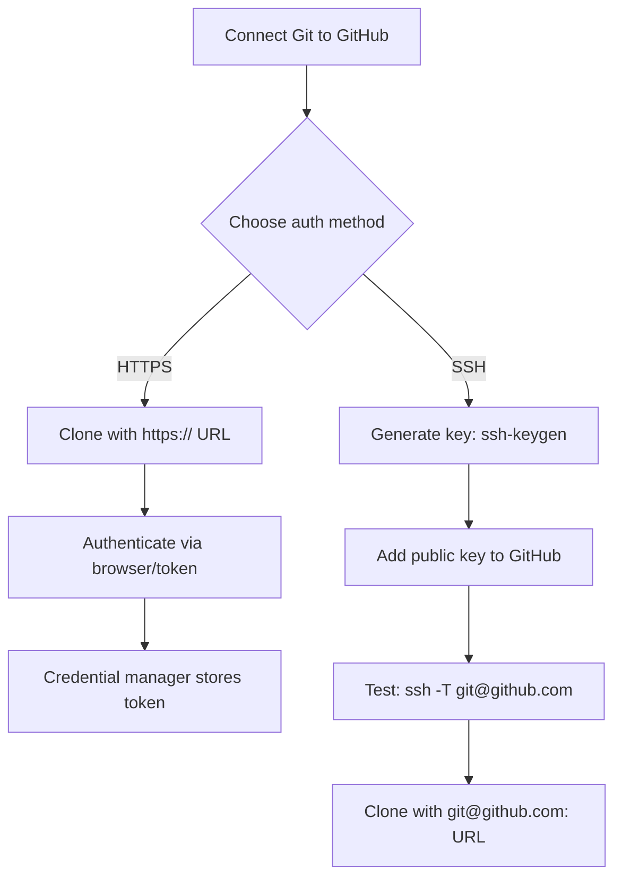

**Explanation**
- HTTPS is usually fastest to start.
- SSH is best when you work with GitHub every day and want key-based auth.

##### HTTPS authentication notes
- GitHub no longer supports password authentication for Git operations.
- You typically authenticate using a browser flow or a **token** stored by your credential manager.

##### SSH setup (high-level steps)
1. Generate a key pair (often `ed25519`).
2. Add the public key to GitHub account settings.
3. Test SSH connection.
4. Use the SSH repo URL when cloning.

Example commands (adjust email):
```bash
ssh-keygen -t ed25519 -C "you@example.com"
ssh -T git@github.com
```

##### SSH troubleshooting (common)
- If `ssh -T git@github.com` hangs or fails:
  - ensure your key exists and is loaded into the agent
  - ensure GitHub has the matching public key
  - ensure you are using the SSH remote URL (`git@github.com:OWNER/REPO.git`)

#### Check your current remotes (quick)
```bash
git remote -v
```

##### GitHub CLI (optional but great)
- Installs a command `gh` that helps with auth, PRs, issues, releases.
- Typical flow:
```bash
gh auth login
gh repo clone OWNER/REPO
gh pr create
```

---

### 3) Daily Git basics (commands you use constantly)

#### Start a repo
- **New repo locally**
```bash
git init
```

- **Clone an existing repo**
```bash
git clone <repo-url>
```

#### See what changed
```bash
git status
git diff            # unstaged changes
git diff --staged   # staged changes
```

#### Understand `status` (read it like a checklist)
`git status` tells you:
- **Which branch you’re on**
- Whether you’re ahead/behind a remote
- **What is staged** (will be in the next commit)
- **What is not staged** (changed but not included yet)
- **What is untracked** (new files Git hasn’t started tracking)

#### Show changes in useful ways
```bash
git diff --stat
git diff --name-only
git diff --word-diff
```

#### Stage and commit
```bash
git add <file>
git add .           # stage everything in current dir
git commit -m "Short message"
```

#### Visual: Daily workflow (full)
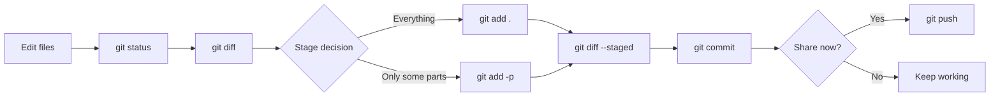

**Explanation**
- Always preview: `git diff` (unstaged) and `git diff --staged` (staged).
- Use partial staging for clean history and easier reviews.

#### What exactly is staged?
- Show staged vs last commit:
```bash
git diff --staged
```
- Show unstaged changes:
```bash
git diff
```

#### Track a new file (untracked → tracked)
- Untracked files only become part of history after you **add** and **commit** them:
```bash
git add newfile.txt
git commit -m "chore: add newfile"
```

#### Partial staging (very important for clean commits)
Stage only parts of files:
```bash
git add -p
```

#### Unstage or discard safely (common daily actions)
- Unstage a file (keep your edits):
```bash
git restore --staged <file>
```
- Discard local edits in a file (danger: loses uncommitted work):
```bash
git restore <file>
```
- Discard everything not committed (very dangerous):
```bash
git reset --hard
```

#### Good commit messages (practical)
- Treat the subject line as: “If applied, this commit will …”
- Prefer **why** over **what** (the diff shows what).

Examples:
- `fix: avoid crash when config is missing`
- `feat: support importing CSV contacts`
- `docs: add setup steps for Windows`

#### Fix your last commit (only if not shared)
- Change message:
```bash
git commit --amend -m "new message"
```
- Add missed changes:
```bash
git add .
git commit --amend --no-edit
```
If you already pushed and others may have pulled it, avoid amend; use a new commit or revert.

#### Remove and rename files the “Git way”
- Remove tracked files (and stage the deletion):
```bash
git rm <file>
```
- Rename/move files (preserves history detection):
```bash
git mv oldname newname
```

#### Ignoring files (`.gitignore`) in daily work
- Add patterns to `.gitignore` to stop tracking future untracked files.
- If a file is **already tracked**, `.gitignore` won’t stop it—untrack it once:
```bash
git rm --cached path/to/tracked-file
```

#### Typical “save work” loop
```bash
git status
git add .
git commit -m "Explain why this change exists"
```

#### Common daily workflows
- **Small task**:
  - edit → `git add -p` → `git commit` → `git push`
- **Large task**:
  - create feature branch → commit in small chunks → open PR early → iterate with reviews

#### Cleaning your working directory (use with care)
- Remove untracked files (preview first!):
```bash
git clean -n
git clean -fd
```

#### Inspecting history while you work
```bash
git log --oneline --decorate -n 20
git show HEAD
git show HEAD~1
```

#### Syncing with a remote (daily team routine)
- Fetch remote updates (safe, no working-tree changes):
```bash
git fetch origin
```
- Update your current branch:
```bash
git pull
```
- Publish your commits:
```bash
git push
```

---

### 4) Version history (the “full” model)

#### 4.1 Commits are nodes in a graph (DAG)
- Each commit has:
  - **SHA** (hash id)
  - **tree** (snapshot of files)
  - **parents** (one parent normally; two parents for merge commits)
  - **author/committer**, timestamps, message

History is not a “list”; it’s a **directed acyclic graph**:
- **Directed**: commits point to parent commit(s)
- **Acyclic**: no loops

#### 4.1.1 The object model (what Git really stores)
Git stores content as objects:
- **Blob**: file contents
- **Tree**: directory listing (names → blobs/trees)
- **Commit**: points to a tree + parents + metadata
- **Tag object** (annotated tags): points to a commit and adds metadata/message

This explains why Git is fast: content is addressed by hash.

#### Visual: Git object model (flow)
```mermaid
flowchart TD
  C[Commit] --> T[Tree<br/>(directory snapshot)]
  C --> P[Parent commit(s)]
  T --> B1[Blob<br/>(file contents)]
  T --> T2[Tree<br/>(subdirectory)]
  T2 --> B2[Blob]
```

**Explanation**
- **Commits** point to a **tree** (the snapshot of the whole project).
- **Trees** point to files (blobs) and folders (trees).
- Parents link commits into the history graph.

##### Inspect objects (advanced but illuminating)
```bash
git cat-file -t HEAD
git cat-file -p HEAD
```

##### How Git stays efficient (high-level)
- Git compresses objects and stores them in **packfiles** for efficiency.
- It also reuses identical content across commits (content-addressed storage).

#### 4.2 HEAD, branches, tags, and refs
- **HEAD**: “where you are now” (usually points to a branch).
- **Branch**: a **movable pointer** to a commit (e.g., `main` points to latest commit on main).
- **Tag**: usually an **immovable pointer** (used for releases like `v1.4.0`).
- **Remote-tracking branches**: your local view of remote state, e.g. `origin/main`.

#### Visual: Branches and HEAD are pointers
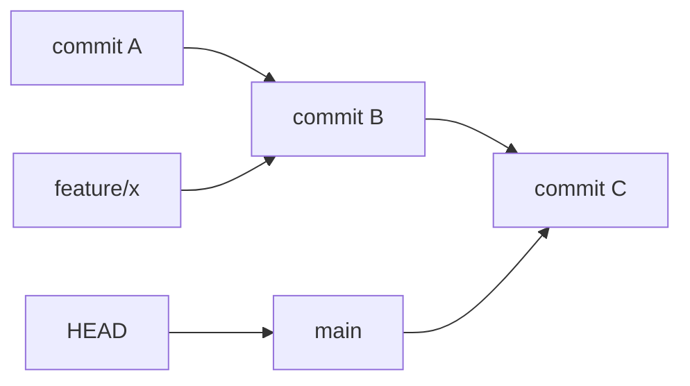

**Explanation**
- `main` and `feature/x` are just names pointing to commits.
- `HEAD` usually points to your current branch; when you commit, the current branch moves forward.

#### 4.2.1 Refs you’ll see in real repos
- `refs/heads/*` → local branches
- `refs/remotes/origin/*` → remote-tracking branches
- `refs/tags/*` → tags

Useful inspection commands:
```bash
git show-ref
git branch -vv
git remote -v
```

#### 4.2.2 Commit selectors (“revisions”)
- `HEAD` = current commit
- `HEAD~1` = parent of HEAD
- `HEAD~3` = 3 commits before HEAD (following first parent)
- `HEAD^2` = second parent (useful on merge commits)

##### More revision patterns you’ll use
- “The commit where two branches diverged” (merge base):
```bash
git merge-base origin/main HEAD
```
- “That branch name at the remote”:
  - `origin/main` is a ref to the last fetched state of `main` on `origin`.
- “Select a file as of a commit”:
```bash
git show HEAD~2:path/to/file.txt
```

#### 4.3 Viewing “full” history
```bash
git log
git log --oneline --decorate
git log --graph --oneline --decorate --all
```

##### Useful `log` formats for real work
- Show files changed per commit:
```bash
git log --name-status -n 10
```
- Show summary stats:
```bash
git log --stat -n 10
```
- Show one-line history with dates:
```bash
git log --oneline --decorate --date=short --pretty=format:"%h %ad %d %s" -n 20
```

#### 4.3.1 Ranges and comparisons (super useful)
- What changed between two commits:
```bash
git diff A B
```
- What’s on your branch compared to main:
```bash
git diff origin/main...HEAD
git log origin/main..HEAD --oneline
```
Notes:
- `A..B` means “commits reachable from B but not A”
- `A...B` (triple-dot) compares the two branches from their merge base

Find a specific change:
```bash
git blame <file>
git log -p <file>          # commit history + patches for a file
git show <commit-sha>      # inspect one commit
```

#### 4.3.2 Search history
- Find commits by message:
```bash
git log --grep="keyword"
```
- Find commits that touched a string (pickaxe):
```bash
git log -S "someText"
```

##### Search for removed/added lines (pickaxe variants)
- `-S` finds changes in the number of occurrences (good for exact text).
- `-G` uses regex matching on diff content:
```bash
git log -G "regexPattern"
```

#### 4.4 Remote history (fetch vs pull)
- **fetch**: download remote updates; does not change your current branch
```bash
git fetch origin
```

- **pull**: fetch + integrate (merge by default, or rebase if configured)
```bash
git pull
```

#### Visual: `fetch` vs `pull` (full flow)
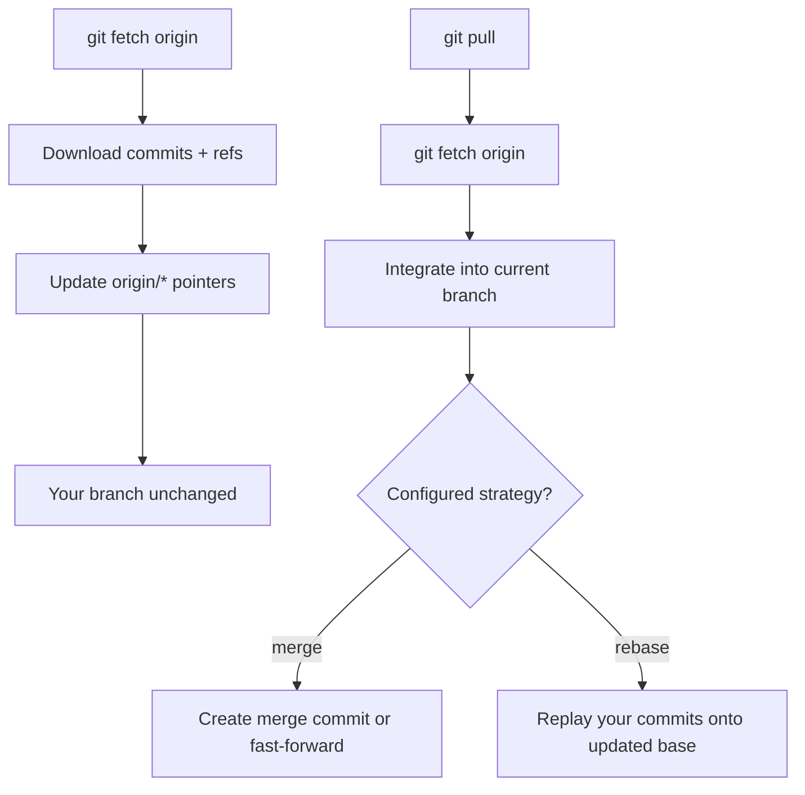

**Explanation**
- `fetch` is safest for inspection: it updates `origin/*` without touching your working tree.
- `pull` also integrates changes, so you may get a merge/rebase and possibly conflicts.

#### 4.4.1 `pull` gotchas
- If your branch and the remote both changed, pull must choose a strategy:
  - merge (default in many setups)
  - rebase
  - fast-forward only

You can set:
```bash
git config --global pull.ff only
```
This prevents “accidental merges” during `git pull`, but you must rebase/merge manually.

#### 4.4.2 Remotes and tracking (why `git push` sometimes complains)
- A local branch can “track” a remote branch (upstream). Then:
  - `git pull` knows what to pull from
  - `git push` knows where to push to

Set upstream when pushing the first time:
```bash
git push -u origin HEAD
```

#### 4.5 Reflog and garbage collection (why “lost commits” happen)
- **Reflog** records where your refs (like `HEAD`) pointed recently.
- If you make commits and then delete the only branch pointing to them, those commits become **unreachable**.
- Unreachable commits can still be recovered via reflog for a while, until Git prunes them.

Useful commands:
```bash
git reflog
git reflog show main
```

---

### 5) Branching & merging

#### Visual: Branch lifecycle (create → work → integrate)
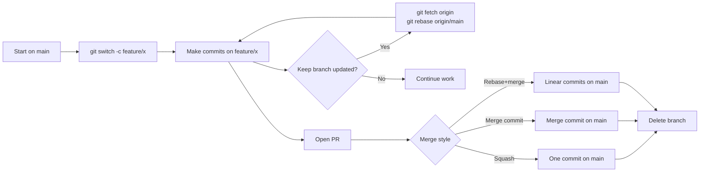

**Explanation**
- Feature branches isolate work; PRs are where review + CI happen.
- Rebase (or merge) often updates the branch with latest `main` before merging.

#### 5.1 Create / switch branches
```bash
git branch                  # list local branches
git switch -c feature/login # create+switch (modern)
git switch main
```

#### 5.1.1 Common branch maintenance
- Rename a branch:
```bash
git branch -m old-name new-name
```
- Delete a local branch (safe):
```bash
git branch -d feature/login
```
- Force-delete a local branch (danger):
```bash
git branch -D feature/login
```

#### 5.2 Merge types
- **Fast-forward merge**: if `main` didn’t move, Git just advances `main` pointer.
- **Merge commit**: combines two histories and creates a new commit with **two parents**.

```bash
git switch main
git merge feature/login
```

#### Table: Merge options (team decision)
| Approach | Result on `main` | Pros | Cons | Typical usage |
|---|---|---|---|---|
| Fast-forward | pointer moves, no merge commit | simplest history | loses explicit PR boundary unless squashed | small repos, linear policy |
| Merge commit | merge commit with 2 parents | preserves topology, clear integration point | extra commits in history | audit-heavy teams |
| Squash merge (GitHub) | single commit per PR | clean `main`, easy rollback | loses individual commit history on main | many product teams |
| Rebase + merge (GitHub) | linear commits | keeps commit granularity, no merge commits | rewrites branch SHAs | teams that like linear logs |

#### 5.2.1 Merge strategies you’ll hear about
- **Merge commit** preserves branch topology (good for audit trail).
- **Squash merge** (often done on GitHub) combines a PR into a single commit on `main`.
- **Rebase + merge** keeps `main` linear but preserves individual commits (still rewrites on branch).

##### Fast-forward only merges (policy option)
If your team wants strictly linear history:
```bash
git merge --ff-only feature/login
```
On GitHub, this is similar to requiring “rebase and merge” or “squash and merge” (no merge commits).

#### 5.3 Rebase (rewrite branch base)
- **Rebase** “replays” your branch commits onto a new base (creates new SHAs).
- Good for keeping feature branches up-to-date with a clean linear history.
- Avoid rebasing commits that are already shared/pushed and used by others.

```bash
git fetch origin
git switch feature/login
git rebase origin/main
```

#### 5.3.2 Rebase vs merge (how to choose)
- Prefer **merge** when:
  - you want a visible merge commit (audit trail)
  - you do not want to rewrite history
- Prefer **rebase** when:
  - you want a clean, linear feature-branch history before PR
  - you are working only on your own branch (or your team explicitly allows it)

#### 5.3.3 Advanced rebase: move commits to a different base (`--onto`)
Useful when you branched from the wrong place:
```bash
git rebase --onto origin/main origin/old-base feature/my-branch
```

#### 5.3.1 Interactive rebase (clean up before PR)
Use carefully (history rewrite):
```bash
git rebase -i origin/main
```
Common uses:
- reorder commits
- squash “fixup” commits
- edit commit messages

##### Interactive rebase commands (what the words mean)
- `pick`: keep commit as-is
- `reword`: edit commit message
- `edit`: stop and let you modify the commit
- `squash`: combine with previous, edit message
- `fixup`: combine with previous, keep previous message
- `drop`: remove commit

##### Abort/continue when rebasing
```bash
git rebase --continue
git rebase --abort
```

#### 5.4 Merge conflicts (what to do)
When Git can’t auto-merge:
- Open conflicted files
- Choose correct content
- Mark resolved:

```bash
git add <resolved-files>
git commit       # if merge
# or
git rebase --continue
```

#### Visual: Conflict resolution (full playbook)
```mermaid
flowchart TD
  A[Git reports conflict] --> B[git status: list conflicted files]
  B --> C[Open each conflicted file]
  C --> D[Decide correct final content]
  D --> E[Remove conflict markers]
  E --> F[Run tests/build if available]
  F --> G[git add resolved files]
  G --> H{Were you rebasing?}
  H -->|Yes| I[git rebase --continue]
  H -->|No, merging| J[git commit]
  I --> K[Push branch (maybe force-with-lease)]
  J --> K
```

**Explanation**
- Conflicts mean Git can’t decide; you must choose the correct final code.
- During rebase, you continue; during merge, you create a merge commit.

#### 5.4.1 Conflict resolution playbook (practical)
- **Start by understanding intent**: which side is “correct,” or do you need both?
- **Resolve one file at a time**, run tests/build if available.
- After resolving, always do:
```bash
git status
```

#### 5.4.2 Helpful tools
- Reuse recorded conflict resolutions:
```bash
git config --global rerere.enabled true
```
- Visual merge tools (optional):
```bash
git mergetool
```

##### Abort a merge if needed
```bash
git merge --abort
```

---

### 6) Branching strategies (what teams should choose)

#### Table: Strategies at a glance (expanded)
| Strategy | Branches you typically have | How you release | Works best when | Common failure mode |
|---|---|---|---|---|
| Trunk-based | `main`, short `feature/*` | tags from `main` | CI is strong, fast iteration | long-lived features without flags |
| GitHub Flow | trunk-based + PR-first | deploy from `main` | you deploy frequently | skipping CI/review under pressure |
| Release branches | `main` + `release/*` | tags on release branch | supporting multiple versions | painful backports without discipline |
| GitFlow | `main`, `develop`, `release/*`, `hotfix/*` | `main` tags | strict release cycles | too much merging + drift |

#### Strategy A: Trunk-based development (recommended for many teams)
- **Branches**: short-lived feature branches
- **Main branch**: always releasable (protected)
- **Releases**: tags from `main`
- **Hotfix**: branch off `main`, PR back quickly
- Works best with: CI, good tests, feature flags.

**Flow**
- `main` (protected)
- `feature/*` (short lived)
- optional `release/*` only if you need stabilization windows

##### Trunk-based “picture” (conceptual)
```text
main:     A---B---C---D---E
               \     /
feature/x:      c1--c2
```

#### Visual: Trunk-based delivery (PR → merge → deploy)
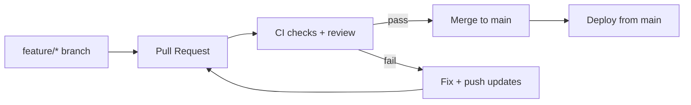

**Explanation**
- Main stays releasable; features are integrated quickly.
- Feature flags help ship incomplete work safely.

**Pros**
- Simple, fast, reduces long-lived drift

**Cons**
- Requires discipline and CI/testing maturity

#### When to choose which strategy (quick guidance)
- **Trunk-based / GitHub Flow**: best for continuous delivery, web apps, fast iteration.
- **Release branches**: best when supporting multiple production versions at once.
- **GitFlow**: only when you truly need strict separation and can afford complexity.

#### Typical branch lifetime targets
- Feature branches: **hours to a few days**
- Release branches: **days to weeks**
- Long-lived branches (months) usually cause painful merges; avoid if possible.

#### Comparison table (quick)
| Strategy | Main idea | Best for | Trade-offs |
|---|---|---|---|
| Trunk-based | `main` always releasable, short branches | fast-moving products | needs strong CI/testing |
| GitHub Flow | trunk-based + PR-centric | most GitHub teams | same as trunk-based |
| Release branches | maintain supported versions | enterprise, multiple versions | more backport work |
| GitFlow | `develop` + releases + hotfixes | strict release cadence | heavier process, more merges |

#### Release and hotfix patterns
- **Hotfix**: branch from the production commit (tag) → fix → PR → tag a patch release.
- **Backport**: cherry-pick fix commits into older release branches.

#### Strategy B: GitHub Flow
- Branch from `main`
- Open PR early
- Review + CI
- Merge to `main`
- Deploy from `main`

#### Strategy C: GitFlow (older, heavier)
- `main`: production releases
- `develop`: integration branch
- `feature/*` from `develop`
- `release/*` from `develop`, merged to `main` and back to `develop`
- `hotfix/*` from `main`

**Pros**
- Strong separation of release stabilization

**Cons**
- More merges, more complexity, slower for continuous delivery

#### Strategy D: Release branches (enterprise-friendly)
- `main`: ongoing development
- `release/2026.03` (or `release/1.8`) maintained with selective fixes
- Useful when supporting multiple versions in parallel

##### Release branch “picture” (conceptual)
```text
main:         A---B---C---D---E---F
release/1.2:          C---D---e1---e2   (stabilization + patch fixes)
```

---

### 7) A practical branching strategy you can adopt (simple + professional)

#### Visual: Full PR lifecycle (idea → merged)
```mermaid
flowchart TD
  A[Pick work: Issue / ticket] --> B[Create branch from main]
  B --> C[Commit in small chunks]
  C --> D[Push branch to origin]
  D --> E[Open Pull Request]
  E --> F[CI runs]
  F --> G{CI green?}
  G -->|No| H[Fix + push updates]
  H --> F
  G -->|Yes| I[Review]
  I --> J{Approved?}
  J -->|Changes requested| K[Update branch]
  K --> F
  J -->|Approved| L[Merge to main]
  L --> M[Delete branch]
  M --> N[Deploy / release (if applicable)]
```

**Explanation**
- PRs are the “quality gate”: review + CI + discussion.
- Keeping branches small makes reviews faster and reduces merge conflicts.

#### Branches
- **`main`**: protected, always green (CI must pass)
- **`feature/<ticket>-short-name`**: new work
- **`fix/<ticket>-short-name`**: bug fixes
- **`chore/...`**, **`docs/...`**: maintenance/documentation
- Optional: **`release/<version>`** if you need a stabilization window

#### Rules
- No direct pushes to `main`
- PR required + at least 1 approval
- CI required (tests/lint)
- Pick a merge style and stay consistent:
  - **Squash merge**: clean `main` history, one commit per PR
  - **Merge commits**: preserves full branch structure in history

#### Suggested PR template (copy/paste into GitHub)
```markdown
## Summary
- What changed and why?

## Testing
- [ ] Unit tests
- [ ] Manual smoke test
- [ ] Edge cases considered

## Risk
- What could break? How do we roll back?
```

#### Branch naming examples
- `feature/123-add-login`
- `fix/456-crash-on-startup`
- `docs/readme-windows-setup`
- `chore/deps-2026-03`

#### Protect `main` (recommended)
- Require PR reviews
- Require status checks (CI)
- Require linear history (optional; depends on your merge style)
- Restrict force pushes

#### Backporting fixes to a release branch (common in enterprises)
If you maintain `release/1.2` and need a fix from `main`:
```bash
git switch release/1.2
git pull
git cherry-pick <fix-commit-sha>
git push
```

#### Commit message style
- **Good**: “Fix null crash when saving profile”
- **Optional** (Conventional Commits):
  - `feat: add profile image upload`
  - `fix: prevent crash when profile is empty`
  - `chore: update dependencies`

#### End-to-end example workflow (feature → PR → merge)
```bash
# start from updated main
git switch main
git pull --ff-only

# create a feature branch
git switch -c feature/123-add-login

# work + commit in chunks
git add -p
git commit -m "feat: add login form UI"
git add -p
git commit -m "feat: validate login form inputs"

# push and open PR
git push -u origin HEAD
```

During review:
```bash
git fetch origin
git rebase origin/main
git push --force-with-lease
```

After merge:
```bash
git switch main
git pull --ff-only
git branch -d feature/123-add-login
```

---

### 8) Collaboration essentials (GitHub PR workflow)

#### Visual: Collaboration data flow (local ↔ origin ↔ upstream)


**Explanation**
- In a single-repo team, `origin` is usually the shared repo.
- In open source, `origin` is your fork and `upstream` is the original project.

#### Typical PR steps
```bash
git switch -c feature/123-add-login
# work...
git add .
git commit -m "feat: add login form validation"
git push -u origin HEAD
```

Then on GitHub:
- Open PR → describe changes + link issue
- CI runs
- Review + requested changes
- Merge (squash/merge/rebase-merge depending on policy)
- Delete branch

#### Code review (what good reviews look like)
- **Author**:
  - keep PRs small and focused
  - explain intent, risk, and test plan
  - respond to comments (and update the PR)
- **Reviewer**:
  - review for correctness, security, maintainability, tests
  - suggest improvements with clear reasoning
  - approve only when CI is green and requirements are met

#### Handling PR conflicts
- If GitHub shows “This branch has conflicts that must be resolved”:
  - rebase/merge `main` into your branch locally, resolve, then push updated branch
```bash
git fetch origin
git switch feature/123-add-login
git rebase origin/main
git push --force-with-lease
```

#### Keep your branch updated
```bash
git fetch origin
git rebase origin/main     # or merge origin/main
```

#### What “origin/main” really means (common confusion)
- `origin/main` is **your local pointer** to the last fetched state of `main` on the remote named `origin`.
- It updates when you run `git fetch` or `git pull`.

#### Pushing new branches correctly
- First push should usually set upstream:
```bash
git push -u origin HEAD
```
After that, plain `git push` is usually enough.

#### Collaboration patterns you’ll encounter
- **Single repo team**: everyone has push access; PRs are the gate.
- **Forking model (open source)**:
  - You fork repo
  - Add `upstream` remote for original
  - PR from your fork to upstream

Fork sync example:
```bash
git remote add upstream <upstream-url>
git fetch upstream
git switch main
git merge upstream/main
git push origin main
```

#### Visual: Fork sync (full flow)
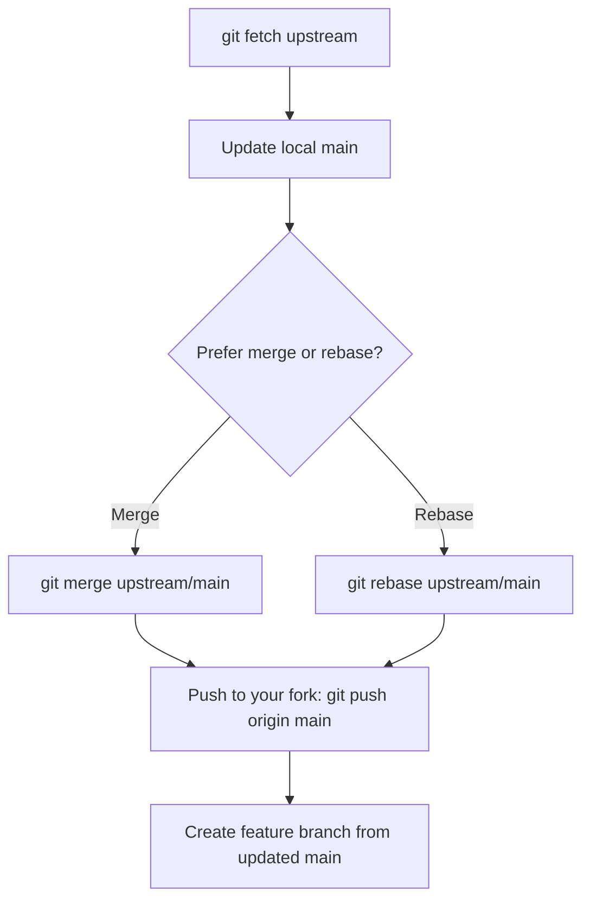

**Explanation**
- Syncing reduces conflicts and makes your PR closer to what maintainers expect.
- Use merge if you want to avoid rewriting your fork’s `main`; use rebase if you prefer a linear fork history.

##### Fork sync alternative (rebase style)
Some contributors prefer rebasing their fork’s `main`:
```bash
git fetch upstream
git switch main
git rebase upstream/main
git push --force-with-lease origin main
```
(Only do this on your fork’s branch; do not rewrite history on shared branches.)

#### “Force push” safety
- Force push is sometimes needed after rebasing a feature branch:
```bash
git push --force-with-lease
```
- Prefer `--force-with-lease` over `--force` because it refuses to overwrite others’ work.

---

### 9) Undo & recovery (important “git safety”)

#### Table: Undo tools (choose the right one)
| Goal | Best tool | Safe for shared branches? | Notes |
|---|---|---:|---|
| discard unstaged file edits | `git restore <file>` | yes (local only) | loses uncommitted work |
| unstage a file | `git restore --staged <file>` | yes | keeps your edits |
| undo last commit but keep changes | `git reset --soft HEAD~1` | no | rewrites history |
| undo last commit and unstage | `git reset --mixed HEAD~1` | no | rewrites history |
| undo a pushed commit on `main` | `git revert <sha>` | yes | creates a new undo commit |
| recover “lost” commits | `git reflog` | yes (local) | find SHA, then create a branch |

#### Visual: Undo decision tree (full)
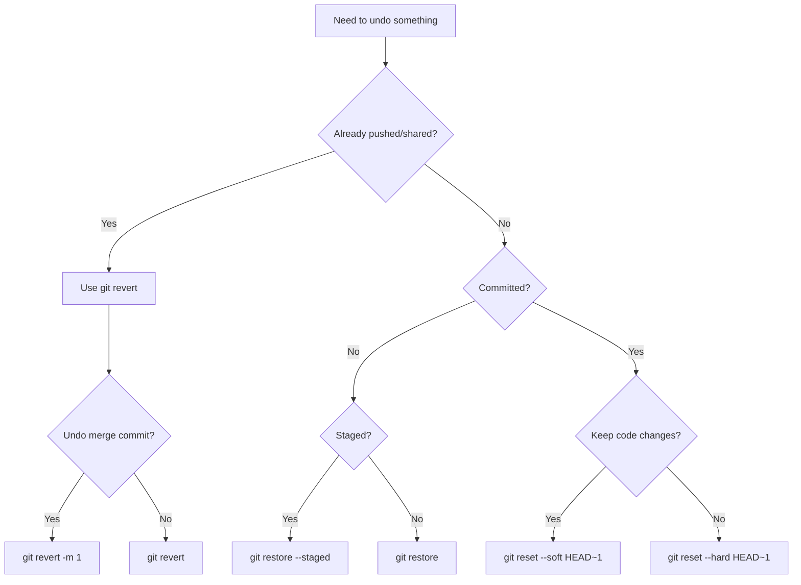

**Explanation**
- If others might have pulled it, avoid rewriting history: **revert** is safest.
- If it’s only local, `restore`/`reset` are faster.

#### Undo local working changes
- Discard unstaged edits:
```bash
git restore <file>
```

- Unstage (keep changes):
```bash
git restore --staged <file>
```

#### Undo commits (choose carefully)
- **Revert** (safe for shared history): makes a new commit that undoes an earlier commit
```bash
git revert <commit-sha>
```

- **Reset** (rewrites history; be careful if pushed):
  - Keep changes staged/unstaged:
```bash
git reset --soft <sha>
git reset --mixed <sha>
```

  - Discard changes (danger):
```bash
git reset --hard <sha>
```

#### Recovery superpower: reflog
```bash
git reflog
# find the old SHA, then:
git switch -c recovered <sha>
```

#### Choosing the right undo tool (rules of thumb)
- **Not pushed / only you**: amend, reset, rebase are OK.
- **Pushed / shared**: prefer revert; avoid rewriting history.

#### Reset modes explained
- `--soft`: move HEAD, keep changes staged
- `--mixed` (default): move HEAD, keep changes unstaged
- `--hard`: move HEAD, discard changes (danger)

#### Undo recipes (expanded)
##### “I want to undo changes in one file only”
```bash
git restore path/to/file
```

##### “I staged the wrong file”
```bash
git restore --staged path/to/file
```

##### “I want to undo the last commit, but keep the code changes”
```bash
git reset --soft HEAD~1
```

##### “I want to undo the last commit and unstage the changes”
```bash
git reset --mixed HEAD~1
```

##### “I want to undo the last commit and discard changes” (danger)
```bash
git reset --hard HEAD~1
```

##### “I need to undo a commit that’s already on `main` (shared)”
```bash
git revert <sha>
```

##### Reverting a merge commit (advanced)
If you must undo a merge commit on a shared branch:
```bash
git revert -m 1 <merge-commit-sha>
```
`-m 1` means “keep the first parent” (usually mainline). Review carefully before pushing.

##### “Abort a bad rebase or merge”
```bash
git rebase --abort
git merge --abort
```

##### “I committed on the wrong branch”
One common safe approach:
```bash
# on the wrong branch: copy commit to the correct branch
git switch correct-branch
git cherry-pick <sha>

# then remove it from the wrong branch (if not shared)
git switch wrong-branch
git reset --hard HEAD~1
```

#### Common recovery recipes
- “I deleted a branch / lost commits”:
  - `git reflog` → find SHA → `git switch -c recovered <sha>`
- “I accidentally committed to `main`” (not pushed):
  - create a branch at current commit
  - reset `main` back

#### Detached HEAD recovery (expanded)
If you see “detached HEAD” and you made commits:
```bash
git switch -c my-saved-work
```
This attaches your commits to a branch so they don’t get lost.

#### Restore a deleted file from history
```bash
git restore --source=HEAD~1 -- path/to/file
```
Or from a specific commit:
```bash
git restore --source=<sha> -- path/to/file
```

---

### 10) Tags & releases

#### Visual: Release flow (build → tag → GitHub release)
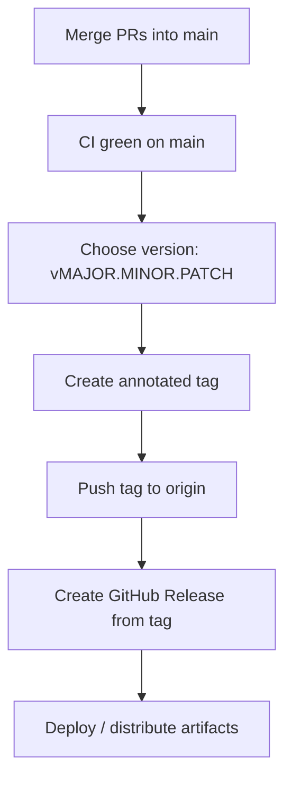

**Explanation**
- Tags mark the exact commit you shipped.
- GitHub Releases attach notes and artifacts to tags for users.

#### Tags (recommended: annotated tags)
```bash
git tag -a v1.2.0 -m "Release v1.2.0"
git push origin v1.2.0
```

#### Lightweight vs annotated tags
- **Lightweight tag**: just a name → commit
```bash
git tag v1.2.0
```
- **Annotated tag**: name → tag object → commit (has message, tagger, date; can be signed)
```bash
git tag -a v1.2.0 -m "Release v1.2.0"
```

#### Common tag commands
```bash
git tag
git tag -n
git show v1.2.0
git push --tags
```

#### Semantic versioning (SemVer)
- `MAJOR.MINOR.PATCH`
- **MAJOR**: breaking changes
- **MINOR**: new features (backward compatible)
- **PATCH**: bug fixes

#### Release notes and changelogs (practical)
- Many teams keep a `CHANGELOG.md` and update it via PRs.
- A simple approach:
  - merge PRs into `main`
  - tag the release commit
  - create a GitHub Release from that tag with notes

#### A simple release process (example)
1. Merge PRs into `main`
2. Run CI on `main` and ensure green
3. Tag the release commit:
```bash
git tag -a v1.3.0 -m "Release v1.3.0"
git push origin v1.3.0
```
4. Create a GitHub Release from the tag
5. (Optional) create a `release/1.3` branch if you need ongoing patches

---

### 11) GitHub features you should know
- **Issues**: track work (bugs/features), assign, label, milestone
- **Pull Requests**: review + discussion + CI gate
- **Projects**: kanban/roadmap planning
- **Actions**: CI/CD pipelines (test, build, deploy)
- **Pages**: host static sites
- **Packages**: package registry
- **Wikis**: documentation
- **CODEOWNERS**: auto-request reviews for paths
- **Branch protection rules**: require reviews, require CI, prevent force-push
- **Security**: Dependabot alerts, secret scanning (depending on plan)

#### CODEOWNERS (auto review requests)
Create `.github/CODEOWNERS`:
```text
# Backend changes require backend team review
/backend/ @your-org/backend-team

# Docs changes require docs owner
*.md @your-org/docs
```

#### GitHub Actions (CI) idea
Typical CI checks:
- install dependencies
- lint
- run tests
- build

#### Visual: CI pipeline (typical)
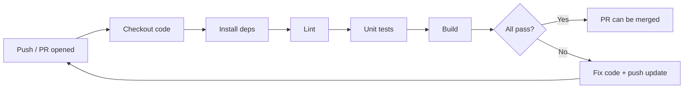

**Explanation**
- CI turns “works on my machine” into a consistent quality gate.
- Branch protections can require CI to pass before merge.

#### Minimal GitHub Actions workflow example (generic)
Create `.github/workflows/ci.yml`:
```yaml
name: CI
on:
  pull_request:
  push:
    branches: [main]

jobs:
  build:
    runs-on: ubuntu-latest
    steps:
      - uses: actions/checkout@v4
      - name: Run tests
        run: echo "Add your test command here"
```

#### Issues and PR templates (quality boost)
- Issue templates: `.github/ISSUE_TEMPLATE/`
- PR template: `.github/pull_request_template.md`

#### Branch protections (what to turn on first)
Common protections for `main`:
- require PR before merging
- require approvals (1+)
- require status checks (CI) to pass
- restrict force pushes
- require up-to-date branches before merging (optional)

#### GitHub Pages / Packages / Wikis (quick)
- **Pages**: host docs/static sites from a branch or build artifact
- **Packages**: publish container images or language packages
- **Wikis**: lightweight documentation (many teams prefer docs inside the repo)

---

### 12) Repo hygiene & other Git-related things

#### Visual: Advanced toolbox map (when to use what)
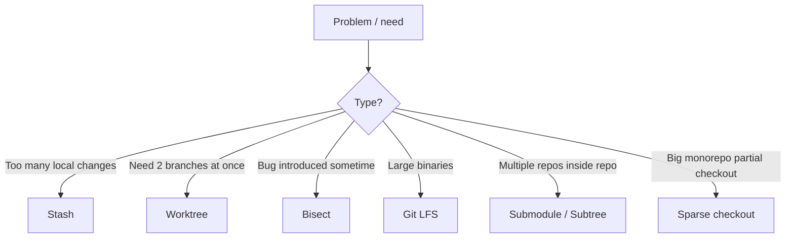

**Explanation**
- These are “power tools”: they solve specific pain points efficiently, but should be used intentionally.

#### `.gitignore`
- Ignore build artifacts, secrets, local config, dependency folders, etc.
- Never commit secrets like `.env`, private keys, tokens.

##### Common `.gitignore` entries (examples)
```text
# dependencies
node_modules/

# build outputs
dist/
build/

# logs
*.log

# environment / secrets
.env
.env.*

# OS/editor
.DS_Store
.vscode/
```

#### `.gitattributes` (consistency tool)
- Use this to enforce line endings, diff drivers, binary handling, etc.
- If you have weird “files keep changing” issues across OSes, `.gitattributes` is often the fix.

#### Large files: Git LFS
- Use Git LFS for large binaries (avoid bloating Git history).

##### Git LFS basics
```bash
git lfs install
git lfs track "*.psd"
git add .gitattributes
git add path/to/file.psd
git commit -m "chore: track large design files with LFS"
```

#### Hooks
- Local automation (format, lint, tests) before commit/push.
- Enforce in CI for reliability across the team.

##### Common hook types
- `pre-commit`: format/lint
- `commit-msg`: enforce message format
- `pre-push`: run tests before pushing

Team note: hooks are local; CI is the true enforcement.

#### Submodules vs subtree
- **Submodule**: repo inside repo with a pinned commit (can be confusing).
- **Subtree**: vendor another repo’s code into your repo (often simpler).

##### Submodule essentials
```bash
git submodule add <url> path/to/submodule
git submodule update --init --recursive
```

##### Subtree essentials (high-level)
```bash
git subtree add --prefix=vendor/somelib <url> main --squash
```

#### Stash (park changes temporarily)
```bash
git stash push -m "wip: experiment"
git stash list
git stash pop
```

#### Visual: Stash flow (save → switch → restore)
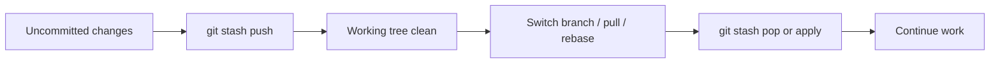

**Explanation**
- `pop` applies the stash and removes it; `apply` keeps it for later reuse.

##### Safer stash usage
- Keep the stash (use apply instead of pop):
```bash
git stash apply
```
- Stash including untracked files:
```bash
git stash push -u -m "wip: include untracked"
```

#### Worktrees (work on multiple branches without re-cloning)
```bash
git worktree add ../repo-hotfix hotfix/urgent-fix
git worktree list
```

#### Visual: Worktree flow (parallel branches)
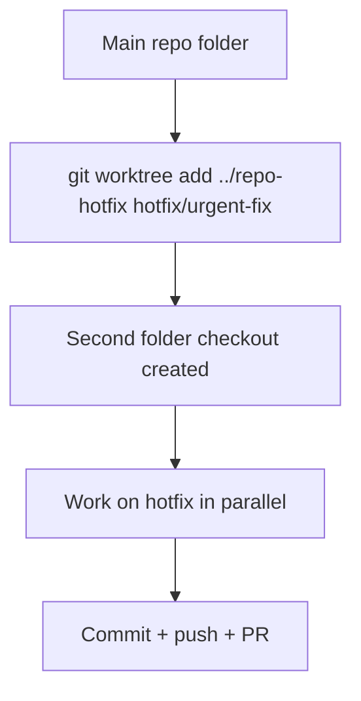

**Explanation**
- Worktrees are ideal when you need to keep one branch open while fixing another (hotfix + feature).

#### Bisect (find the commit that introduced a bug)
```bash
git bisect start
git bisect bad
git bisect good <known-good-sha>
# test each step:
git bisect good
# or:
git bisect bad
git bisect reset
```

#### Visual: Bisect flow (binary search)
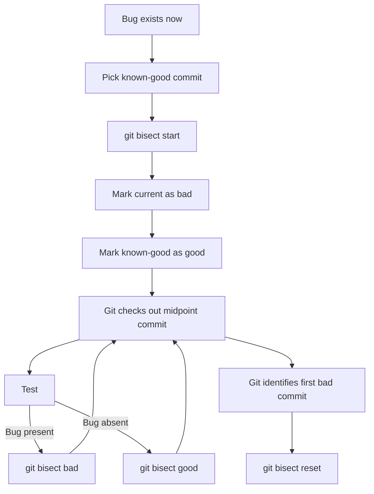

**Explanation**
- Bisect is a fast way to find “which commit broke it” even in very large histories.

##### Automating bisect (advanced)
If you can write a script that exits 0/1 based on pass/fail:
```bash
git bisect start
git bisect bad
git bisect good <known-good-sha>
git bisect run ./run-tests.sh
git bisect reset
```

#### Commit signing (trust & security)
- You can sign commits/tags so others can verify authorship.
- Common options:
  - GPG signing
  - SSH signing (supported by GitHub)

#### Sparse checkout (big repos)
For monorepos, you can checkout only part of the tree:
```bash
git sparse-checkout init --cone
git sparse-checkout set path/to/subdir another/dir
```

##### Extra security practices on GitHub
- Enable branch protections (required reviews + required checks).
- Require signed commits (optional policy).
- Use Dependabot for dependency update PRs.
- Turn on secret scanning if available for your plan.

---

## Quick command cheat sheet

### Daily
```bash
git status
git diff
git add .
git commit -m "message"
git push
git pull
```

### History
```bash
git log --oneline --graph --decorate --all
git show <sha>
git blame <file>
```

### Branching
```bash
git switch -c feature/x
git merge feature/x
git rebase origin/main
```

### Undo
```bash
git restore <file>
git restore --staged <file>
git revert <sha>
git reflog
```

### “When in doubt” commands
```bash
git status
git log --oneline --decorate -n 30
git lg      # if you added the alias earlier
git diff
```
